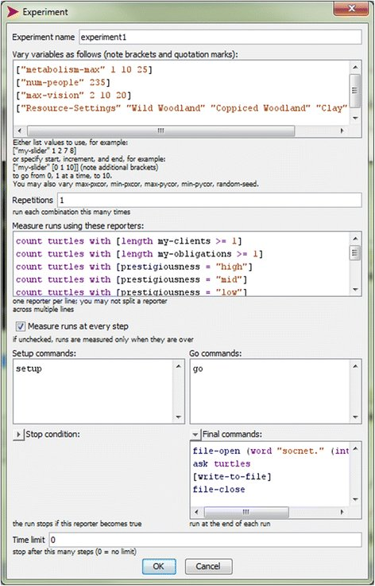
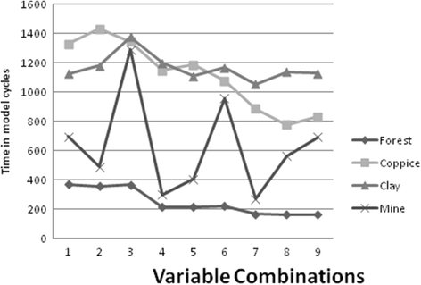

# The Equifinality of Archaeological Networks: an Agent-Based Exploratory Lab Approach

**Shawn Graham & Scott Weingart**  

*Journal of Archaeological Method and Theory* (2015) 22:248–274  

Published online: 28 December 2014  

DOI: [10.1007/s10816-014-9230-y](https://doi.org/10.1007/s10816-014-9230-y)  

© 2014 Springer Science+Business Media New York

## Abstract

When we find an archaeological network, how can we explore the necessary versus contingent processes at play in the formation of that archaeological network? Given a set of circumstances or processes, what other possible network shapes could have emerged? This is the problem of equifinality, where many different means could potentially arrive at the same end result: the networks that we observe. This paper outlines how agent-based modelling can be used as a laboratory for exploring different processes of archaeological network formation. We begin by describing our best guess about how the (ancient) world worked, given our target materials (here, the networks of production and patronage surrounding the Roman brick industry in the hinterland of Rome). We then develop an agent-based model of the Roman extractive economy which generates different kinds of networks under various assumptions about how that economy works. The rules of the simulation are built upon the work of Bang (2006; 2008) who describes a model of the Roman economy which he calls the ‘imperial Bazaar’. The agents are allowed to interact, and the investigators compare the kinds of networks this description generates over an entire landscape of economic possibilities. By rigorously exploring this landscape, and comparing the resultant networks with those observed in the archaeological materials, the investigators will be able to employ the principle of equifinality to work out the representativeness of the archaeological network and thus the underlying processes.

**Keywords** Agent-based modelling · Networks · Roman economic history · Simulation · Trade · Natural resources

## Introduction

Equifinality is the principle that the past could have unfolded in a multitude of ways, each of which could have resulted in the same evidence we are presented with today. Because of this, presenting a single hypothesis of how the past unfolded that matches the evidence we see is insufficient to make a credible claim about the past. Agent-based models allow us to simulate many hypotheses about the past simultaneously, matching them against the evidence we see, thus improving our ability to hone in on credible historical narratives, and to move away from incredible ones.

This paper explores what the economist Lea Tesfatsion calls ‘agent-based computational economics’ (2013) in order to explore ideas concerning network formation in archaeological materials. Networks are everywhere. They can be discerned on a variety of bases, whether the relationships are similarity of artistic motif, geographical proximity, or indeed, social networks as recorded in epigraphic materials. Revisiting data first published in Graham 2006a, we draw out a network of production surrounding Roman brick and tile in the Tiber Valley, based on archaeometric and survey data. This method of making connections between the bricks depends on mapping out the relationships of ‘same’ and ‘different’ along three axes (find spot, ceramic fabric and stamp type) for every brick in our study. The information in the stamp types themselves is multidimensional, carrying information concerning the estate on which the brick was made, the brick maker, the landowner and the year, and so, we can draw out a parallel network based solely on the epigraphic and prosopographic data. We recast this network into single mode networks of individuals by period. We then simulate a hypothesis about the genesis of that network in order to test whether the hypothesis is credible.

In the archaeological literature, while there is some discussion of the methodological and theoretical problems of discerning these relationships, comparatively little discussion is given over to the problem of sample representativeness (see Brughmans’ review of archaeological networks analysis, 2013a, b); in effect, whatever network we find in the archaeological material is a sample of one. Any resulting explanation of the formation process (es) of that network runs the risk, therefore, of being a ‘just-so’ story. How can we explore the necessary versus the contingent processes at play in the formation of our archaeological networks? What other possible networks could have been generated, given a particular set of underlying social or economic processes? This is the problem of multifinality, at odds with equifinality or under-determination: that many different means could potentially arrive at the same end result, the networks that we observe. However, we can narrow down the field through agent-based modelling, by simulating the stories we tell about the past, to generate potential networks against which we may then measure our observed networks. This heuristic approach is also advocated by Luke Premo, who writes, ‘(agent-based models) allow us to see when conventional assumptions lead to implausible outcomes or when they are unnecessary to explain observed phenomena’ (Premo 2006, p. 92). Equifinality is thus an important concept when assessing the degree of uncertainty of different explanations about the past may hold. (Brughmans *et al.* 2014 have described an alternative approach to the same problem, using exponential random graph models of networks. In this approach, random graphs with the same number of nodes and the same kinds of connections between them, given the kind of network under consideration, are generated to develop a probabilistic sense of the degree of representativeness of the actual observed graph, though the method says little about the actual underlying human processes that result or are facilitated by networks).

After drawing out our networks, we use the Netlogo agent-based modelling platform (Wilensky 1999) to implement a (necessarily) simplified Roman economy. The model generates social networks which can then be measured against our known archaeological networks; where there is a degree of congruence, we argue that the model has vetted a credible hypothesis; where there is incongruence, the model is an inadequate explanation of the historical evidence. In this regard, what we are building is a ‘computational laboratory’ that takes place in an explicitly spatial environment (Dibble 2006; Premo 2006 calls agent-based models ‘behavioural laboratories’). In the spirit of open access, we make the model and its code available for experimentation and extension (see the appendix for the URL). The results presented here should be seen as necessarily preliminary.

Thus, in what follows, we first describe our archaeological networks and then explore the economic framework in which those networks may have emerged. We then describe that framework in an agent-based model such that the model generates social networks; we conclude by exploring those generated networks in the light of the archaeological and epigraphic networks.

## Networks of Production and Patronage Outside Rome

The brick industry in the hinterland of Rome began in the middle of the first century, accelerating through expanded production and consolidation until, finally, all productive lands were in the hands of the emperor by the beginning of the third century. Frequently, the bricks were stamped with progressively more elaborate stamps; in their most developed second century form, they could carry the name of the brick maker (*officinator*), land lord (*dominus*), estate, the consular date and a figurative (possibly heraldic) device in the centre of the stamp. Knitting this information together, tying stamp types by virtue of the named individuals, or fabrics by the presence/absence of stamps from particular brick makers, or estates, or land owners, creates a number of archaeological networks for us to examine.

The way individuals are connected carries implications for the ways in which information or other materials flow through that network. Network structure carries implication for the ability to act, and the ways individuals embedded in a network can leverage the information/material that flows through that network. Individuals and their positioning on the network matter. In a network, individuals’ local situations give rise to a global network whose dynamics emerge from this local interplay (see for instance Coward 2010; Mitchell 2009, pp. 227–290; Christakis and Fowler 2009; Ruffini 2008; Graham 2006c; Barabási 2002; Watts 1999).

One can compute metrics to understand the implications of an individual’s positioning (such as the number of connections, or the number of paths through the network between every pair of individuals on which this particular individual sits). We use the Gephi network visualisation suite (Bastian *et al.* 2009). Here, we are concerned with global-level metrics rather than measurements of individual historic actors. We have chosen two commonly-used metrics in particular to compare the behaviour of the generated networks with the ones known from archaeology and epigraphy (Brughmans 2012 gives an excellent overview of the statistical properties of networks and their archaeological implications). Future work will consider other metrics.

- Clustering coefficient. This is a measurement that looks at how dense the connections are amongst the neighbours of each individual in the network (neighbours are those to whom the individual is directly connected). The coefficient is the average density of all the ‘neighbourhoods’ (Hanneman and Riddle 2005 Chapter 8).
- Average path length. This is a measurement that takes the mean of the number of links between every pair of actor.

Watts (1999) formally identified a network structure that appears in social (and other) systems of all kinds, which he called the ‘small-world’ phenomenon. In a small-world, most individuals are tightly connected in small groups or neighbourhoods; it is highly ordered. Normally, this means that it takes many steps to get from one side of the network to the other. Yet in a small-world network, occasionally, some individuals have links that connect otherwise disparate parts of the network, a kind of short circuit. This has the effect of making the entire network much ‘closer’ than its clustering would suggest—it looks ordered but behaves randomly. Watts suggests that a small-world exists when the average path lengths are similar but the clustering coefficient is an order of magnitude greater (that is roughly ten times larger) than in the equivalent random network (Watts 1999, p. 114).

In Roman economic history, discussions of the degree of market integration within and across the regions of the empire could usefully be recast as a discussion of small-worlds. Irad Malkin’s recent A small Greek world (2011) uses the idea of small-worlds as a metaphor to explore the emergence of the Greek-speaking world, but does not actually analyse any of the examples he provides with a network methodology, taking for granted that they must be small-worlds (2011, pp. 16–20; cf Ruffini 2012 and Brughmans 2013a, b on this use of small-worlds). If small-worlds could be identified in the archaeology (or emerge as a consequence of a simulation of the economy), then we would have a powerful tool for exploring flows of power, information and materials. Perhaps, Rome’s structural growth—or lack thereof—could be understood in terms of the degree to which the imperial economy resembles a small-world network (cf. the papers in Manning and Morris 2005). Small-worlds also seem to be a prerequisite for self-organisation, where complex phenomena emerge from the interaction of the constituent parts (Cilliers 1998).

### Drawing Out the Network

Archaeometric analysis of a proportion of the stamped bricks held at the British School at Rome (collected during the South Etruria Survey in the 1960s and 1970s) demonstrated that the same stamp type could be used on different clay sources, and that bricks from similar clay sources might carry different stamps, and bricks could be found both downstream and upstream from their findspots (implying their distribution owes as much to social factors as to purely economic ones, Graham 2006a, pp. 28–54). This means that in practice, any stamped brick found in the landscape of the Tiber Valley can be analysed with a series of binary relationships of find spot, stamp and fabric. Other examples of bricks with the same stamp might be found at the same site or at different sites. The brick might be composed of the same clay as the other bricks in its assemblage at that site, or it might not. It is through considering the industry through these binaries that we see most clearly that the industry has bazaar-like elements. If bricks carry the same stamp, and are made of similar fabrics, the implication is that they all had a common origin and distribution. If the stamps are the same, but the clays are different, then the implication is that the loci of their production are dispersed around the landscape. If the stamps are different, but the clays are the same, the implication is that the same clay source was exploited by different estates. Finally, if the assemblage of stamped bricks at a site is composed of differing stamp types and differing clays, it suggests that the builders at that site had access to a wide variety of sources.

Keeping these relationships straight requires a network analysis. In the collection of stamped bricks from the British School at Rome, specimens from 23 sites were subjected to archaeometric analyses, enabling us to tease apart these relationships (Graham 2006a, p. 61). Any one stamped brick might participate in more than one relationship at a time. We assumed that no stamped brick from an earlier period was being used or reused in a later period (by ruling dynasty), thus, we did not observe relationships between, for instance, Flavian-era bricks and Julio-Claudian-era bricks.

We took Graham’s 2006a Table 4.3 and recast it as a two-mode network, where the nodes were of two types: individual stamped bricks and nodes representing the various kinds of relationships. That is two stamped bricks might be connected to each other as per the various kinds of relationships, and for instance, to a ‘common origin and distribution’ node. We then collapsed this network into a one-mode network where stamped bricks were connected to each other within their period by virtue of their production mode. (While it is possible to calculate various metrics on a two-mode network, unless the metrics are actually designed to work with two-mode data, the results will be meaningless, which is why it is necessary to convert a two-mode networks to two one-mode networks, Weingart 2011). The resulting network gives a snapshot of approximately two centuries’ worth of development.

While we could present a visualisation of that network, the visualisation itself does not provide much analytic value; its statistics do though. There are 71 nodes (bricks) and 723 edges (connections between bricks of similar production mode). The average degree (number of bricks each other brick is connected to) of this network is 20, the average path length 2, and the clustering coefficient 0.784. The network statistics draw attention to the quite clumpy nature of the brick distribution. The question is, what kind of human process, over two centuries, could generate such a network with such statistics? One candidate process is immediately clear in the gradual migration of landed estates from private into public hands and adduces the workings of the government, but the dynasts of the second century already had roots in the industry back in the first century. The conglomeration of land resulted from accident rather than design, a by-product of marriages and alliances. Bloch (1959) argued that the uniformity of formulae and expression in the stamps themselves pointed to government intervention, to a top-down direction of this industry. In point of fact, the network as elucidated here bears some (broad but not perfect) similarity to a small-world network as defined by Duncan Watts (1999, p. 114). One detects a small-world by comparing a network to a random graph where the number of nodes and average degree are the same. We generated 1000 random networks with 71 nodes and average degree of 20 using a random network generator in Netlogo. The average path length over these 1000 networks was 1.72, but the clustering coefficient was 0.28. Thus, the observed network had clustering only 2.8 times greater, not enough to be considered a small-world. Why should this matter? If the network did have strong evidence of being a small-world, then we might begin to suggest mechanisms for how the network might have arose, such as spontaneous self-organisation (and even then, what does that mean, in the context of the Roman economy?).

If we look at the networks in the stamped brick that are derived from their epigraphy, that is the actual social networks themselves (rather than these archaeometric relationships), we can also parse the network by rough dynastic period (Table [1](https://link-springer-com.dartmouth.idm.oclc.org/article/10.1007/s10816-014-9230-y#Tab1)). Only the Flavian period social network meets the working definition of a small-world, while the Julio-Claudian may be angling towards it. In the aftermath of the Great Fire, demand for brick could have prompted a massive transformation in the patterns of brick making, as patrons called on the resources of clients, of the market, to rebuild the city—those with connections, with access to materials, with knowledge of where materials might be procured (cf Graham 2009a) being preferentially attached to by others. With the death of Nero and the building programmes of Vespasian, Titus and especially, Domitian, that heightened demand continued, transforming the making of brick from being a seasonal, regional, agricultural extra to a major component of the extractive economy.

**Table 1.** Network characteristics of stamped Tiber Valley bricks, based on the epigraphy of the stamps

|                                | Julio-Claudian | Flavian | Antonine | Severan |
| ------------------------------ | -------------- | ------- | -------- | ------- |
| Clustering coefficient         | 0.04           | 0.06    | 0.02     | 0.11    |
| Equivalent on a random graph   | 0.008          | 0.005   | 0.02     | 0.08    |
| Average path length            | 1.16           | 1       | 3.88     | 2       |
| Equivalent on a random graph   | 6.76           | 4       | 4.3      | 5       |

Shading suggests that small-world conditions might be in evidence (same average path length as in a random graph although the clustering is of an order of magnitude or more higher, Watts 1999, p. 114). After Graham (2006a), p. 102, Table 6.1

Shading suggests that small-world conditions might be in evidence (same average path length as in a random graph although the clustering is of an order of magnitude or more higher, Watts 1999, p.114; after Graham 2006a, p. 102, Table 6.1.).

If we model our understandings of how the Roman extractive economy works so that we generate outputs similar to our archaeological evidence, we might have a basis for understanding what these various network metrics mean and what they imply for Roman history. So, let us look at the economy.

## Modelling the Roman Economy

Ideas about the Roman economy tend to clump in either the ‘primitivist’ or ‘modernist’ camps (the historiography is usefully covered and dissected throughout Scheidel 2012). Recently, Peter Bang put forth a model that self-consciously tried to transcend this discussion through cross-cultural comparison. Bang’s ideas are not without their critics (most trenchantly, Silver 2009; other thoughtful critiques include Morley 2010; Katsari 2010; Holleran 2010; Kiiskinen 2009) Bang’s vision of the Roman economy is attractive for the kind of experiment we are conducting here because it is operational. He seems to provide a clear description of how all the pieces fit together, such that we can implement it in code, and a critical component of his model is his vision of the role of networks in the operations of the economy. According to Bang, the Roman economic system is best understood as a complex, agrarian tributary empire, of a kind similar to the Ottoman or Mughal (Bang 2006, 2008). In such states, trade and markets remained locally and regionally fragmented (though there could be overlapping ‘regions’ of different sizes, depending on the product; cf. Horden and Purcell 2000, pp. 123-172 on ‘connectivity of microregions’). This was a ‘stable’ economic state, with its own characteristics and patterns. Bang (2006, pp. 72–79) draws attention to the concept of the *bazaar*. The bazaar was a complete social system that incorporated the small peddler with larger merchants, long-distance trade and a smearing of categories of role and scale. ‘The bazaar was notorious as a place of high risk and uncertainty where bottlenecks, asymmetries and imbalances were endemic… Bazaar can be used to denote a stable and complex business environment characterised by uncertainty, unpredictability and local segmentation of markets.’ (Bang 2006, p. 79)

The bazaar emerged from the interplay of instability and fragmentation. The mechanisms developed to cope with these reproduced that same instability and fragmentation. Bang (2006, pp. 80–84) identifies four key mechanisms that did this:

1. 1. Small parcels of capital (to combat risk, cf. Skydsgaard 1976)
1. 2. Little homogenization of products (agricultural output and quality varied year by year and region by region as Pliny discusses in *Naturalis Historia* 12 and 18)
1. 3. Opportunism
1. 4. Social networks where there is high local clustering and a few long-distance links

These are the four key ideas that we will operationalize in our agent-based model. As Bang demonstrates, these characteristics correspond well with the archaeology of the Roman economy and the picture we know from legal and other text. Bang concludes, ‘…the set of strategies outlined here provided a complex and resistant foundation for trade. But the result was to consolidate tendencies towards market segmentation where economic flows seem to run in separate, compartmentalised channels and networks… The bazaar, to conclude, is the model of agrarian markets we have been looking for.’ (Bang 2006, p. 84). We make no statement here whether or not we believe Bang when he says this—but we can encode it and see what emerges.

We formalise in Netlogo code our (Bang’s) ideas concerning how these networks might be formed; we then sweep the parameter space, the entire landscape of possible outcomes; we compare that generated landscape of the model against our known archaeological networks; and in the degree of conformity or disjuncture between the model and our observed networks, we re-evaluate the stories we tell about the past, creating new models in the process. We will never be able to simulate perfectly the formation processes that give rise to a particular archaeological network. To do so would require making a map as large as the territory it is intended to describe. But we will be able to prune our ideas over time, iterating hermeneutically towards increasingly credible stories about the past.

Our model of Bang’s idea of the bazaar (2008, 2006), a computer translation of a conceptual model and the role of social networks within that model should be couched in all appropriate caveats and warnings. Networks can be discerned and drawn out from archaeology, prosopography and historical sources (e.g. Brughmans 2010; Manning 2010; Ruffini 2008; Graham and Ruffini 2007; Graham 2006a). If we can align networks from the ancient evidence to those generated from the model’s simulation of the ancient economy, we have a powerful tool for exploring antiquity, for playing with different ideas about how the ancient world worked (cf. Dibble 2006). Simulations offer a powerful method of bridging our models and our evidence. In this paper, we develop a simple simulation of Bang’s ideas concerning the economy that represents a *starting* point for bringing this agenda about and explore some of its consequences.

### The Bazaar and the New Institutional Economics

Bang’s idea of the Roman economy as a kind of bazaar puts the emphasis on the trading institutions of the Roman world. This is a trend that fits into the ‘New Institutional Economics’ (NIE) of Douglass North (1990) and his followers (especially for antiquity as formulated by Frier and Kehoe’s 2007 chapter in the *Cambridge Economic History of the Greco-Roman World*; cf. also Bang’s 2009 review). What North proposed in his NIE was not a rejection of neoclassical economics, but rather a re-assessment of what rationality could mean, especially over time. Over time, what is most costly in any transaction is information. Working out these costs and measuring them are the roots of institutions (Lo Cascio 2006, p. 219, citing North 1990, p. 27).

NIE assumes that knowledge is costly to acquire, which limits actors in their ability (or their will) to act. Thus, individuals tend to make ‘good enough’ decisions, that is ones that are ‘satisficing’. They account for incomplete knowledge through guess work, reliance on social relationships, values and judgements that are necessarily incomplete (Frier and Kehoe 2007, pp. 121–122). Once a particular choice is made, further choices in the same direction are easier (less immediately costly) than perhaps superior alternatives. This is called ‘path dependence’ (Frier and Kehoe 2007, p. 137, citing North 1990). The development of the slave-based villa economy is an example, where the immediate profits from the system forestalled the development of a more sustainable system that promoted longer-term growth.

Institutions help to regularise and promote the flow of knowledge; it was a strategy to cope with uncertainty. In the ancient world, the institution of the market or fair helped to overcome the problems of asymmetrical knowledge not through some ‘invisible hand’ setting a ‘correct’ price but through the formation of personal networks. ‘(More important than bringing buyers and sellers together is) the network of long-term personal relationships that arise within regular markets: patterns of trust and reliance based upon prior experience… cultivating these long-term ‘relational’ contracts is often of more importance than obtaining the lowest price’ (Frier and Kehoe 2007, p. 119)

According to Bang, the key characteristics of a bazaar-type economy lie in poor information, fragmented organisation and little standardisation. Personal connections were used to obtain information and bridge the gaps (2008, p. 198). The participants in a bazaar market actively sought to minimise uncertainty by establishing a clientele. By trading with a preferred partner, the marketer is sheltered from some risk and uncertainty, but only by fostering particular relationships. Other possibilities might exist, but are not open to the market trader, since he is limited to what can be known through his own network of contacts. More generally, Bang finds it telling for instance that transport amphorae never lost their regional characteristics, that despite entering trading networks of long or mid range, they never evolved to a standard type or size. He argues that the world of Roman trade should therefore be modelled not as a ‘generalized market sphere’, but as a patchy, weakly integrated space where trading ‘circuits’ are segmented at different scales: ‘It was a high-risk, high transaction cost environment’ (2008, pp. 194–195). That sounds rather like a small-world environment.

Despite market irregularities, imperfect knowledge and differences in social power, the trader should not be seen as passive. Rather, what the NIE suggests is that despite high transaction costs creating so-called market imperfections, they also create different approaches, different strategies to cope with uncertainty. For Bang, the key is to explore social differences between actors in a market. ‘(The differences) show the existence of a hierarchy and thus of a particular social system replete with institutionalised forms of behaviour and specialisation of functions. The markets of traditional trade should not be seen in terms only of one of its players, the pedlar, they constituted an entire social universe—the bazaar’. For Bang, the bazaar is not the quaint tourist trap of labyrinthine shops and traders, but rather a ‘system and hierarchy’ that includes fairs and markets, stretching from rural hinterlands to inter-urban exchange networks (Bang 2008, p. 197).

We do accept that the brick industry might not, on first blush, appear to be the most appropriate industry to see through the lens of small-worlds or the Imperial Bazaar, given the strong role the Imperial family had in its later manifestations. But brick making, buying, selling and trading does have many of the characteristics suggested by Bang, especially if we think about the flow of information that surrounded the building industry of Rome. The appearance of consular dating on the developed form of the stamped bricks found around Rome, is often thought of as being a sign of government intervention in the industry (beginning with Bloch 1959). Rutilius Lupus was the first to use consular dates on his stamps, starting in 113, but by 123, nearly every producer used them. Lupus’ network of brick makers (who moved to other estates and worked with other land lords) is sufficient for this idea to spread to every actor in the industry, for he was but three short steps to the most central figure in the industry, Domitia Lucilla (discussed in depth in Graham 2006a: 93–95). This path from Rutilius Lupus to Domitia Lucilla was one bottleneck in the industry. There are clear asymmetries of power in the brick industry as deduced from the names on the stamps—from the Emperor down to slaves, men and women. Until the land ownership consolidated in the hands of the imperial family in the second century, the industry as a whole seems characterised by both geographic clumps (local producers for their local hinterland; brick production happened throughout South Etruria and the Sabina to a distance of at least 100 km from Rome) and social clumps (producers who only worked on one estate). Stamped bricks from this region are found well distant from Rome (including North Africa), which is usually thought of as being the result of ‘transport-as-ballast’; if true, then the brokerage of bricks to ship owners, captains or their agents would probably involve similar power and structural imbalances (cf. Graham 2009a for imbalances in geographic knowledge and economic opportunities in the brick industry).

Finally, in the light of NIE, euergetism (a public benefaction of private wealth) or other investments in ‘social capital’ by merchants was ‘sound business’. These investments helped to maintain or improve the *fides* of the individual, thus proving or signalling the honour and thus credit worthiness of the individual (Bang 2008, p. 260). This idea accords well with ideas of *costly signalling*, an evolutionary idea where one gains prestige and status, by putting energy into conspicuous display (discussed in archaeological contexts in for instance Shennan 2002, pp. 224–227). Game theory experiments suggest that individuals are prepared to accept lower returns from individuals with a perceived higher status (Shennan 2002, p. 225, citing Boone and Kessler 1999, p 271); the experiments also seem to suggest that individuals who invest in costly signalling also end up at the head of the queue for resources in times of crisis (Shennan 2002, p. 225, citing Boone and Kessler 1999, pp. 262–265). Shennan also draws attention to the fact that individuals who engage in costly signalling also must be able to ‘back up’ the display by providing benefits to the larger social group as a whole. He argues that their display achieves this end also by making it too expensive for other individuals to compete in the same game, thus cementing their role (Shennan 2002, p. 225). Thus, market activities of merchants taken as a communal whole turn the bazaar into a social system; for Bang, a market was also a ‘social universe fostering a sense of hierarchy and promoting norms of proper conduct between individual traders’ (Bang 2008, p. 260).

The *Piazzale delle Corporazione* in Ostia, the *collegiae* of traders in Lugdunum, the Palmyrene merchants in Palmyra—all of these are evidence, for Bang, of the ways traders banded together into social groups in attempts to mitigate the imperfect knowledge and regional vagaries of the Roman world (Bang 2008, pp. 251–253). Information uncertainty and unpredictability of supply and demand are the ‘ideal-typical’ characteristics of the bazaar (Bang 2008, p. 4). Building networks was one response to this situation. These then are the economic characteristics and social behaviours that we will seek to model in our computational simulation of the bazaar. Can such a simulation generate social differences between actors? What kinds of hierarchies can emerge? Under what conditions does this computational world resemble the one we see in the archaeology—and what can that tell us about the Roman economy?

## The Roman Bazaar as Agent-Based Model

Agent- based modelling is an approach to simulation that focuses on the individual. In an agent-based model, the agents or individuals are autonomous computing objects. They are their own programmes. They are allowed to interact within an environment (which frequently represents some real-world physical environment). Every agent has the same suite of variables, but each agent’s individual combination of variables is unique (if it was a simulation of an ice-hockey game, every agent would have a ‘speed’ variable, and an ‘ability’ variable, and so the nature of every game would be unique). Agents can be aware of each other and the state of the world (or their location within it), depending on the needs of the simulation. It is a tool to simulate how we believe a particular phenomenon worked in the past (cf. Gilbert and Troitzsch 2005, p. 17 on the logic of simulation; Macal and North 2010). When we simulate, we are interrogating our own understandings and beliefs. What is particularly valuable then is that we can build a simulation, and when the agents begin to interact along the patterns of behaviour that we have specified (drawn from our understanding of how various processes worked), we have a way of exploring the non-linear, non-intuitive, emergent consequences of those beliefs. In this way, we can trace what affects our hypotheses would have on the past and test how well they are aligned with surviving evidence.

What is more, in order to code a particular behaviour, we have to be clear about what we think about that behaviour. We have to make our assumptions explicit in order to translate a historical argument into code. A third party then can examine the code, critique these assumptions and biases (or indeed, errors) and modify the simulation towards a ‘better’ state. The model is built using the open-source Netlogo modelling environment and language (Wilensky 1999). Examples of agent-based models used for archaeological questions include Wilkinson *et al.* (2007); Graham (2009b), (2006b); Graham and Steiner (2008); Premo (2006); Kohler *et al.* (2005); Bentley et al (2005).

### What goes In, and What Comes Out, of an Agent-Based Model

A criticism of computational simulation is that one only gets out of it what one puts in; that its, results are tautological. This is to misunderstand what an agent-based simulation does. As Box and Draper put it, ‘all models are wrong, but some are useful’ (1987, p. 424). In the model developed here, we put no information into the model about the ‘real world’, the archaeological information against which we measure the results. Although the initial model instantiation was created ‘in a vacuum’, so to speak, as a test of the suitability of Bang’s formulation of the Imperial Bazaar, we can say that Bang’s descriptive model was actually insufficiently precise to create a computational simulation because we cannot take from his description the parameters of the simulation. That said, we can take his model and, assuming any set of parameters, ask if there is any possible world/configuration for which his description would be sufficient to describe the evidence. This is the point where we go from model testing to model building, and though it is not strictly separated from the evidence, it is the tuning of the model that can lead us from an unlikely hypothesis to a credible one.

We measure whether or not this formulation, this model is correct by matching its results against archaeological information which was never incorporated into the agents’ rules, procedures, or starting points. We never prespecify the shape of the social networks that the agents will employ; rather, we allow them to generate their own social networks which we then measure against those known from archaeology. This is an important point: we do not use the same evidence to train and validate the model. Social networks can be discerned in archaeological materials since artefacts are the direct result of social relationships (Knappett 2011; Coward 2010; Graham and Ruffini 2007, pp. 325–331).

Our archaeological base line for the networks comes primarily from epigraphy. Clay and timber carried explicit messages on them, in the form of stamps (Graham 2005). Other classes of raw materials in the Roman world similarly carried explicit messages on them (such as masons’ marks on marble in the quarries). These messages ranged from the simple name of the maker, to the name of the estate whence they came, to the year in which they were made/cut down/quarried. In essence, the right to extract or use the resource was arranged through *locatio-conductio* contracts, whether or not the landowner took an active stake in production, which the language of the stamps reflects (Steinby 1993; Setälä 1977; Helen 1975; Aubert 1994). Meiggs supposes that the same system used for letting out public contracts was used in managing the public forests (1982, p. 329). Hirt discusses the differences between private and public mines/quarries, in much the same terms (2010, pp. 84–93).

It is possible to reconstruct something of the social networks surrounding the exploitation of materials from this epigraphic material. (Additionally, we can see these networks in the archaeometry of brick, tile and other objects, Graham 2006a, pp. 92–113; Malkin *et al.* 2007; for criticism of the approach, see Brughmans 2010). The named individuals in brick stamps can be knitted together into a social network. We use network statistics generated from a study of the patterning of co-occurrence of names of individuals, estates and workshops, as well as patterns of co-exploitation of clay bodies as the control in this study. We set the simulation to run through all combinations of its variables and then match the shape of the resulting generated social networks against the archaeological ones to identify simulation runs of interest.

However, the model tells us more if it *fails* than if it succeeds. If it fails, we know the model is insufficient to describe the phenomena, making this approach a type of falsification. This is a definite thing we learn: the model is wrong, or incomplete. If the model matches, we know it is *sufficient*, but we do not know that it is *necessary*. Model falsification, therefore, provides more certainty than model matching. That said, if we do match, we can say (at least, and more with supporting historical and archaeological evidence) that the model is a credible hypothesis for the Roman economy.

### The Model Setup and Rules

The four key mechanisms of the Bazaar that we wish to simulate are, recapping from above:

- Small parcels of capital or land.
- Little homogenization of products.
- Opportunism.
- Social networks where there is high local clustering and a few long-distance links

Our model[^1] is an extension of Wilensky’s Wealth Distribution model (1998) which represents a simple world with one resource that agents consume; because of the differential distribution of that resource across the world, and the limit ability of agents to know the world (to see better locations—*patches*, in Netlogo jargon—of resource), the amount the agents can collect always results in a global population where the majority of individuals have very little resources. (An alternative model developed for archaeology was developed in Repast by Bentley, Lake and Shennan 2005, which has two resources being traded at once, on predefined network topologies. The benefit of working with the Wilensky’s Wealth Distribution model is that it comes packaged with Netlogo; its operations are well documented and understood, and there is no a-priori network topology involved). The Netlogo Wealth Distribution model is a simple model that results in a complex phenomenon: inequality of wealth. As a general rule while modelling, it is always better to start with a simple simulation, even at the expense of fidelity to the phenomenon under consideration, on the grounds that it is easier to understand and interpret outputs. A simple model can always be made more complex when we understand what it is doing and why; a complex model is rather the inverse, its outcomes difficult to isolate and understand.

Our modified and extended version of the model imagines a ‘world’ (‘game board’ would not be an inappropriate term) in which help is necessary to find and consume resources. The agents do not know when or where resources will appear or become exhausted. By accumulating resources, and ‘investing’ in improvements to make extraction easier, agents can accrue prestige. When agents get into ‘trouble’ (they run out of resources), they can examine their local area and become a ‘client’ of someone with more prestige than themselves (thus, a network of patron-client relationships may emerge). It is an exceedingly simple simulation, but one that exhibits subtle complexity in its results (the original model had no communication or interaction between the agents).

#### Small Parcels of Capital or Land—Modelling the Environment

In this simple world, only one kind of resource is simulated at a time—forest, coppicing, clay and mining/quarrying. These resources are chosen because of the probable use of broadly similar kinds of strategies to brick in order to organise the trade (Graham 2005 pp. 111–115, the use of stamps on timber and other primary resource products to organise extraction and distribution). There was of course a great deal of difference between these resources in terms of the scale of the organisation by the Imperial period (cf. Meiggs 1982, pp. 325–370; Hirt 2010, pp. 357–369; for an agent-based simulation of mining in Bronze Age Halstatt, see Kowarik *et al.* 2012).

#### Little Homogenization

The model takes account of scale and variability by giving each point in the world a chance of holding a certain amount of whatever resource is being simulated (with mines being the least likely, and forests the most). In the model, forest and coppicing regenerate after a set amount of time, while clay pits and mines do not. Each location keeps track of how often it has been ‘harvested’, allowing for exhaustion or depletion of the resource (scarcity) and thus taking it out of play.

#### Opportunism, Transaction Costs and Informational Uncertainty

Each individual agent represents a single individual who works in this world. Their sole task is to locate and ‘harvest’ the resource. Each agent consumes a portion of whatever is harvested in order to remain active. The amount consumed is set randomly per agent, to a user preset maximum; every individual is different in their abilities. The original simulation calls this ‘metabolism’; we can think of it as representing ‘transaction cost’. Individual agents also have knowledge of the world (which is called ‘vision’ in the model, representing how ‘far’ they can ‘see’ within the environment), to differing degrees (again, to a user preset maximum). We can think of this as representing Bang’s informational uncertainty. These two variables allow the user to simulate worlds of differing economic conditions.

An agent searches the environment within its field of vision, looking for a resource. If it finds some, it may harvest it. If its costs of movement are greater than the amount of the resource it has on hand, it is removed from the simulation. A new agent takes its place, representing a generational change-over. If the agent has now consumed all of its resources, it may ask for help (and thus stave off removal). Each agent keeps track of who has given it help and to whom it has given help in turn, which generates a network structure that we may analyse at the conclusion of the simulation.

#### Generating Social Networks

When an agent asks for help, it examines its local neighbourhood (within its range of vision, i.e. knowledge-of-the-world) for a possible patron. A possible patron is one whose prestige is equal to or greater than its own (initially, all agents have the same prestige value; exact values are not as important as having appropriately conceived processes, cf. Agar 2003). If a potential patron can be found, and the potential patron accepts the other agent as client (determined by a roll of the die), then the patron gives the client some of its resource. This gift increases the patron’s prestige and puts the client in its debt. Patrons, in the model, invest some of their resources in improving the yield from a location, thus representing the investment in fides.

Thus, the network is generated by agents who have consumed all their resources. Agents with higher metabolisms/transaction costs are more likely to consume all their resources and thus more likely to make connections. Agents with lower vision are also more likely to make connections.

At the end of each cycle, the agents compare their resource amount against others whom they know (who may be found within the agent’s vision). The simulation makes the same comparison for the population of all agents as a whole at the same time. The agents set their prestige to reflect their local status into top, middle and bottom thirds. Each patron (an agent with at least two other agents in its debt) selects another patron to compete against at the same rank (thus, local elites compete against each other). Elites compare both the quality and number of their followers against each other. A patron with a few wealthy clients might beat a patron with several poor ones. Winning the game increases prestige, losing reduces prestige. The winner then calls on its clients to support it through gifts of resources (while simplistic, this modelling of patronage does not stray from the broad outlines suggested by scholars collected in Wallace-Hadrill 1989a. It does cancel out the limiting effect described above—one can only give what one has, and no more—on patrons’ ability to give).

#### Outputs

At the end of the simulation, each agent writes its patrons and clients into a single file for network analysis. The network analysis is performed using the Gephi network analysis programme (Bastian *et al.* 2009; Kuchar 2011). Data on the state of the model at each time step is written to a spreadsheet, counting the number of agents who are patrons, clients, their degree of prestige and their classification into high-middle-low status both locally and globally. This status division is calculated as in the original model, in terms of the amount of resource the agent has accumulated. An agent compares its amount to those in its network, for a sense of local status, and the simulation performs the same calculation for the population of agents as a whole, for a sense of global status. The networks that are generated in this model depend on status and role. Social role in the Roman world was not absolute but rather depended on the context of the interaction; an individual might be a patron of one individual while being a client of another. In the epigraphy of stamped bricks, one can make fairly safe deductions regarding social class and relationship between individuals, due to the legalistic wording of the stamp that mirrors that for contract letting. Patterns of patronage are thus the fossilised networks we see in the bricks.

## Simulation Results

We sweep the ‘parameter space’ to understand how the simulation behaves; i.e. the simulation is set to run multiple times with different variable settings. In this case, there are only two agent variables that we are interested in (having already preset the environment to reflect different kinds of resources). Because we are ultimately interested in comparing the social networks produced by the model against a known network, the number of agents is set at 235, a number that reflects the networks known from archaeometric and epigraphic analysis of the South Etruria Collection of stamped Roman bricks (Graham 2006a).

Nine different combinations of variables (Table [2](https://link-springer-com.dartmouth.idm.oclc.org/article/10.1007/s10816-014-9230-y#Tab2)) are used to sweep the entire space, twice for each of the four resources, making for 72 different runs over nearly 60,000 iterations of the model. The simulation is set to stop at the arbitrary point of 50 generations (the question of when to halt an experiment is not at all obvious when it comes to simulation. The reader may wish to experiment with changing this; Fig. [1](https://link-springer-com.dartmouth.idm.oclc.org/article/10.1007/s10816-014-9230-y#Fig1)). In continuous runs of the models, we found that some settings had results that fluctuated persistently over time, suggesting an unstable economy or an incomplete model. (We hope to address these issues in a follow-up or invite the reader to download the simulation and improve it accordingly.).

**Table 2.** Combinations of variables in the 'sweep' of the model's behaviour space

|                | Transaction costs (metabolism) | Knowledge of the world (vision) |
| -------------- | ------------------------------ | ------------------------------- |
| Combination 1  | Low                            | Low                             |
| Combination 2  | Low                            | Middle                          |
| Combination 3  | Low                            | High                            |
| Combination 4  | Middle                         | Low                             |
| Combination 5  | Middle                         | Middle                          |
| Combination 6  | Middle                         | High                            |
| Combination 7  | High                           | Low                             |
| Combination 8  | High                           | Middle                          |
| Combination 9  | High                           | High                            |

**Fig. 1.** Netlogo screenshot, setting the parameters for sweeping

We should expect some basic trends to emerge. We could expect that:

- Increasing the transaction costs (Bang’s organisational fragmentation) should make it much more difficult for agents to survive (i.e. make the simulation reach its arbitrary end conditions, a point where the average number of generations per agent equals 50) relatively quickly.
- Increasing vision (we reduce information uncertainty by increasing the amount of the world it is possible to know, which in both the simulation and antiquity make it easier to form the personal networks that promote the flow of knowledge) should make it much easier for agents to survive, that the simulation takes a relatively long time to reach its arbitrary end point.

This is in fact what we see (Fig. [2](https://link-springer-com.dartmouth.idm.oclc.org/article/10.1007/s10816-014-9230-y#Fig2)). A world where fifty generations are reached quickly might be characterised as unstable, while one that takes some time could be called stable. Combinations 3, 6 and 9 lead to the greatest peaks in stability. If one were to map these against the economic development of the Roman world, one could argue that combinations 9 and 6 would agree with a situation or area where many transport or communications links have still to be developed, though the general lay of the land is well known. Combination 3 would agree with a situation where the transportation or communications networks were at the most developed and secure. Either way, these combinations point to a degree of integration (and the differing circumstances under which integration could be produced, in the simulation).

**Fig. 2.** The amount of time (number of model cycles) to reach a global mean of 50 generations, by combination of metabolism and vision against resource

Combinations 4 and 7, the greatest dips in the graph (and thus worlds of instability), are suggestive of a situation where transaction costs are high and communications are poor. The question is, which of these situations corresponds with the real world? We turn to the generated social networks and their comparison with archaeological data.

### Social Networks Analysis of the Simulated Society

The networks generated from the study of brick stamps are of course a proxy indicator at best. Not everyone (presumably) who made brick stamped it. That said, there are two particular combinations of settings that produce results similar to those observed in stamp networks, in terms of their internal structure and the average path length between any two agents. Recall that Table [1](https://link-springer-com.dartmouth.idm.oclc.org/article/10.1007/s10816-014-9230-y#Tab1) shows the relevant metrics from the real-world network of stamped bricks. It is worth noting that the first century of brick production was most like a small-world, while the second century brick production is not. It is this early brick world that is most similar to the world described by Bang’s Bazaar. If we compare then with the generated networks, a few runs spark our interest. In run 21, the variable settings are those for combination 3, which corresponds to a world where transactions costs (M) are significant (*M* = 10) and knowledge of the world (*V*) is deep (*V* = 20); the resource is forest. The clustering coefficient and average path length observed for stamped bricks during the second century (Antonines) fall just outside the range of results for multiple runs with these settings (from 0 to 0.018 for the clustering coefficient and 2 to 8 for the average path length). Small-world conditions do not seem to be fulfilled in the real-world network, which perhaps means that we are dealing with a form of economic activity that does not correspond to the bazaar. Rather than being an emergent bottom-up economy, perhaps some form of outside control is imposed. In which case, we need to be very careful about using small-worlds and their consequences as a metaphor when our observed evidence points in other directions.

In the second run which produces network statistics, very similar to observed real-world brick networks (run 13), the variable settings are those for combination 4, a world where transaction costs are significant (but not prohibitive; *M* = 10), and knowledge of the world is limited (*V* = 2); the resource is forest. The clustering coefficient and average path length observed for stamped bricks during the second century fall within the range of results for multiple runs with these settings (from 0 to 0.034 for the clustering coefficient and 2 to 14 for the average path length). In the simulation, the rate at which individuals linked together into a network suggests that there was a constant demand for help and support.

There were a number of runs that did not produce any clustering at all (and very little social network growth). Most of those runs occurred when the resource being simulated was coppiced woodland. This would suggest that the nature of the resource is such that social networks do not need to emerge to any great degree (for the most part, they are all dyadic pairs, as small groups of agents exploit the same patch of land over and over again). The implication is that some kinds of resources do not need to be tied into social networks to any great degree in order for them to be exploited successfully (these were also some of the longest model runs, another indicator of stability).

The strongest network cohesion occurred in runs 5 (forest), 28 (mine) and 23 (clay) (Table [3](https://link-springer-com.dartmouth.idm.oclc.org/article/10.1007/s10816-014-9230-y#Tab3)). Run 5 occurred in a combination implying a world where transaction costs were low and knowledge of the world was middling. Run 28 occurred in a combination implying a world where the transactions costs were great and the knowledge of the world was limited. Run 23 shows a world where the transactions costs were middling and the knowledge of the world was deep. In each case, it is the nature of the resource that makes the difference, rather than the variable settings. The social network which emerges depends on the kind of resource or product involved (cf. Fant 1993 on the organisation of the marble trade. It may be noteworthy that the model produces results ‘by accident’ which are congruent to other archaeological hypotheses, but that is beyond the scope of the current study).

**Table 3.** Network statistics for the greatest participation rates (number of agents not isolated)

| Run                                  | 5      | 23   | 28   |
| ------------------------------------ | ------ | ---- | ---- |
| Resource                             | Forest | Clay | Mine |
| Transaction costs (M)                | 1      | 10   | 25   |
| Knowledge of the world (V)           | 10     | 20   | 2    |
| Number of nodes                      | 202    | 188  | 200  |
| Number of links                      | 494    | 406  | 446  |
| Average path length                  | 6.2    | 7.019| 7.6  |
| Clustering coefficient               | 0.01   | 0.01 | 0.01 |
| % participation in the social network| 86     | 80   | 85   |

## Conclusion

What are some of the implications of thinking of the Roman economy as a kind of bazaar? If, despite its flaws, this model correctly encapsulates something of the way the Roman economy worked, we have an idea of, and the ability to explore, some of the circumstances that promoted economic stability. It depends on the nature of the resource and the interplay with the degree of transaction costs and the agents’ knowledge of the world. In some situations, patronage (as instantiated in the model) serves as a system for enabling continual extraction; in other situations, patronage does not seem to be a factor.

However, with that said, none of the model runs produced networks that had the characteristics of a small-world. The equivalent random graphs in every case had similar clustering coefficients and similar path lengths. Since neither the observed networks in brick nor the networks generated by the simulation match each other or small-worlds, we are left with a puzzle. If we have correctly modelled the Imperial Bazaar (including how it imagines networks to emerge, cf. Verboven 2002 on networks of patronage as key to understanding Rome), we should have expected the results to match the historical/archaeological evidence. As they did not, or if there were not enough details in Bang’s model, then we perhaps have discovered that this idea of the Imperial Bazaar as instantiated here is not sufficient to describe the evidentiary record. One could re-calibrate the model to model Bang’s critics’ version of the Roman economy and see if these formulations do any better. *Unrelatedly*, if other researchers think that the bazaar ought naturally to lead to small-worlds (and which we believe is probably true), then we know that either our operationalization of Bang’s model is not a good representation of a bazaar, or his model itself is inadequate. If the networks we find archaeologically do not seem to have small-world properties, then it is not unreasonable to suspect that there were more top-down economic forces that the Bazaar model would seem to allow. We can begin to explore the conundrum by examining the argument made in the code of the simulation, especially in the way agents search for patrons. In the model, it is a local search. There is no way of creating those occasionally long-distance ties. We had initially imagined that the differences in the individual agents’ vision would allow some agents to have a greater ability to know more about the world and thus choose from a wider range. In practice, those with greater vision were able to find the best patches of resources, indeed, the variability in the distribution of resources allowed these individuals to squat on what was locally best. Our ‘competition’ and prestige mechanisms seem to have promoted a kind of path dependence. Perhaps, we should have instead included something like a ‘salutatio’, a way for the agents to assess patrons’ fitness or change patrons (Graham 2009b; Garnsey and Woolf 1989, p.154; Drummond 1989, p.101; Wallace-Hadrill 1989b, pp. 72-73). Even when models fail, their failures still throw useful light. This failure of this simulation suggests that we should focus on markets and fairs as not just economic mechanisms but as social mechanisms that allow individuals to make the long-distance links. A subsequent iteration of the model will include just this.

Finally, the model runs on a torus-shaped world (that is the left and right sides of the environment are connected, as are the top and bottom. If an agent wanders off the top of the screen, it re-appears at the bottom). A more useful model would be instantiated on top of a GIS with the real locations of various resources (and associated infrastructure) known. Perhaps, it could be made to work with the transport economics modelled by Scheidel and Meeks (2012) and the ORBIS project (this interactive mapping project allows the user to explore the differences in the economic geography of the Roman world depending on time of year, mode of transport and routes through the Roman world).

This model will come into its own once there is more and better network data drawn from archaeological, epigraphic and historical sources. This will allow the refining of both the setup of the model and comparanda for the results. The model presented here is a very simple model, with obvious faults and limitations. Nevertheless, it does have the virtue of forcing us to think about how patronage, resource extraction and social networks intersected in the Roman economy. It produces output that can be directly measured against archaeological data, unlike most models of the Roman economy. When one finds fault with the model (since every model is a simplification), and with the assumptions coded therein, he or she is invited to download the model and to modify it to better reflect his or her understandings. In this way, we develop a laboratory, a petri dish, to test our beliefs about the Roman economy. We offer this model in that spirit.

## Notes

[^1]: For the full model code and the details of its routines, please download http://dx.doi.org/[10.6084/m9.figshare.92953](https://doi-org.dartmouth.idm.oclc.org/10.6084/m9.figshare.92953). Open with Netlogo 5. The code itself is annotated with comments explaining what is happening in each procedure and may be reviewed by clicking on the ‘Code’ button.

## References

Agar, M. (2003). My kingdom for a function: modeling misadventures of the innumerate. *Journal of Artificial Societies and Social Simulation* 6(3) [http://jasss.soc.surrey.ac.uk/6/3/8.html](http://jasss.soc.surrey.ac.uk/6/3/8.html). Accessed 19 Sep 2013.

Aubert, J.-J. (1994). *Business managers in Ancient Rome. A Social and Economic Study of Institores, 200 BC – AD 250.* Columbia Studies in the Classical Tradition 21. New York: E.J. Brill.

Bang, P. (2006). Imperial Bazaar: towards a comparative understanding of markets in the Roman Empire. In P. Bang, M. Ikeguchi, & H. Ziche (Eds.), *Ancient economies modern methodologies. Archaeology, comparative history, models and institutions* (pp. 51–88). Bari: Edipuglia.

Bang, P. (2008). *The Roman Bazaar. A comparative study of trade and markets in a tributary empire*. Cambridge: Cambridge University Press.

Bang, P. (2009). The ancient economy and new institutional economics. *Journal of Romance Studies, 99*, 194–206.

Barabási, A.-L. (2002). *Linked: the new science of networks*. Cambridge: Perseus.

Bastian, M., S. Heymann, & Jacomy, M. (2009). Gephi: An open source software for exploring and manipulating networks. *Third International AAAI Conference on Weblogs and Social Media (ICWSM 2009)*, San Jose, Ca. 2009. [http://www.aaai.org/ocs/index.php/ICWSM/09/paper/view/154](http://www.aaai.org/ocs/index.php/ICWSM/09/paper/view/154) and [http://gephi.org](http://gephi.org/).

Bentley, R. A., Lake, M., & Shennan, S. (2005). Specialisation and wealth inequality in a model of a clustered economic network. *Journal of Archaeological Science, 32*(9), 1346–1356.

Bloch, H. (1959). The Serapeum of Ostia and the brick-stamp of 123. New landmark in the history of Roman architecture. *American Journal of Archaeology, 63*, 225–240.

Boone, J., & Kessler, K. (1999). More status or more children? Social status, fertility reduction, and long-term fitness. *Evolution and Human Behaviour, 20*, 257–277.

Box, G., & Draper, N. (1987). *Empirical model-building and response surfaces*. New York: Wiley.

Brughmans, T. (2010). Connecting the dots: towards archaeological network analysis. *Oxford Journal of Archaeology, 29*(3), 277–303.

Brughmans, T. (2013a). Thinking through networks: a review of formal network methods in archaeology. *Archaeological Method and Theory, 20*, 623–662. doi:[10.1007/s10816-012-9133-8](https://doi-org.dartmouth.idm.oclc.org/10.1007/s10816-012-9133-8).

Brughmans, T. (2013b). Review of I. Malkin 2011. A small Greek world. Networks in the Ancient Mediterranean. *The Classical Review (New Series), 63*(1), 146–148.

Brughmans, T., Keay, S., & Earl, G. P. (2014). Introducing exponential random graph models for visibility networks. *Journal of Archaeological Science, 49*, 442–454. doi:[10.1016/j.jas.2014.05.027](https://doi-org.dartmouth.idm.oclc.org/10.1016/j.jas.2014.05.027).

Christakis, N., & Fowler, M. (2009). *Connected: the surprising power of our social networks and how they shape our lives*. New York: Little, Brown, and Company.

Cilliers, P. (1998). *Complexity and postmodernism: understanding complex systems*. London: Routledge.

Coward, F. (2010). Small worlds, material culture and Near Eastern social networks. *Proceedings of the British Academy, 158*, 449–479. [http://www.fcoward.co.uk/Cowardsmallworlds.pdf](http://www.fcoward.co.uk/Cowardsmallworlds.pdf).

Dibble, C. (2006). Computational laboratories for spatial agent-based models. In L. Tesfatsion & K. Judd (Eds.), *Handbook of Computational Economics, Vol. 2: Agent-Based Computational Economics* (pp. 1511–1550). Amsterdam: Elsevier.

Drummond, A. (1989). Early Roman clientes. In A. Wallace-Hadrill (Ed.), *Patronage in ancient society* (pp. 89–116). London: Routledge.

Frier, B., & Kehoe, D. (2007). Law and economic institutions. In W. Scheidel, I. Morris, & R. Saller (Eds.), *The Cambridge economic history of the Greco-Roman world* (pp. 113–143). Cambridge: Cambridge University Press.

Garnsey, P., & Woolf, G. (1989). Patronage of the rural poor in the Roman world. In A. Wallace-Hadrill (Ed.), *Patronage in ancient society* (pp. 153–170). London: Routledge.

Gilbert, N., & Troitzsch, K. (2005). *Simulation for the social scientist* (2nd ed.). Milton Keynes: Open University Press.

Graham, S. (2005). Of lumberjacks and brick stamps: working with the Tiber as infrastructure. In A. MacMahon & J. Price (Eds.), *Roman urban living* (pp. 106–124). Oxford: Oxbow.

Graham, S. (2006a). Ex *Figlinis: The Network Dynamics of the Tiber Valley Brick Industry in the Hinterland of Rome*. BAR International Series 1468. Oxford: John Hedges.

Graham, S. (2006b). Networks, agent-based models and the Antonine itineraries: implications for Roman archaeology. *Journal of Mediterranean Archaeology, 19*(1), 45–64.

Graham, S. (2006c). Who’s in charge? Studying social networks in the roman brick industry in Central Italy. In C. Mattusch & A. Donohue (Eds.), *Proceedings of the XVIth International Congress of Classical Archaeology* (pp. 359–362). Oxford: Oxbow.

Graham, S. (2009a). The space between: The Geography of Social Networks in the Tiber Valley. In Coarelli, F. and H. Patterson (eds.) *Mercator Placidissimus: the Tiber Valley in Antiquity. New research in the upper and middle river valley.* Proceedings of the Conference held at the British School at Rome, 27-28 Feb. 2004. (pp.671-686) Rome: British School at Rome – Edizioni QVASAR.

Graham, S. (2009b). Behaviour space: Simulating Roman social life and civil violence. *Digital Studies / Le Champ Numérique,* 1(2). [http://www.digitalstudies.org/ojs/index.php/digital_studies/article/view/172/214](http://www.digitalstudies.org/ojs/index.php/digital_studies/article/view/172/214). Accessed 18 Sep 2013.

Graham, S., & Ruffini, G. (2007). Network analysis and Greco-Roman prosopography. In K.S.B. Keats-Rohan, (ed.) *Prosopography Approaches and Applications. A Handbook*. Occasional Publications of the Unit for Prosopographical Research (pp. 325–336). Oxford: Linacre College.

Graham, S., & Steiner, J. (2008). Travellersim: growing settlement structures and territories with agent-based modelling. In J. Clark & E. Hagemeister (Eds.), *Digital discovery: exploring new frontiers in human heritage. CAA 2006. Computer Applications and Quantitative Methods in Archaeology. Proceedings of the 34th Conference, Fargo, United States, April 2006* (pp. 57–67). Budapest: Archaeolinga.

Grimm, V., Berger, U., Bastiansen, F., Eliassen, S., Ginot, V., Giske, J., Goss-Custard, J., Grand, T., Heinz, S. K., Huse, G., Huth, A., Jepsen, J. U., Jørgensen, C., Mooij, W. M., Müller, B., Pe'err, G., Piou, C., Railsback, S. F., Robbins, A. M., Robbins, M. M., Rossmanith, E., Rüger, N., Strand, E., Souissi, S., Stillman, R. A., Vabø, R., Visser, U., & DeAngelis, D. L. (2006). A standard protocol for describing individual-based and agent-based models. *Ecological Modelling, 198*(1-2), 115–126.

Helen, T. (1975). *Organization of roman brick production in the first and second centuries A. D.: an interpretation of Roman Brick stamps*. Helsinki: Suomalainen Tiedeakatemia.

Hirt, A. (2010). *Imperial Mines and Quarries in the Roman World. Organizational Aspects 27 BC–AD 235*. Oxford: Oxford University Press.

Holleran, C. (2010). The Roman Economy (P.F.) Bang The Roman Bazaar: a comparative study of trade and markets in a tributary empire. *The Classical Review (New Series), 60*(2), 529–531.

Horden, P., & Purcell, N. (2000). *The corrupting sea: a study of Mediterranean history*. Oxford: Blackwell.

Katsari, C. (2010). P. Bang, The Roman Bazaar: a comparative study of trade and markets in a tributary empire. *The Journal of Romance Studies, 100*, 260–261.

Kiiskinen, H. (2009). Review of: The Roman Bazaar: A Comparative Study of Trade and Markets in a Tributary Empire. Cambridge Classical Studies (51 2009). *Bryn Mawr Classical Review* 2009.06.51 [http://bmcr.brynmawr.edu/2009/2009-06-51.html](http://bmcr.brynmawr.edu/2009/2009-06-51.html). Accessed 20 Nov 2013.

Knappett, C. (2011). *An archaeology of interaction. Network perspectives on material culture and society*. Oxford: Oxford University Press.

Kohler, T., Gumerman, G., & Reynolds, R. (2005). Simulating ancient societies. *Scientific American, 293*(1), 77–84.

Kowarik, K., Reschreiter, H., & Wurzer, G. (2012). Modelling Prehistoric Mining. In F. Breitenecker, I. Troch, (eds.) *Mathmod Vienna 2012*, full paper preprint volume. [http://seth.asc.tuwien.ac.at/proc12/full_paper/Contribution468.pdf](http://seth.asc.tuwien.ac.at/proc12/full_paper/Contribution468.pdf) Accessed 18 Sep 2013.

Kuchar, J. (2011). Social network analysis plugin for Gephi. [http://gephi.org/plugins/social-network-analysis/](http://gephi.org/plugins/social-network-analysis/) Accessed 18 Sep 2013.

Lo Cascio, E. (2006). The role of the state in the Roman economy: making use of the New Institutional Economics. In P. Bang, M. Ikeguchi, & H. Ziche (Eds.), *Ancient economies modern methodologies. Archaeology, comparative history, models and institutions* (pp. 215–236). Bari: Edipuglia.

Macal, C., & North, M. (2010). Tutorial on agent-based modelling and simulation. *Journal of Simulation, 4*(3), 151–162.

Malkin, I. (2011). *A Small Greek World: Networks in the Ancient Mediterranean*. Greeks Overseas. Oxford: Oxford University Press.

Malkin, I., Constantakopoulou, C., & Panagopoulou, K. (2007). Preface: networks in the ancient Mediterranean. *Mediterranean Historical Review, 22*(1), 1–9.

Manning, J. (2010). Networks, hierarchies, and markets in the Ptolemaic economy. In J. Archibald, J. Davies, & V. Gabrielsen (Eds.), *The economies of Hellenistic societies, third to first centuries BC* (pp. 296–323). Oxford: Oxford University Press.

Manning, J., & Morris, I. (2005). *The ancient economy: evidence and models*. Stanford: Stanford University Press.

Meiggs, R. (1982). *Trees and timber in the ancient Mediterranean world*. Oxford: Clarendon.

Mitchell, M. (2009). *Complexity: a guided tour*. Oxford: Oxford University Press.

Morley, N. (2010). Peter Fibiger Bang. The Roman Bazaar: a comparative study of trade and markets in a tributary empire. *The American Historical Review, 115*(1), 267–268.

North, D. (1990). *Institutions, institutional change and economic performance*. Cambridge: Cambridge University Press.

Premo, L. S. (2006). Agent-based models as behavioral laboratories for evolutionary anthropological research. *Arizona Anthropologist, 17*, 91–113.

Ruffini, G. (2008). *Social networks in byzantine Egypt*. Cambridge: Cambridge University Press.

Ruffini, G. (2012). Irad Malkin. A small Greek World: networks in the ancient Mediterranean. *The American Historical Review, 117*(5), 1643–1644.

Scheidel, W. (2012). *The Cambridge companion to the roman economy*. Cambridge: Cambridge UP.

Scheidel, W., & Meeks, E. (2012). ORBIS The Stanford Geospatial Network Model of the Roman World. Stanford. [http://orbis.stanford.edu](http://orbis.stanford.edu.dartmouth.idm.oclc.org/) Accessed 18 Sep 2013.

Setälä, P. (1977). *Private Domini in Roman brick stamps of the empire: a historical and prosopographical study of landowners in the district of Rome*. Helsinki: Suomalainen tiedeakatemia.

Shennan, S. (2002). *Genes, memes and human history: Darwinian archaeology and cultural evolution*. London: Thames and Hudson.

Silver, M. (2009). Historical otherness, the Roman bazaar, and primitivism: P.F. Bang on the Roman economy. *Journal of Romance Archaeology, 22*(2), 421–443.

Skydsgaard, J. (1976).The Disintegration of the Roman Labour Market and the Clientela Theory*. Studia Romana in honorem Petri Krarup Septuagenari* (pp. 44–48). Odense: Odense University Press.

Steinby, E. M. (1993).L’Organizzazione produttiva dei laterizi: un modello interpretativo per l’instrumen in genere? In W. Harris (Ed.), *The inscribed economy : production and distribution in the Roman empire in the light of instrumentum domesticum : the proceedings of a conference held at the American Academy in Rome on 10-11 January*, Journal of Roman Archaeology Supplementary Series 6 (pp. 139-144). Portsmouth, Rhode Island.

Tesfatsion, L. (2013). Growing Economies from the Bottom Up. *Agent-Based Computational Economics (ACE)* [http://www2.econ.iastate.edu/tesfatsi/ace.htm](http://www2.econ.iastate.edu/tesfatsi/ace.htm) Accessed 2 Sep 2013.

Verboven, K. (2002). *The economy of friends. Economic aspects of Amicitia and Patronage in the Late Republic*. Bruxelles: Latomus.

Wallace-Hadrill, A. (Ed.). (1989a). *Patronage in ancient society*. London: Routledge.

Wallace-Hadrill, A. (1989b). Patronage in Roman society: from Republic to Empire. In A. Wallace-Hadrill (Ed.), *Patronage in ancient society* (pp. 63–87). London: Routledge.

Watts, D. (1999). *Small Worlds: The Dynamics of Networks between Order and Randomness*. Princeton Studies in Complexity, Princeton: Princeton University Press.

Weingart, S. (2011) Demystifying Networks, Parts I & II. *Journal of Digital Humanities* 1.1. [http://journalofdigitalhumanities.org/1-1/demystifying-networks-by-scott-weingart/](http://journalofdigitalhumanities.org/1-1/demystifying-networks-by-scott-weingart/) Accessed 20 Nov 2013.

Wilensky, U. (1998). NetLogo Wealth Distribution model [http://ccl.northwestern.edu/netlogo/models/WealthDistribution](http://ccl.northwestern.edu/netlogo/models/WealthDistribution). Center for Connected Learning and Computer-Based Modeling, Northwestern University, Evanston, IL.

Wilensky, U. (1999) NetLogo. [http://ccl.northwestern.edu/netlogo/](http://ccl.northwestern.edu/netlogo/) . Center for Connected Learning and Computer-Based Modeling, Northwestern University, Evanston, IL.

Wilkinson, T. J., Gibson, M., Christiansen, J., Widell, M., Schloen, D., Kouchoukos, N., Woods, C., Sanders, J., Simunich, K.-L., Altaweel, M., Ur, J. A., Hritz, C., Lauinger, J., & Tenney, J. (2007). Modeling settlement systems in a dynamic environment: case studies from Mesopotamia. In T. Kohler & S. Van der Leuw (Eds.), *The model-based archaeology of socionatural systems* (pp. 175–208). Santa Fe: School for Advanced Research Press.

## Acknowledgments

An early exploration of this model was presented at the Land and Natural Resources in the Roman World conference in Brussels, May 2011. A subsequent elaboration was presented at SAA2013 in Honolulu at the Connected Past session. We would like to thank Paul Erdkamp, Koen Verboven and Tom Brughmans for inviting us to participate in those conferences, and also the participants for their insight and criticism of these ideas. Thanks also to Fiona Coward, Anna Collar and Barbara Mills for their feedback and support for this special issue. Various drafts have been seen by various people at various stages, and we thank them for their comments and patience, especially Mark Lawall. We are especially grateful for the thoughtful and generous comments of the anonymous peer reviewers. Errors of logic or understanding are of course our own.

## Appendix

### The Model

This model description follows the ODD protocol developed by Grimm *et al.*, (2006). The model may be downloaded at http://dx.doi.org/[10.6084/m9.figshare.92953](https://doi-org.dartmouth.idm.oclc.org/10.6084/m9.figshare.92953). Open with Netlogo 5. It is an elaboration of Wilensky’s Wealth Distribution model (1998), built using the Netlogo platform (Wilensky 1999).

### Purpose

The purpose of this model is to explore network formation under the conditions described by Bang’s formulation of what he calls ‘the Roman Bazaar’. It focuses on the emergence of networks generated by Roman patronage (as understood in Bang’s model) under different economic conditions (concerning natural resources).

### State Variables and Scales

In this simplified world, there is one kind of resource available for extraction and consumption at a time (forest, coppiced woodland, mines and clay). Each individual agent represents the head of a single family who exploits this world. Each agent has a ‘metabolism’, the maximum value of which is set by the user. Every agent will have a random metabolism up to that maximum. This metabolism is a value indicating how much of the resource is consumed at each time step. The other variable is ‘vision’, and it is set the same way. Thus, the population as a whole has normally distributed values for these two variables, but the particular combination for a particular agent is distinct from every other agent. These two variables represent in a larger sense the agent’s ability to move in the world—its transport economics, if you will—and the agent’s ability to know about the world, to find other agents who can help it, or to find other resources. Similarly, a random life span is set between a globally determined minimum and maximum.

Each patch in the world has a chance of holding a certain amount of whatever resource is being simulated. Each resource regenerates after a set amount of time (forest; coppiced woodland). Mines and clay pits do not regenerate. Each patch in the world can hold a maximum amount of resource, and a certain amount is allowed to regenerate on each tick. The combination of these four variables (growth interval; amount grown; maximum allowed; percent best land) is preset to represent the four kinds of resource.

Forest takes twice as long as coppiced wood to regenerate. Coppiced wood is more productive (and has more uses) than forest wood. Both wild and coppiced wood cover the same density of patches, with the highest concentrations occurring on 4 % of patches (and surrounding patches containing diffused amounts).

Mines hold an order of magnitude more resources than clay pits, but mines are set to be very rare (1 % of the patches) while clay pits are somewhat more common (3 %). These resources do not diffuse but are constrained to a single patch.

Finally, each patch keeps track of how often it has been ‘harvested’, allowing for exhaustion or depletion of the resource and thus taking it out of play.

### Process Overview and Scheduling

#### Resource Growth

Each patch checks to see how much resource is allowed and examines how much it currently contains. If it is less than the maximum, it regenerates the allowed amount to grow.

#### Harvest

Each agent examines its local neighbourhood and heads towards the local maximum amount of the resource (if the patch is exhausted, it moves on). If the amount of resource is above the mean for the world, the agent notes the number of other agents on the patch, and they divide the resource between them. If the amount is less than the mean for the world, the agent examines whether or not it is embedded in social networks. If it is embedded, it will not harvest, but rather rely on help from its social network to obtain resource. If it is not embedded, it will go ahead and harvest anyway.

#### Move-Eat-Age-Die

Each agent consumes some of its resource that it is holding, and ages +1. If an agent has less resources than its metabolism value, or if its age has now reached beyond its life span, the agent ‘dies’ and a new agent takes its place, thus, representing a generational change-over.

The agent, however, is aware that it may be in peril. If the agent has now consumed all of its resources, it may ask for help (and thus stave off ‘death’).

#### Patronage (Ask-For-Help)

When an agent asks for help, it examines its local neighbourhood (within its range of vision, that is knowledge-of-the-world) for a possible patron. A possible patron is one whose prestige is equal to or greater than its own (initially, all agents have the same prestige value). If a potential patron can be found, and the potential patron accepts the other agent as client (determined by a roll of the die), then the patron gives the client some of its resource. This gift increases the patron’s prestige and puts the client in its debt.

#### Set-Initial-Variables

Should an agent be unable to find help, or its age exceeds its life span, the agent ‘regenerates’. Its generation is set +1, and its metabolism is reset randomly. Some of the prestige of the previous generation carries onwards. Since vision can be thought of as representing an agent’s knowledge of the world, there is an ‘educational’ function in that the richer agents are able to impart a greater degree of their knowledge to succeeding generations. The poorest have their vision set at random within the limits of the user-set maximum vision.

#### Euergetism

Patrons invest in their local area. Patrons who are in the top half of the population by prestige build ‘super-improvements’ which magnify the resource by 50 %. All other patrons improve the productivity by 10 %.

#### Games of Patronage (Compete, Patron-Compete, Calculate-Clients-Worth, Extract-Wealth-From-Clients)

At the end of each cycle, the agents compare their resource amount both locally and globally. They set their colour to reflect their local status into top, middle and bottom thirds. They do the same comparison at the global level. Each patron (an agent with at least two other agents in its debt) selects another patron to compete against; the decision is made based on colour, i.e. wealth (thus, local elites compete against other local elites; the middling sort compete against the middling sort). Elites compare both the quality and number of their followers against each other. A patron with a few wealthy clients might beat a patron with several poor ones. Winning the game increases prestige; losing reduces prestige. The winner then calls on its clients to support it through gifts of resources.

#### Exhaustion (Grow-Settlement)

Every 25 cycles, the patches examine how many times they’ve been harvested, and if they are in the top 1 %, they become ‘exhausted’ and can no longer be harvested.

### Design Concepts

#### Emergence

The simulation is allowed to run until the population as a whole has reached an average of 50 generations. *How quickly* that end state is reached depends on not just the resource being modelled but also on the interplay between the average movement costs (metabolism) in the world and the average ability of the agents to know the world (vision).

As we sweep through the various combinations of the two variables, there are three distinct peaks and troughs in terms of social stability (that is long-lived generations and thus the amount of resource they have in any given moment (whether obtained through direct harvest or through gift giving) is sufficient to keep them going.

The rate with which social networks emerge also depends on the resource being extracted, with forest growing linearly, while coppiced woodland and clay grow almost exponentially very quickly and then plateau for the duration, and mines show an initial linear growth and then slowly plateau.

The tripartite breakdown of ‘wealth’ in the model is different when measured locally versus globally. While, locally, there can be a great deal of equality (measured as each agent reports its own wealth in comparison to those in its range of vision), when every agent is compared against every other, different structures emerge. These are dependent not just on the resource and its distribution in the world but also on the interplay of metabolism and vision.

#### Adaptation

Individuals will move to a new site with greater resources than the one where they are currently located. Individual patrons can improve a location and distort the ‘natural’ patterns of resource growth.

#### Sensing

Agents know how much resource is available anywhere within their range of vision. They know the relative wealth of others within their vision. They know also the relative prestige of others within their vision. Patches know how many times they’ve been harvested and whether or not they are still productive.

#### Interaction

Agents interact when they are in danger of using up all of their resources; patrons require support from their clients when the patron is competing for prestige against other patrons. Agents also act indirectly through the competition for resources at a particular location and the carrying capacity of that location.

#### Stochasticity

All processes are modelled as probabilities.

#### Collectives

Each agent, at the end of the model run, reports its patrons and its clients. These can then be knit together into a social network, whose characteristics can be explored statistically. Patrons call on their clients for support at certain times, drawing on the entire wealth of the group (and thus slowing down the patron’s generational turnover.) Individuals who are not part of a group exhibit selfish behaviour when harvesting, as they will not leave resource for others if the resource is in danger of being depleted.

### Initialization

The world is torus-shaped. The environment is set to represent one of the four resources. Agents are distributed randomly across the world. Each agent is given a random life span within the minimum and maximum amounts. Each agent is given a random metabolism within the maximum amount. Vision is similarly set. Each agent is initially given a random amount of resources around the maximum metabolism (so that they survive longer than the initial model cycle). Prestige and generation are set to 1.

### Output

At the end of the model run, each agent writes its patrons and clients into a single file for network analysis. The network analysis is performed using the Gephi network analysis programme.

Data on the state of the model at each time step is written to a spreadsheet, counting the number of agents who are patrons, clients, their degree of prestige and their classification into high-middle-low status both locally and globally.

During the run itself, a Gini index of inequality and Lorenz Curve are calculated and displayed (a legacy of the original Wealth Distribution model).
