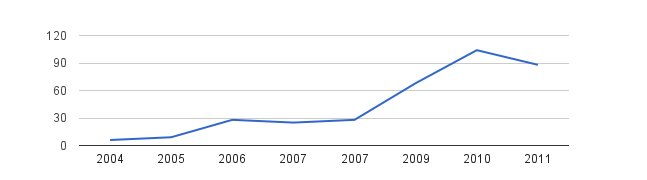
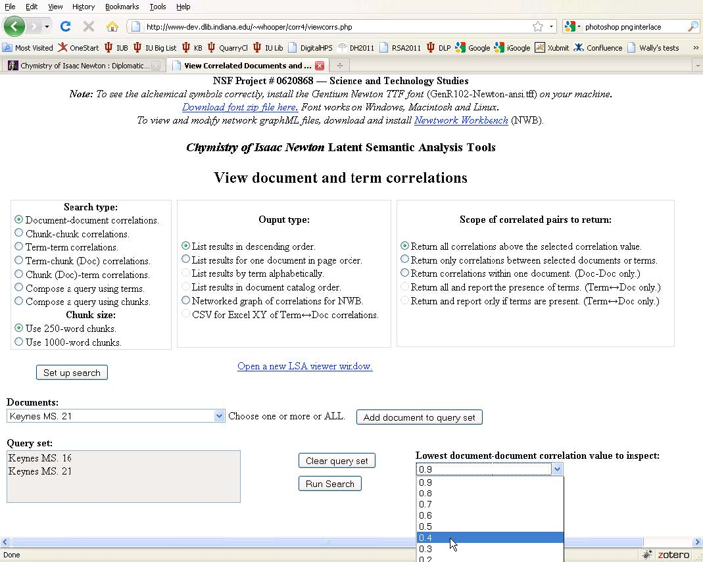
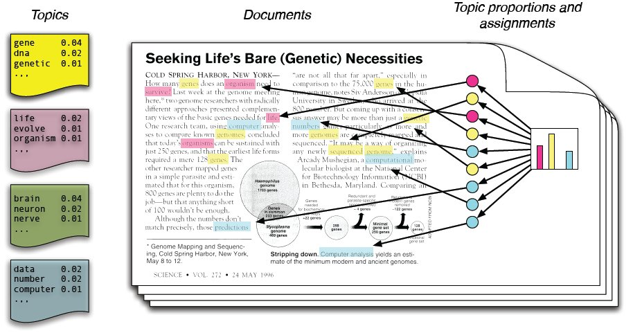
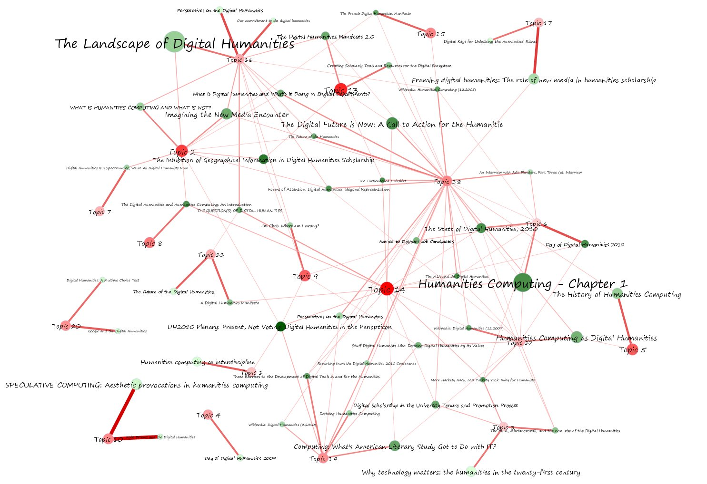

# Topic Modeling and Network Analysis

According
to Google Scholar, David Blei’s first topic modeling paper has received
3,540 citations since 2003. Everybody’s talking about topic
models. Seriously, I’m afraid of visiting my parents this Hanukkah
and hearing them ask “Scott… what’s this topic modeling I keep hearing
all about?” They’re powerful, widely applicable, easy to use, and
difficult to understand — a dangerous combination.

Since shortly after Blei’s first publication, researchers have been
looking into the interplay between networks and topic models. This post
will be about that interplay, looking at how they’ve been combined, what
sorts of research those combinations can drive, and a few pitfalls to
watch out for. I’ll bracket the big elephant in the room until a later
discussion, whether these sorts of models capture the semantic meaning
for which they’re often used. This post also attempts to introduce topic
modeling to those not yet fully ~~converted~~ aware of its potential.

Citations
to Blei (2003) from ISI Web of Science. There are even two citations
already from 2012; where can I get my time machine?

# A brief history of topic modeling

In my [recent post](http://www.scottbot.net/HIAL/?p=129) on [IU’s awesome alchemy project](http://webapp1.dlib.indiana.edu/newton/),
I briefly mentioned Latent Semantic Analysis (LSA) and Latent Dirichlit
Allocation (LDA) during the discussion of topic models. They’re
intimately related, though LSA has been around for quite a bit longer.
Without getting into too much technical detail, we should start with a
brief history of LSA/LDA.

The story starts, more or less, with a [tf-idf](http://en.wikipedia.org/wiki/Tf%E2%80%93idf)
matrix. Basically, tf-idf ranks words based on how important they are
to a document within a larger corpus. Let’s say we want a list of the
most important words for each article in an encyclopedia.

Our first pass is obvious. For each article, just attach a list of
words sorted by how frequently they’re used. The problem with this is
immediately obvious to anyone who has looked at word frequencies; the
top words in the entry on the History of Computing would be “the,”
“and,” “is,” and so forth, rather than “turing,” “computer,” “machines,”
etc. The problem is solved by tf-idf, which scores the words based on
how special they are to a particular document within the larger corpus.
Turing is rarely used elsewhere, but used exceptionally frequently in
our computer history article, so it bubbles up to the top.

## LSA and pLSA

LSA utilizes these tf-idf scores [^1]
within a larger term-document matrix. Every word in the corpus is a
different row in the matrix, each document has its own column, and the
tf-idf score lies at the intersection of every document and word. Our
computing history document will probably have a lot of zeroes next to
words like “cow,” “shakespeare,” and “saucer,” and high marks next to
words like “computation,” “artificial,” and “digital.” This is called a
sparse matrix because it’s mostly filled with zeroes; most documents use
very few words related to the entire corpus.

With this matrix, LSA uses [singular value decomposition](http://en.wikipedia.org/wiki/Singular_value_decomposition)
to figure out how each word is related to every other word. Basically,
the more often words are used together within a document, the more
related they are to one another. [^2]
It’s worth noting that a “document” is defined somewhat flexibly. For
example, we can call every paragraph in a book its own “document,” and
run LSA over the individual paragraphs.

To get an idea of the sort of fantastic outputs you can get with LSA, do check out the implementation over at [The Chymistry of Isaac Newton](http://webapp1.dlib.indiana.edu/newton/lsa/index.php).

Newton Project LSA

The method was significantly improved by Puzicha and Hofmann (1999),
who did away with the linear algebra approach of LSA in favor of a more
statistically sound probabilistic model, called [probabilistic latent semantic analysis](http://en.wikipedia.org/wiki/Probabilistic_latent_semantic_analysis)
(pLSA). Now is the part of the blog post where I start getting
hand-wavy, because explaining the math is more trouble than I care to
take on in this introduction.

Essentially, pLSA imagines an additional layer between words and
documents: topics. What if every document isn’t just a set of words, but
a set of *topics*? In this model, our encyclopedia article about
computing history might be drawn from several topics. It primarily
draws from the big platonic computing topic in the sky, but it also
draws from the topics of history, cryptography, lambda calculus, and all
sorts of other topics to a greater or lesser degree.

Now, these topics don’t actually exist anywhere. Nobody sat down with
the encyclopedia, read every entry, and decided to come up with the 200
topics from which every article draws. pLSA *infers* topics
based on what will hereafter be referred to as black magic. Using the
dark arts, pLSA “discovers” a bunch of topics, attaches them to a list
of words, and classifies the documents based on those topics.

## LDA

Blei et al. ([2003](http://www.cs.princeton.edu/~blei/papers/BleiNgJordan2003.pdf))
vastly improved upon this idea by turning it into a generative model of
documents, calling the model Latent Dirichlet allocation (LDA). By this
time, as well, some sounder assumptions were being made about the
distribution of words and document length — but we won’t get into that.
What’s important here is the generative model.

Imagine you wanted to write a new encyclopedia entry, let’s say about
digital humanities. Well, we now know there are three elements that
make up that process, right? Words, topics, and documents. Using these
elements, how would you go about writing this new article on digital
humanities?

First off, let’s figure out what topics our article will consist of.
It probably draws heavily from topics about history, digitization, text
analysis, and so forth. It also probably draws more weakly from a slew
of other topics, concerning interdisciplinarity, the academy, and all
sorts of other subjects. Let’s go a bit further and assign weights to
these topics; 22% of the document will be about digitization, 19% about
history, 5% about the academy, and so on. Okay, the first step is done!

Now it’s time to pull out the topics and start writing. It’s an easy
process; each topic is a bag filled with words. Lots of words. All sorts
of words. Let’s look in the “digitization” topic bag. It includes words
like “israel” and “cheese” and “favoritism,” but they only appear once
or twice, and mostly by accident. More importantly, the bag also
contains 157 appearances of the word “TEI,” 210 of “OCR,” and 73 of
“scanner.”

LDA Model from Blei (2011)

So here you are, you’ve dragged out your digitization bag and your
history bag and your academy bag and all sorts of other bags as well.
You start writing the digital humanities article by reaching into the
digitization bag (remember, you’re going to reach into that bag for 22%
of your words), and you pull out “OCR.” You put it on the page. You then
reach for the academy bag and reach for a word in there (it happens to
be “teaching,”) and you throw that on the page as well. Keep doing that.
By the end, you’ve got a document that’s all about the digital
humanities. It’s beautiful. Send it in for publication.

## Alright, what now?

So why is the generative nature of the model so important? One of the
key reasons is the ability to work backwards. If I can generate an
(admittedly nonsensical) document using this model, I can also reverse
the process an infer, given any new document and a topic model I’ve
already generated, what the topics are that the new document draws from.

Another factor contributing to the success of LDA is the ability to
extend the model. In this case, we assume there are only documents,
topics, and words, but we could also make a model that assumes authors
who like particular topics, or assumes that certain documents are
influenced by previous documents, or that topics change over time. The
possibilities are endless, as evidenced by the absurd number of topic
modeling variations that have appeared in the past decade. David Mimno
has compiled a [wonderful bibliography](http://www.cs.princeton.edu/~mimno/topics.html) of many such models.

While the generative model introduced by Blei might seem simplistic,
it has been shown to be extremely powerful. When a newcomer sees the
results of LDA for the first time, they are immediately taken by how
intuitive they seem. People sometimes ask me “but didn’t it take forever
to sit down and make all the topics?” thinking that some of the magic
had to be done by hand. It wasn’t. Topic modeling yields intuitive
results, generating what really *feels* like topics as we know them [^3], with virtually no effort on the human side. Perhaps it is the intuitive utility that appeals so much to humanists.

# Topic Modeling and Networks

Topic models can interact with networks in multiple ways. While a lot
of the recent interest in digital humanities has surrounded using
networks to visualize how documents or topics relate to one another, the
interfacing of networks and topic modeling initially worked in the
other direction. Instead of inferring networks from topic models, many
early (and recent) papers attempt to infer topic models from networks.

## Topic Models from Networks

The first research I’m aware of in this niche was from McCallum et al. ([2005](http://dl.acm.org/citation.cfm?id=1642419)). Their model is itself an extension of an earlier LDA-based model called the Author-Topic Model ([Steyvers et al., 2004](http://dl.acm.org/citation.cfm?id=1036902)),
which assumes topics are formed based on the mixtures of authors
writing a paper. McCallum et al. extended that model for directed
messages in their Author-Recipient-Topic (ART) Model. In ART, it is
assumed that topics of letters, e-mails or direct messages between
people can be inferred from knowledge of both the author and the
recipient. Thus, ART takes into account the social structure of a
communication network in order to generate topics. In a later paper ([McCallum et al., 2007](http://www.cs.umass.edu/~mccallum/papers/art-jair07.pdf)), they extend this model to one that infers the roles of authors within the social network.

Dietz et al. ([2007](http://dl.acm.org/citation.cfm?id=1273526))
created a model that looks at citation networks, where documents are
generated by topical innovation and topical inheritance via citations.
Nallapati et al. ([2008](http://dl.acm.org/citation.cfm?id=1401957))
similarly creates a model that finds topical similarity in citing and
cited documents, with the added ability of being able to predict
citations that are not present. Blei himself joined the fray in [2009](https://www.cs.princeton.edu/~blei/papers/ChangBlei2009.pdf),
creating the Relational Topic Model (RTM) with Jonathan Chang, which
itself could summarize a network of documents, predict links between
them, and predict words within them. Wang et al. ([2011](http://ieeexplore.ieee.org/xpl/freeabs_all.jsp?arnumber=5967741&abstractAccess=no&userType=))
created a model that allows for “the joint analysis of text and links
between [people] in a time-evolving social network.” Their model is able
to handle situations where links exist even when there is no similarity
between the associated texts.

## Networks from Topic Models

Some models have been made that infer networks from non-networked text. Broniatowski and Magee ([2010](http://ieeexplore.ieee.org/xpl/freeabs_all.jsp?arnumber=5591237&abstractAccess=no&userType=) & [2011](http://www.springerlink.com/content/w655v786lp583660/))
extended the Author-Topic Model, building a model that would infer
social networks from meeting transcripts. They later added temporal
information, which allowed them to infer status hierarchies and
individual influence within those social networks.

Many times, however, rather than creating new models, researchers
create networks out of topic models that have already been run over a
set of data. There are a lot of benefits to this approach, as
exemplified by the Newton’s Chymistry project highlighted earlier. Using
networks, we can see how documents relate to one another, how they
relate to topics, how topics are related to each other, and how all of
those are related to words.

Elijah Meeks created a wonderful example combining topic models with networks in [Comprehending the Digital Humanities](https://dhs.stanford.edu/comprehending-the-digital-humanities/).
Using fifty texts that discuss humanities computing, Elijah created a
topic model of those documents and used networks to show how documents,
topics, and words interacted with one another within the context of the
digital humanities.

Network generated by Elijah Meeks to show how digital humanities documents relate to one another via the topics they share.

~~Elijah~~ Jeff Drouin has also created networks of topic models in [Proust](https://dhs.stanford.edu/algorithmic-literacy/topic-networks-in-proust/), as reported by Elijah.

[Peter Leonard](http://home.uchicago.edu/psleonar/) recently directed me to [TopicNets](http://www.ics.uci.edu/~asuncion/pubs/TIST_11.pdf),
a project that combines topic modeling and network analysis in order to
create an intuitive and informative navigation interface for documents
and topics. This is a great example of an interface that turns topic
modeling into a useful scholarly tool, even for those who know
little-to-nothing about networks or topic models.

If you want to do something like this yourself, Shawn Graham recently posted [a great tutorial](http://electricarchaeologist.wordpress.com/2011/11/11/topic-modeling-with-the-java-gui-gephi/)
on how to create networks using MALLET and Gephi quickly and easily.
Prepare your corpus of text, get topics with MALLET, prune the CSV, make
a network, visualize it! Easy as pie.

Networks can be a great way to represent topic models. Beyond simple
uses of navigation and relatedness as were just displayed, combining the
two will put the whole battalion of network analysis tools at
the researcher’s disposal. We can use them to find communities of
similar documents, pinpoint those documents that were most influential
to the rest, or perform any of a number of other workflows designed for
network analysis.

As with anything, however, there are a few setbacks. Topic models are
rich with data. Every document is related to every other document, if
some only barely. Similarly, every topic is related to every other
topic. By deciding to represent document similarity over a network, you
must make the decision of precisely *how similar* you want a
set of documents to be if they are to be linked. Having a network with
every document connected to every other document is scarcely useful, so
generally we’ll make our decision such that each document is linked to
only a handful of others. This allows for easier visualization and
analysis, but it also destroys much of the rich data that went into the
topic model to begin with. This information can be more fully preserved
using other techniques, such as [multidimensional scaling](http://en.wikipedia.org/wiki/Multidimensional_scaling).

A somewhat more theoretical complication makes these network
representations useful as a tool for navigation, discovery, and
exploration, but not necessarily as evidentiary support. Creating a
network of a topic model of a set of documents piles on abstractions.
Each of these systems comes with very different assumptions, and it is
unclear what complications arise when combining these methods *ad hoc*.

# Getting Started

Although there may be issues with the process, the combination of
topic models and networks is sure to yield much fruitful research in the
digital humanities. There are some fantastic tutorials out there for
getting started with topic modeling in the humanities, such as Shawn
Graham’s post on [Getting Started with MALLET and Topic Modeling](http://electricarchaeologist.wordpress.com/2011/08/30/getting-started-with-mallet-and-topic-modeling/), as well as on combining them with networks, such as [this post](http://electricarchaeologist.wordpress.com/2011/11/11/topic-modeling-with-the-java-gui-gephi/) from the same blog. Shawn is right to point out [MALLET](http://mallet.cs.umass.edu/),
a great tool for starting out, but you can also find the code used for
various models on many of the model-makers’ academic websites. One code
package that stands out is Chang’s [implementation of LDA and related models](http://cran.r-project.org/web/packages/lda/index.html) in R.

Airoldi, Edoardo M., David M. Blei, Stephen E. Fienberg, and Eric P. Xing. 2008. “Mixed Membership Stochastic Blockmodels.” *The Journal of Machine Learning Research* 9 (June): 1981–2014. [http://dl.acm.org/citation.cfm?id=1390681.1442798](http://dl.acm.org/citation.cfm?id=1390681.1442798 "Mixed Membership Stochastic Blockmodels").

AlSumait, Loulwah, Daniel Barbará, James Gentle,
and Carlotta Domeniconi. 2009. “Topic Significance Ranking of LDA
Generative Models.” In *Machine Learning and Knowledge Discovery in Databases*,
edited by Wray Buntine, Marko Grobelnik, Dunja Mladenić, and John
Shawe-Taylor, 5781:67–82. Berlin, Heidelberg: Springer Berlin
Heidelberg. [http://www.springerlink.com/content/v3jth868647716kg/](http://www.springerlink.com/content/v3jth868647716kg/ "Topic Significance Ranking of LDA Generative Models").

Bamman, David, Brendan O’Connor, and Noah Smith. 2013. “Learning Latent Personas of Film Characters.” In *Proceedings of the Annual Meeting of the Association for Computational Linguistics*. Sofia, Bulgaria.

Binder, Jeffrey M., and Collin Jennings. 2014. “Visibility and Meaning in Topic Models and 18th-century Subject Indexes.” *Literary and Linguistic Computing* (May 7): fqu017. [doi:10.1093/llc/fqu017](http://dx.doi.org/10.1093/llc/fqu017). [http://llc.oxfordjournals.org/content/early/2014/05/06/llc.fqu017](http://llc.oxfordjournals.org/content/early/2014/05/06/llc.fqu017 "Visibility and meaning in topic models and 18th-century subject indexes").

Blei, David M. 2012. “Probabilistic Topic Models.” *Communications of the ACM* 55 (4) (April 1): 77. [doi:10.1145/2133806.2133826](http://dx.doi.org/10.1145/2133806.2133826). [http://cacm.acm.org/magazines/2012/4/147361-probabilistic-topic-models/fulltext](http://cacm.acm.org/magazines/2012/4/147361-probabilistic-topic-models/fulltext "Probabilistic topic models").

Blei, David M. 2011. “Introduction to Probabilistic Topic Models.” *Communications of the ACM*.

Blei, David M., and John D. Lafferty. 2006. “Dynamic Topic Models.” In *Proceedings of the 23rd International Conference on Machine Learning*, 113–120. ICML  ’06. New York, NY, USA: ACM. [doi:10.1145/1143844.1143859](http://dx.doi.org/10.1145/1143844.1143859). [http://doi.acm.org/10.1145/1143844.1143859](http://doi.acm.org/10.1145/1143844.1143859 "Dynamic topic models").

Blei, David M., and John D. Lafferty. 2007. “A Correlated Topic Model of Science.” *The Annals of Applied Statistics* 1 (1) (June 1): 17–35. [http://www.jstor.org/stable/4537420](http://www.jstor.org/stable/4537420 "A Correlated Topic Model of Science").

Blei, David M., Andrew Y. Ng, and Michael I. Jordan. 2003. “Latent Dirichlet Allocation.” *J. Mach. Learn. Res.* 3 (March): 993–1022. [http://dl.acm.org/citation.cfm?id=944919.944937](http://dl.acm.org/citation.cfm?id=944919.944937 "Latent dirichlet allocation").

Block, Sharon. 2006. “Doing More with Digitization.” *Common-Place* 6 (2) (January).

Boyd-Graber, Jordan, and David M. Blei. 2009. “Multilingual Topic Models for Unaligned Text.” In *Proceedings of the Twenty-Fifth Conference on Uncertainty in Artificial Intelligence*, 75–82. UAI  ’09. Arlington, Virginia, United States: AUAI Press. [http://dl.acm.org/citation.cfm?id=1795114.1795124](http://dl.acm.org/citation.cfm?id=1795114.1795124 "Multilingual topic models for unaligned text").

Broniatowski, David A., and Christopher L. Magee.
2011. “Towards a Computational Analysis of Status and Leadership Styles
on FDA Panels.” In *Social Computing, Behavioral-Cultural Modeling and Prediction*,
edited by John Salerno, Shanchieh Jay Yang, Dana Nau, and Sun-Ki Chai,
6589:212–218. Berlin, Heidelberg: Springer Berlin Heidelberg. [http://www.springerlink.com/content/w655v786lp583660/](http://www.springerlink.com/content/w655v786lp583660/ "Towards a Computational Analysis of Status and Leadership Styles on FDA Panels").

Broniatowski, David A., and Christopher L. Magee.
2010. “Analysis of Social Dynamics on FDA Panels Using Social Networks
Extracted from Meeting Transcripts.” In *2010 IEEE Second International Conference on Social Computing (SocialCom)*, 329–334. IEEE. [doi:10.1109/SocialCom.2010.54](http://dx.doi.org/10.1109/SocialCom.2010.54).

Chaney, Allison J.B., and David M. Blei. 2012. “Visualizing Topic Models.” In Dublin, Ireland.

Chang, Jonathan, and David M. Blei. 2010. “Hierarchical Relational Models for Document Networks.” *The Annals of Applied Statistics* 4 (1) (March): 124–150. [doi:10.1214/09-AOAS309](http://dx.doi.org/10.1214/09-AOAS309). [http://projecteuclid.org/euclid.aoas/1273584450](http://projecteuclid.org/euclid.aoas/1273584450 "Hierarchical relational models for document networks").

Chang, Jonathan, and David M. Blei. 2009. “Relational Topic Models for Document Networks.” In *Proceedings of the 12th International Conference on AI and Statistics*. Clearwater Beach, Florida. [http://citeseerx.ist.psu.edu/viewdoc/summary?doi=10.1.1.186.6279](http://citeseerx.ist.psu.edu/viewdoc/summary?doi=10.1.1.186.6279 "Relational topic models for document networks").

Dietz, Laura, Steffen Bickel, and Tobias Scheffer. 2007. “Unsupervised Prediction of Citation Influences.” In *Proceedings of the 24th International Conference on Machine Learning*, 233–240. ICML  ’07. New York, NY, USA: ACM. [doi:10.1145/1273496.1273526](http://dx.doi.org/10.1145/1273496.1273526). [http://doi.acm.org/10.1145/1273496.1273526](http://doi.acm.org/10.1145/1273496.1273526 "Unsupervised prediction of citation influences").

Erosheva, Elena, Stephen E. Fienberg, and John D. Lafferty. 2004. “Mixed-membership Models of Scientific Publications.” *Proceedings of the National Academy of Sciences* 101 (January 23): 5220–5227. [doi:10.1073/pnas.0307760101](http://dx.doi.org/10.1073/pnas.0307760101). [http://www.pnas.org/content/101/suppl.1/5220.short](http://www.pnas.org/content/101/suppl.1/5220.short "Mixed-membership models of scientific publications").

Gardner, Matthew J., Joshua Lutes, Jeff Lund,
Josh Hansen, Dan Walker, Eric Ringger, and Kevin Seppi. 2010. “The Topic
Browser: An Interactive Tool for Browsing Topic Models.” In .

Gerrish, Sean, and David M. Blei. 2010. “A Language-based Approach to Measuring Scholarly Impact.” In *Proceedings of the 26th International Conference on Machine Learning*. Haifa, Israael. [http://www.cs.princeton.edu/ blei/papers/GerrishBlei2010.pdf](http://www.cs.princeton.edu/%20blei/papers/GerrishBlei2010.pdf "A language-based approach to measuring scholarly impact").

Gerrish, Sean, and David M. Blei. 2009. “Modeling
Influence in Text Corpora” presented at the NIPS Workshop on
Applications for Topic Models: Text and Beyond., Whistler, Canada.

Girolami, Mark, and Ata Kabán. 2003. “On an Equivalence Between PLSI and LDA.” In *Proceedings of the 26th Annual International ACM SIGIR Conference on Research and Development in Informaion Retrieval*, 433–434. SIGIR  ’03. New York, NY, USA: ACM. [doi:10.1145/860435.860537](http://dx.doi.org/10.1145/860435.860537). [http://doi.acm.org/10.1145/860435.860537](http://doi.acm.org/10.1145/860435.860537 "On an equivalence between PLSI and LDA").

Goldstone, Andrew, and Ted Underwood. 2012. “What
Can Topic Models of PMLA Teach Us About the History of Literary
Scholarship?” Blog. *ARCADE*. 12–14. [http://arcade.stanford.edu/blogs/what-can-topic-models-pmla-teach-us-about-history-literary-scholarship](http://arcade.stanford.edu/blogs/what-can-topic-models-pmla-teach-us-about-history-literary-scholarship "What can topic models of PMLA teach us about the history of literary scholarship?").

Gretarsson, Brynjar, John O’Donovan, Svetlin
Bostandjiev, Tobias Hollerer, Arthur Asuncion, David Newman, and
Padhraic Smyth. 2011. “TopicNets: Visual Analysis of Large Text Corpora
with Topic Modeling.” In *ACM Transactions on Intelligent Systems and Technology*, 5:1–26.

Hall, David, Daniel Jurafsky, and Christopher D. Manning. 2008. “Studying the History of Ideas Using Topic Models.” In *Proceedings of the Conference on Empirical Methods in Natural Language Processing*, 363–371. EMNLP  ’08. Stroudsburg, PA, USA: Association for Computational Linguistics. [http://dl.acm.org/citation.cfm?id=1613715.1613763](http://dl.acm.org/citation.cfm?id=1613715.1613763 "Studying the history of ideas using topic models").

Jockers, Matthew. 2013. *Macroanalysis: Digital Methods and Literary History*. UIUC Press.

Laudun, John, and Jonathan Goodwin. 2013.
“Computing Folklore Studies: Mapping over a Century of Scholarly
Production through Topics.” *Journal of American Folklore* 126 (502) (Autumn): 455–475. [doi:10.1353/jaf.2013.0063](http://dx.doi.org/10.1353/jaf.2013.0063). [http://muse.jhu.edu/login?auth=0&type;=summary&url;=/journals/journal_of_american_folklore/v126/126.502.laudun.html](http://muse.jhu.edu/login?auth=0&type=summary&url=/journals/journal_of_american_folklore/v126/126.502.laudun.html "Computing Folklore Studies: Mapping over a Century of Scholarly Production through Topics").

McCallum, Andrew, Andrés Corrada-Emmanuel, and Xuerui Wang. 2005. “Topic and Role Discovery in Social Networks.” In *Proceedings of the 19th International Joint Conference on Artificial Intelligence*, 786–791. IJCAI’05. San Francisco, CA, USA: Morgan Kaufmann Publishers Inc. [http://dl.acm.org/citation.cfm?id=1642293.1642419](http://dl.acm.org/citation.cfm?id=1642293.1642419 "Topic and role discovery in social networks").

McCallum, Andrew, Xuerui Wang, and Andrés
Corrada-Emmanuel. 2007. “Topic and Role Discovery in Social Networks
with Experiments on Enron and Academic Email.” *Journal of Artificial Intelligence Research* 30 (1) (October): 249–272. [http://dl.acm.org/citation.cfm?id=1622637.1622644](http://dl.acm.org/citation.cfm?id=1622637.1622644 "Topic and role discovery in social networks with experiments on enron and academic email").

Mei, Qiaozhu, Deng Cai, Duo Zhang, and ChengXiang Zhai. 2008. “Topic Modeling with Network Regularization.” In *Proceeding of the 17th International Conference on World Wide Web*, 101–110. WWW  ’08. New York, NY, USA: ACM. [doi:10.1145/1367497.1367512](http://dx.doi.org/10.1145/1367497.1367512). [http://doi.acm.org/10.1145/1367497.1367512](http://doi.acm.org/10.1145/1367497.1367512 "Topic modeling with network regularization").

Mimno, David. 2012. “Computational Historiography: Data Mining in a Century of Classics Journals.” *J. Comput. Cult. Herit.* 5 (1) (April): 3:1–3:19. [doi:10.1145/2160165.2160168](http://dx.doi.org/10.1145/2160165.2160168). [http://doi.acm.org/10.1145/2160165.2160168](http://doi.acm.org/10.1145/2160165.2160168 "Computational historiography: Data mining in a century of classics journals").

Mimno, David, and Andrew McCallum. 2007. “Mining a Digital Library for Influential Authors.” In *Proceedings of the 7th ACM/IEEE-CS Joint Conference on Digital Libraries*, 105–106. JCDL  ’07. New York, NY, USA: ACM. [doi:10.1145/1255175.1255196](http://dx.doi.org/10.1145/1255175.1255196). [http://doi.acm.org/10.1145/1255175.1255196](http://doi.acm.org/10.1145/1255175.1255196 "Mining a digital library for influential authors").

Nallapati, Ramesh M., Amr Ahmed, Eric P. Xing,
and William W. Cohen. 2008. “Joint Latent Topic Models for Text and
Citations.” In *Proceeding of the 14th ACM SIGKDD International Conference on Knowledge Discovery and Data Mining*, 542–550. KDD  ’08. New York, NY, USA: ACM. [doi:10.1145/1401890.1401957](http://dx.doi.org/10.1145/1401890.1401957). [http://doi.acm.org/10.1145/1401890.1401957](http://doi.acm.org/10.1145/1401890.1401957 "Joint latent topic models for text and citations").

Newman, David J., and Sharon Block. 2006. “Probabilistic Topic Decomposition of an Eighteenth-century American Newspaper.” *Journal of the American Society for Information Science and Technology* 57 (6) (April): 753–767. [doi:10.1002/asi.20342](http://dx.doi.org/10.1002/asi.20342). [http://doi.wiley.com/10.1002/asi.20342](http://doi.wiley.com/10.1002/asi.20342 "Probabilistic topic decomposition of an eighteenth-century American newspaper").

Riddell, Allen B. 2012. “How to Read 22,198
Journal Articles: Studying the History of German Studies with Topic
Models.” In St. Louis, MO. [http://ariddell.org/static/how-to-read-n-articles.pdf](http://ariddell.org/static/how-to-read-n-articles.pdf "How to Read 22,198 Journal Articles: Studying the History of German Studies with Topic Models").

Rosen-Zvi, Michal, Thomas Griffiths, Mark
Steyvers, and Padhraic Smyth. 2004. “The Author-topic Model for Authors
and Documents.” In *Proceedings of the 20th Conference on Uncertainty in Artificial Intelligence*, 487–494. UAI  ’04. Arlington, Virginia, United States: AUAI Press. [http://dl.acm.org/citation.cfm?id=1036843.1036902](http://dl.acm.org/citation.cfm?id=1036843.1036902 "The author-topic model for authors and documents").

Rusch, Thomas, Paul Hofmarcher, Reinhold
Hatzinger, and Kurt Hornik. 2013. “Model Trees with Topic Model
Pre-processing: An Approach for Data Journalism Illustrated with the
WikiLeaks Afghanistan War Logs.” *The Annals of Applied Statistics*.

Steyvers, Mark, and Thomas Griffiths. 2006. “Probabilistic Topic Models.” In *Latent Semantic Analysis: A Road to Meaning*, edited by T. Landauer, D. McNamara, S. Dennis, and W. Kintsch, 427:424–440.

Tangherlini, Timothy R., and Peter Leonard. 2014.
“Trawling in the Sea of the Great Unread: Sub-corpus Topic Modeling and
Humanities Research.” *Poetics*. [doi:10.1016/j.poetic.2013.08.002](http://dx.doi.org/10.1016/j.poetic.2013.08.002). [http://www.sciencedirect.com/science/article/pii/S0304422X13000648](http://www.sciencedirect.com/science/article/pii/S0304422X13000648 "Trawling in the Sea of the Great Unread: Sub-corpus topic modeling and Humanities research").

Wang, Eric, Jorge Silva, Rebecca Willett, and
Carin Carin. 2011. “Dynamic Relational Topic Model for Social Network
Analysis with Noisy Links.” In *2011 IEEE Statistical Signal Processing Workshop (SSP)*, 497–500. IEEE. [doi:10.1109/SSP.2011.5967741](http://dx.doi.org/10.1109/SSP.2011.5967741).

[^1]: Ted
    Underwood rightly points out in the comments that other scoring systems
    are often used in lieu of tf-idf, most frequently log entropy.
[^2]: Yes
    yes, this is a simplification of actual LSA, but it’s pretty much how
    it works. SVD reduces the size of the matrix to filter out noise, and
    then each word row is treated as a vector shooting off in some
    direction. The vector of each word is compared to every other word, so
    that every pair of words has a relatedness score between them. Ted
    Underwood has a [great blog post](http://tedunderwood.wordpress.com/2011/10/16/lsa-is-a-marvellous-tool-but-humanists-may-no-use-it-the-way-computer-scientists-do/) about why humanists should avoid the SVD step.
[^3]: They’re not, of course. We’ll worry about that later.

---

## Reader Comments

> **Ted Underwood**, 2011-11-16 13:34
>
> Excellent, clear post, and I really appreciate the links to the Isaac Newton Chymistry project and TopicNets. Very helpful.
>
> I’m deeply into a variant of LSA at the moment, so I’m
> disproportionately interested in a couple of details that most people
> won’t care about. E.g., I’m not sure that most versions of LSA actually
> use tf-idf scores in the term-doc matrix. I think the more common
> version may use log-entropy weighting instead of tf-idf weighting.
>
> I actually prefer a different weighting scheme that I haven’t seen
> used widely, which is basically Observed frequency – Expected frequency.
> I would also argue that literary scholars are better off skipping the
> Singular Value Decomposition step, for reasons explained here: [http://
> tedunderwood.wordpress.com/2011/10/16/lsa-is-a-marvellous-tool-but-
> humanists-may-no-use-it-the-way-computer-scientists-do/](http://tedunderwood.wordpress.com/2011/10/16/lsa-is-a-marvellous-tool-but-humanists-may-no-use-it-the-way-computer-scientists-do/)
>
> But to stop geeking out about LSA and return to the main point: very
> helpful post. I haven’t yet tried the generative methods (pLSA and LDA),
> because I’m so happy with LSA itself, but I know people are excited
> about them and I intend to compare results systematically at some point
> this winter.

>> **scottbot**, 2011-11-16 14:42
>>
>> Thanks! I think you’re right about the
>> tf-idf weighting, I just figured that people just approaching LSA would
>> be more familiar with tf-idf. I’ve added a note referencing your
>> comment, though, because the standard certainly ought to be mentioned.
>>
>> That’s a great post, I’ve never thought about the issues of SVD for
>> the purposes of the humanities. While SVD in LSA is still useful for
>> most of my historical retrieval needs, you make a very good point about
>> humanists needing to think very carefully about the nitty-gritty details
>> of algorithms that were built with other purposes in mind.
>>
>> Good luck on your generative model exploration – while pLSA can
>> technically be mathematically equivalent to LDA, it’s a lot more
>> bothersome and misses some of LDA’s functionality, so I’d definitely
>> recommend the latter. LDA and LSA definitely serve two very different
>> purposes; for yours, outlined in the anti-SVD post, LSA is probably more
>> well-suited.
>>
>> Thanks for the comments… I feel like I’ve come to the DH-Text
>> Analysis-Blog party late in the game, and I’ve been trying to read
>> through yours to catch up!

> **Matt Erlin**, 2011-11-16 13:52
>
> Great post, Scott! I found the historical section particularly helpful for getting a sense of how topic modeling has evolved.

>> **scottbot**, 2011-11-16 14:43
>>
>> Thanks! Glad you found it useful.

> **Allen Riddell**, 2011-11-21 15:37
>
> Great post. I’ve been hoping that
> someone would explain how the extensibility of LDA makes it quite a
> different kind of beast (relative to LSA).
>
> The original LDA paper is actually pretty good on this. Another good
> place is the 2010 Rosen-Zvi, M., Griffiths, T., Steyvers, M., &
> Smyth, P. expanded write-up of the author-topic model. Once you get a
> bit beyond LDA it’s clear there’s something being done that can’t be
> done with LSA. Here’s the citation:
>
> Learning author-topic models from text corpora. M Rosen-Zvi, C
> Chemudugunta, T Griffiths, P Smyth, M Steyvers, ACM Transactions on
> Information Systems (TOIS), ACM, 2010. <http://www.datalab.uci.edu/papers/AT_tois.pdf>

