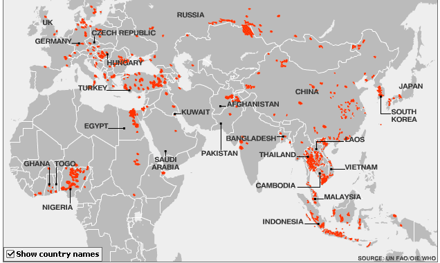
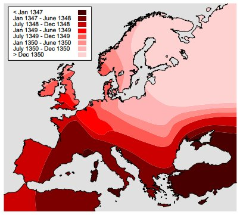

*Note: The conversion of this scholarly blog post to a website (via markdown) was assisted with an LLM. Errors likely exist. To correct errors or to issue a copyright takedown request, please reach out to weingart.scott+dossier@gmail.com or create a pull request.*

# Historians, Doctors, and their Absence

[Note: sorry for the lack of polish on the post compared to others. This was hastily written before a day of international travel. Take it with however many grains of salt seem appropriate under the circumstances.]

[Author’s note two: Whoops! Never included the link to the article. [Here it is](http://arxiv.org/abs/1310.2636).]

Every once in a while, [^1] a group of exceedingly clever mathematicians and physicists decide to do something exceedingly clever on something that has nothing to do with math or physics. This particular research project has to do with the 14th Century Black Death, resulting in such claims as the small-world network effect is a completely modern phenomenon, and “most social exchange among humans before the modern era took place via face-to-face interaction.”

The article itself is really cool. And really clever! I didn’t think of it, and I’m angry at myself for not thinking of it. They look at the empirical evidence of the spread of disease in the late middle ages, and note that the pattern of disease spread looked shockingly different than patterns of disease spread today. Epidemiologists have long known that today’s patterns of disease propagation are dependent on social networks, and so it’s not a huge leap to say that if earlier diseases spread differently, their networks must have been different too.

Don’t get me wrong, that’s *really fantastic*. I wish more people (read: me) would make observations like this. It’s the sort of observation that allows historians to infer facts about the past with reasonable certainty given tiny amounts of evidence. The problem is, the team had neither any doctors, nor any historians of the late middle ages, and it turned an otherwise great paper into a set of questionable conclusions.

Small world networks have a formal mathematical definition, which (essentially) states that no matter how big the population of the world gets, everyone is within a few degrees of separation from *you*. Everyone’s an acquaintance of an acquaintance of an acquaintance of an acquaintance. This non-intuitive fact is what drives the insane speeds of modern diseases; today, an epidemic can spread from Australia to every state in the U.S. in a matter of days. Due to this, disease spread maps are weirdly patchy, based more around how people travel than geographic features.

*Patchy h5n1 outbreak map.*

The map of the spread of black death in the 14th century looked very different. Instead of these patches, the disease appeared to spread in very deliberate waves, at a rate of about 2km/day.

*Spread of the plague, via the original article.*

How to reconcile these two maps? The solution, according to the network scientists, was to create a model of people interacting and spreading diseases across various distances and types of networks. Using the models, they show that in order to generate these wave patterns of disease spread, the physical contact network cannot be small world. From this, because they make the (uncited) claimed that physical contact networks had to be a subset of social contact networks (entirely ignoring, say, correspondence), the 14th century did not have small world social networks.

There’s a lot to unpack here. First, their model does not take into account the fact that people, y’know, die after they get the plague. Their model assumes infected have enough time and impetus to travel to get the disease as far as they could after becoming contagious. In the discussion, the authors do realize this is a stretch, but suggest that because, people *could* if they so choose travel 40km/day, and the black death only spread 2km/day, this is not sufficient to explain the waves.

I am no plague historian, nor a doctor, but a brief trip on the google suggests that black death symptoms could manifest in hours, and a swift death comes only days after. It is, I think, unlikely that people would or could be traveling great distances after symptoms began to show.

More important to note, however, are the assumptions the authors make about social ties in the middle ages. They assume a social tie must be a physical one; they assume social ties are connected with mobility; and they assume social ties are constantly maintained. This is a bit before my period of research, but only a hundred years later (still before the period the authors claim could have sustained small world networks), but any early modern historian could tell you that communication was asynchronous and travel was ordered and infrequent.

Surprisingly, I actually believe the authors’ conclusions: that by the strict mathematical definition of small world networks, the “pre-modern” world might not have that feature. I *do* think distance and asynchronous communication prevented an entirely global 6-degree effect. That said, the assumptions they make about what a social tie is are entirely modern, which means their conclusion is essentially inevitable: historical figures did not maintain modern-style social connections, and thus metrics based on those types of connections should not apply. Taken in the social context of the Europe in the late middle ages, however, I think the authors would find that the salient features of small world networks (short average path length and high clustering) exist in that world as well.

A second problem, and the reason I agree with the authors that there was not a global small world in the late 14th century, is because “global” is not an appropriate axis on which to measure “pre-modern” social networks. Today, we can reasonably say we all belong to a global population; at that point in time, before trade routes from Europe to the New World and because of other geographical and technological barriers, the world should instead have been seen as a set of smaller, overlapping populations. My guess is that, for more reasonable definitions of populations for the time period, small world properties would continue to hold in this time period.

Notes:

[^1]: Every day? Every two days?

---

## Reader Comments

> **Yannick Rochat**, 2013-10-24 18:36
>
> It reminds me of another Newman article : [http://arxiv.org/abs/cond-mat/0305612](http://arxiv.org/abs/cond-mat/0305612)
>
>
>
> In the case of the plague article, I feel like you (an historian) were not supposed to find it. Like if it were storytelling for engineers. Let’s hope that such a work, made without the help of a researcher in (digital ?) humanities, and with quite no sources from work of historians, doesn’t become a reference on this subject, but remains at most one about that spread-with-jumps algorithm.
>
>
>
> There should be a blog about such articles.
>
>
>
> Thanks for your post.

> **Jack Rigby**, 2014-03-05 07:33
>
> Now this *IS* fascinating!
>  The problem with trying to establish the actual truth, as distinct from the political truth, is that academically, it can mean professional death, or in the case of some industries, (Tobacco) real death.
>  I wrote a long lost dissent 40 years ago about plague/disease characteristics and the key point was:
>  “Hellooo?? Nobody with the Black Death infection travels far at all”
>
>
>
> It was tied in to the nonsense about the origin of Man being in Africa, a totally geo-unstable place compared to Australia, where the locals have stories about the “DreamtimeS” ( two lots of 20,000 year memories) and “going out into the world – where everybody was dead from the cold.”
>
>
>
> One of the big catches in disease research is the blatant lies told by the “Vested Interests” protecting their interests.
>  But one can find valid information by looking in esoteric areas like the international battle to get rid of the literal health horrors of SODIUM Fluoride and actually track deterioration in the health of entire populations’ “with no DISCERNIBLE reason.” (Officially)
