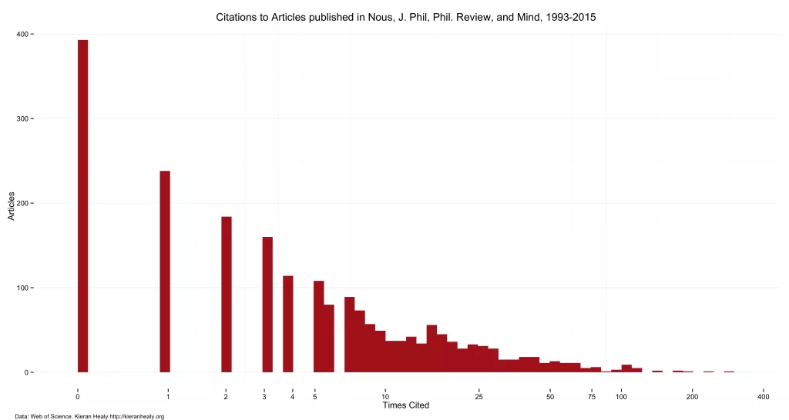
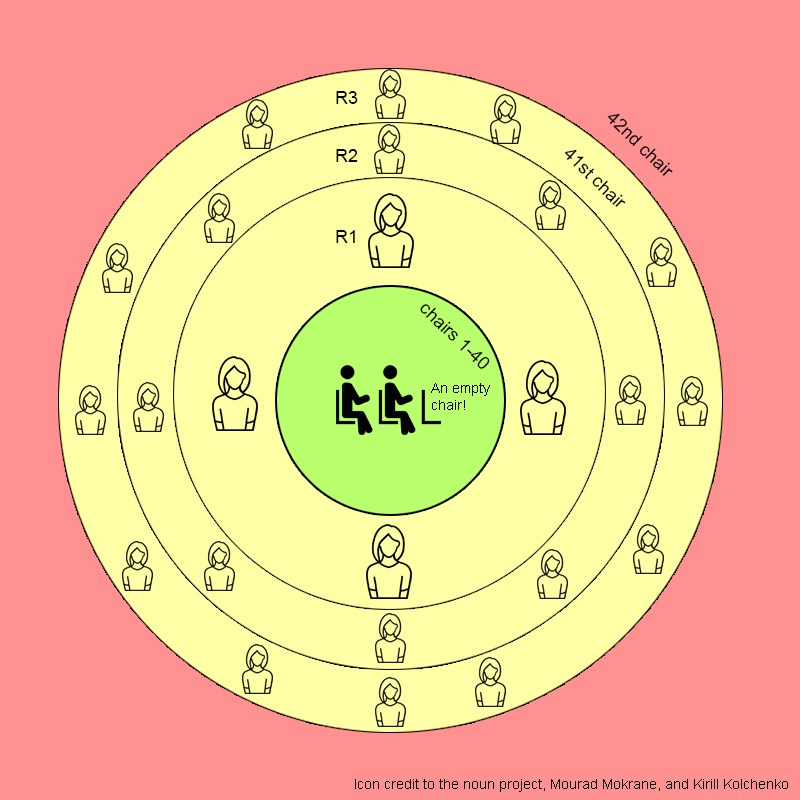

---
# --- post identity ---
title: "Who sits in the 41st chair?"
authors:
  - { family: "Weingart", given: "Scott B.", display: "scott b. weingart", url: "http://scottbot.net/author/admin/" }
post_date: "2016-03-25"
modified_date: "2016-03-25"

# --- blog identity ---
blog_title: "the scottbot irregular"
blog_tagline: "data are everywhen"
blog_url: "http://scottbot.net:80/"
blog_platform: "WordPress"

# --- categorization ---
categories: ["personal research"]
tags: ["ABMs", "academia", "bias", "complexity", "diffusion", "history of science", "human dynamics", "macroanalysis", "network analysis", "scholarly communication", "scientonomy", "social networks"]

# --- archival provenance ---
original_url: "http://scottbot.net:80/who-sits-in-the-41st-chair/"
archive_url: "https://web.archive.org/web/20160610214035/http://scottbot.net:80/who-sits-in-the-41st-chair/"
archive_date: "2016-06-10"
archive_timestamp: "20160610214035"

# --- descriptive ---
language: "en"

# --- comments ---
comments_preserved: true
comment_count: 5

# --- provenance ---
source_html: "Who_sits_in_the_41st_chair____the_scottbot_irregular.htm"
source_html_sha256: "f659668f11a7f313368df44bb944b97f667a40f6dd3420fcf26d8de72d2761e4"
extraction_date: "2026-05-11"
extraction_tool: "claude scholarly-blog-html-to-markdown skill"
extraction_notes: |
  Wayback toolbar and injected scripts stripped. Post body taken from article.hentry > .entry-content. Body preserved verbatim. WordPress chrome (sharedaddy, jp-relatedposts, sidebar widgets, post-navigation, comment form) removed. Simple Footnotes plugin output converted to Markdown footnote syntax (2 footnotes). All 13 body images localized from user-supplied uploads (13/13 matched). Hyperlinks (including [via] credit links in captions) preserved with original URLs (Wayback rewrites stripped). All 5 reader comments preserved with thread depth.
---
*Note: The conversion of this scholarly blog post to a website (via markdown) was assisted with an LLM. Errors likely exist. To correct errors or to issue a copyright takedown request, please reach out to weingart.scott+dossier@gmail.com or create a pull request.*

# Who sits in the 41st chair?

*By scott b. weingart · 2016-03-25*

**tl;dr** Rich-
get-richer academic prestige in a scarce job market makes meritocracy
impossible. Why some things get popular and others don’t. Also
agent-based simulations.

**Slightly longer tl;dr** This post is about why
academia isn’t a meritocracy, at no intentional fault of those in power
who try to make it one. None of presented ideas are novel on their own,
but I do intend this as a novel conceptual contribution in its
connection of disparate threads. Especially, I suggest the
predictability of research success in a scarce academic economy as a
theoretical framework for exploring successes and failures in the
history of science.

But mostly I just beat a “musical chairs” metaphor to death.

# Positive Feedback

**To the victor go the spoils, and to the spoiled go the victories.**
Think about it: the Yankees; Alexander the Great;
Stanford University. Why do the Yankees have twice as many World
Series appearances as their nearest competitors, how was Alex’s
empire so fucking vast, and why does Stanford get all the cool grants?

The rich get richer. Enough World Series victories, and the Yankees
get the reputation and funding to entice the best players. Ol’ Allie-G
inherited an amazing army, was taught by Aristotle, and pretty much
every place he conquered increased his military’s numbers. Stanford’s
known for amazing tech innovation, so they get the funding, which means
they can afford even more innovation, which means *even more*
people think they’re worthy of funding, and so on down the line until
Stanford and its neighbors (Google, Apple, etc.) destroy the local real
estate market and then accidentally blow up the world.

![Alexander's Empire [via]](images/SBW-031-img-001.webp)

*Alexander’s Empire [[via](http://faculty.etsu.edu/kortumr/08hellenistic/htmdescriptionpages/01map.htm)]*

Okay, maybe I exaggerated that last bit.

Point is, power begets power. Scientists call this a *positive feedback loop*: when a thing’s size is exactly what makes it grow larger.

You’ve heard it firsthand when a microphoned singer walks too
close to her speaker. First the mic picks up what’s already coming
out of the speaker. The mic, doings its job, sends what it hears to an
amplifier, sending an even louder version to the very same speaker. The
speaker replays a louder version of what it just produced, which is once
again received by the microphone, until sound **feeds back** onto
itself enough times to produce the ear-shattering squeal fans of
live music have come to dread. This is a positive feedback loop.

![Feedback loop. [via]](images/SBW-031-img-002.jpg)

*Feedback loop. [[via](http://tecnoiglesia.com/2013/02/como-eliminar-la-retroalimentacion-de-audio-feedback-con-ecualizacion/)]*

Positive feedback loops are everywhere. They’re why [the universe counts logarithmically rather than linearly](http://scottbot.net/networks-demystified-3-the-power-law-rant/),
or why income inequality is so common in free market economies.
Left to their own devices, the rich tend to get richer,
since it’s easier to make money when you’ve already got some.

Science and academia are equally susceptible to positive feedback
loops. Top scientists, the most well-funded research institutes, and
world-famous research all got to where they are, in part, because of
something called the *Matthew Effect*.

# Matthew Effect

The [Matthew Effect](https://en.wikipedia.org/wiki/Matthew_effect) isn’t the reality TV show it sounds like.

> For unto every one that hath shall be given, and he shall
> have abundance: but from him that hath not shall be taken even that
> which he hath. —Matthew 25:29, King James Bible.

It’s the Biblical idea that the rich get richer, and it’s become a
popular party trick among sociologists (yes, sociologists go to parties)
describing how society works. In academia, the phrase is brought up
alongside evidence that shows previous grant-recipients are more likely
to receive new grants than their peers, and the more money a researcher
has been awarded, the more they’re likely to get going forward.

The Matthew Effect is also employed metaphorically, when it
comes to citations. He who gets some citations will accrue more; she who
has the most citations will accrue them exponentially faster. There are many correct explanations, but the simplest one will do here:

*If Susan’s article on the danger of
velociraptors is cited by 15 other articles, I am more likely to
find it and cite her than another article on velociraptors containing
the same information, that has never been cited*. *That’s
because when I’m reading research, I look at who’s being cited. The
more Susan is cited, the more likely I’ll eventually come across her
article and cite it myself, which in turn increases the likelihood that
much more that someone else will find her article through my own
citations. Continue ad nauseam.*

Some of you are thinking this is stupid. Maybe it’s trivially
correct, but missing the bigger picture: quality. What if Susan’s
velociraptor research is simply better than the competing research, and
that’s why it’s getting cited more?

Yes, that’s also an issue. Noticeably awful research simply won’t get much traction. [^1] Let’s
disqualify it from the citation game. The point is there is lots
of great research out there, waiting to be read and built upon, and its
quality isn’t the sole predictor of its eventual citation success.

In fact, quality is a mostly-necessary but completely
insufficient indicator of research success. Superstar popularity of
research depends much more on the citation effects I mentioned above –
more citations begets even more. Previous success is the best predictor
of future success, mostly independent of the quality of research
being shared.

*Example of positive feedback loops pushing some articles to citation stardom. [[via](https://kieranhealy.org/blog/archives/2015/02/25/gender-and-citation-in-four-general-interest-philosophy-journals-1993-2013/)]*

This
is all pretty hand-wavy. How do we know success is more
important than quality in predicting success? Uh, basically because
of Napster.

# Popular Music

If VH1 were to produce a retrospective on the first decade of
the 21st century, perhaps its two biggest subjects would be illegal
music sharing and VH1’s *I Love the 19xx…* TV
series. Napster came and went, followed by LimeWire, eDonkey2000,
AudioGalaxy, and other services sued by Metallica. Well-known
early internet memes like *Hamster Dance* and *All Your Base Are Belong To Us*
spread through the web like socially transmitted diseases, and
researchers found this the perfect opportunity to explore how
popularity worked. Experimentally.

In 2006, a group of Columbia University social scientists [designed a clever experiment](https://www.princeton.edu/~mjs3/salganik_dodds_watts06_full.pdf)
to test why some songs became popular and others did not, relying
on the public interest in online music sharing. They created a music
downloading site which gathered 14,341 users, each one to
become a participant in their social experiment.

The cleverness arose out of their experimental design, which allowed
them to get past the pesky problem of history only ever happening once.
It’s usually hard to learn why something became popular, because
you don’t know what aspects of its popularity were simply random chance,
and what aspects were genuine quality. If you could, say, just rerun
the 1960s, changing a few small aspects here or there, would the Beatles
still have been as successful? We can’t know, because the 1960s are
pretty much stuck having happened as they did, and there’s not much we
can do to change it. [^2]

But this music-sharing site *could* rerun history—or at least,
it could run a few histories simultaneously. When they signed up, each
of the site’s 14,341 users were randomly sorted into different groups,
and their group number determined how they were presented music.
The musical variety was intentionally obscure, so users wouldn’t
have heard the bands before.

A user from the first group, upon logging in, would be shown
songs in random order, and were given the option to listen to a song,
rate it 1-5, and download it. Users from group #2, instead,
were shown the songs ranked in order of their popularity among
other members of group #2. Group #3 users were shown a similar
rank-order of popular songs, but this time determined by the song’s
popularity within group #3. So too for groups #4-#9. Every user
could listen to, rate, and download music.

Essentially, the researchers put the participants into 9 different
self-contained petri dishes, and waited to see which music would become
most popular in each. Ranking and download popularity from group #1 was
their control group, in that members judged music based on their quality
without having access to social influence. Members of groups #2-#9
could be influenced by what music was popular with their peers
within the group. The same songs circulated in each petri dish, and
each petri dish presented its own version of history.

*Music sharing site from Columbia study.*

No superstar songs emerged out of the control group. Positive
feedback loops weren’t built into the system, since popularity couldn’t
beget more popularity if nobody saw what their peers were listening to.
The other 8 musical petri dishes told a different story, however.
Superstars emerged in each, but each group’s population of popular music
was very different. A song’s popularity in each group was slightly
related to its quality (as judged by ranking in the control
group), but mostly it was social-influence-produced chaos. The authors
put it this way:

> In general, the “best” songs never do very badly,
> and the “worst” songs never do extremely well, but almost
> any other result is possible. —Salganik, Dodds, & Watts, 2006

These results became even more pronounced when the researchers
increased the visibility of social popularity in the system. The rich
got even richer still. A lot of it has to do with timing. In each
group, the first few good songs to become popular are the ones that
eventually do the best, simply by an accident of circumstance.
The first few popular songs appear at the top of the list, for others
to see, so they in-turn become even more popular, and so *ad infinitum*.  The authors go on:

> experts fail to predict success not because they are
> incompetent judges or misinformed about the preferences of others,
> but because when individual decisions are subject to social
> influence, markets do not simply aggregate pre-existing individual
> preferences.

In short, **quality is a necessary but insufficient criteria for ultimate success**. **Social
influence, timing, randomness, and other non-qualitative features of
music are what turn a good piece of music into an off-the-charts hit.**

# Wait what about science?

Compare this to what makes a “well-respected” scientist: it ain’t all
citations and social popularity, but they play a huge role. And as I
described above, simply out of exposure-fueled-propagation, the more
citations someone accrues, the more citations they are likely to
accrue, until we get a situation like the Yankees ([40 world series appearances, versus 20 appearances by the Giants](https://en.wikipedia.org/wiki/List_of_World_Series_champions)) on
our hands. Superstars are born, who are miles beyond the majority of
working researchers in terms of grants, awards, citations, etc. Social
scientists call this *preferential attachment*.

Which is fine, I guess. Who cares if scientific popularity is so
skewed as long as good research is happening? Even if we take the
Columbia social music experiment at face-value, an exact analog for
scientific success, we know that the most successful are always good
scientists, and the least successful are always bad ones, so what does
it matter if variability within the ranks of the successful is so
detached from quality?

Except, as anyone studying their *#OccupyWallstreet*knows,
it ain’t that simple in a scarce economy. When the rich get richer,
that money’s gotta come from somewhere. Like everything else (cf. [the law of conservation of mass](https://en.wikipedia.org/wiki/Conservation_of_mass)), academia is a (mostly) zero-sum game, and to the victors go the spoils. To the losers? Meh.

So let’s talk scarcity.

# The 41st Chair

The same guy who who introduced the concept of the Matthew Effect to
scientific grants and citations, Robert K. Merton (…of Columbia
University), also brought up “the 41st chair” in [the same 1968 article](http://www.garfield.library.upenn.edu/merton/matthew1.pdf).

Merton’s pretty great, so I’ll let him do the talking:

> In science as in other institutional realms, a special
> problem in the workings of the reward system turns up when individuals
> or organizations take on the job of gauging and suitably rewarding lofty
> performance on behalf of a large community. Thus, that ultimate
> accolade in 20th-century science, the Nobel prize, is often assumed to
> mark off its recipients from all the other scientists of the time. Yet
> this assumption is at odds with the well-known fact that a good number
> of scientists who have not received the prize and will not receive it
> have contributed as much to the advancement of science as some of the
> recipients, or more.
>
> This can be described as the phenomenon of **“the 41st chair.”**
> The derivation of this tag is clear enough. The French Academy, it will
> be remembered, decided early that only a cohort of 40 could qualify as
> members and so emerge as immortals. This limitation of numbers made
> inevitable, of course, the exclusion through the centuries of many
> talented individuals who have won their own immortality. The familiar
> list of occupants of this 41st chair includes Descartes, Pascal,
> Moliere, Bayle, Rousseau, Saint-Simon, Diderot, Stendahl, Flaubert,
> Zola, and Proust
>
> […]
>
> But in greater part, the phenomenon of the 41st chair is an artifact
> of having a fixed number of places available at the summit of
> recognition. Moreover, when a particular generation is rich in
> achievements of a high order, it follows from the rule of fixed numbers
> that some men whose accomplishments rank as high as those actually
> given the award will be excluded from the honorific ranks. Indeed,
> their accomplishments sometimes far outrank those which, in a time of
> less creativity, proved
> enough to qualify men for his high order of recognition.
>
> The Nobel prize retains its luster because errors of the first
> kind—where scientific work of dubious or inferior worth has been
> mistakenly honored—are uncommonly few. Yet limitations of the second
> kind cannot be avoided. The small number of awards means that,
> particularly in times of great scientific advance, there will be many
> occupants of the 41st chair (and, since the terms governing the award of
> the prize do not provide for posthumous recognition, permanent
> occupants of that chair).

Basically, the French Academy allowed only 40 members (chairs) at a
time. We can be reasonably certain those members were pretty great,
but we can’t be sure that equally great—or greater—women existed who
simply never got the opportunity to participate because none of the 40
members died in time.

These good-enough-to-be-members-but-weren’t were said to occupy the
French Academy’s 41st chair, an inevitable outcome of a scarce economy
(40 chairs) when the potential number benefactors of this economy far
outnumber the goods available (40). The population occupying the 41st
chair is huge, and growing, since the same number of chairs have existed
since 1634, but the population of France has quadrupled in the
intervening four centuries.

Returning to our question of “so what if rich-get-richer doesn’t
stick the best people at the top, since at least we can assume the
people at the top are all pretty good anyway?”, scarcity of chairs is
the so-what.

Since [faculty jobs are stagnating compared to adjunct work](https://www.higheredjobs.com/documents/HEJ_Employment_Report_2015_Q4.pdf), yet [new PhDs are being granted](http://www.nsf.gov/statistics/2016/nsb20161/uploads/1/12/fig02-21_1448906027169.png) faster
than new jobs become available, we are presented with the
much-discussed crisis in higher education. Don’t worry, we’re
told, academia is a meritocracy. With so few jobs, only the cream
of the crop will get them. The best work will still be done, even
in these hard times.

![Recent Science PhD growth in the U.S. [via]](images/SBW-031-img-005.webp)

*Recent Science PhD growth in the U.S. [[via](http://www.nsf.gov/statistics/2016/nsb20161/#/)]*

Unfortunately,
as the Columbia social music study (among many other studies) showed,
true meritocracies are impossible in complex social systems. Anyone
who plays the academic game knows this already, and many are quick to
point it out when they see people in much better jobs doing incredibly
stupid things. What those who point out the falsity of meritocracy
often get wrong, however, is intention: the idea that there is no
meritocracy because those in power talk the meritocracy talk, but
don’t then walk the walk. I’ll talk a bit later about how, *even if everyone is above board in trying to push the best people forward*,
occupants of the 41st chair will still often wind up being more
deserving than those sitting in chairs 1-40. But more on that later.

For now, let’s start building a metaphor that we’ll eventually
over-extend well beyond its usefulness. Remember that kids’ game Musical
Chairs, where everyone’s dancing around a bunch of chairs while the
music is playing, but as soon as the music stops everyone’s got to find a
chair and sit down? The catch, of course, is that there are fewer
chairs than people, so someone always loses when the music stops.

The academic meritocracy works a bit like this. It is meritocratic,
to a point: you can’t even play the game without proving some worth. The
price of admission is a Ph.D. (which, granted, is more an endurance
test than an intelligence test, but academic success ain’t
all smarts, y’know?), a research area at least a few people find
interesting and believe you’d be able to do good work in it, etc.
It’s a pretty low meritocratic bar, [since it described 50,000 people who graduated in the U.S. in 2008 alone](http://www.nsf.gov/statistics/infbrief/nsf10308/), but it’s a bar nonetheless. And it’s your competition in Academic Musical Chairs.

# Academic Musical Chairs

Time to invent a game! It’s called Academic Musical Chairs, the game
where everything’s made up and the points don’t matter. It’s like
Regular Musical Chairs, but more complicated (see Fig. 1). Also the
game is fixed.

*Figure 1: Academic Musical Chairs*

See those 40 chairs in the middle green zone? People sitting in them
are the winners. Once they’re seated they have what we call in the
game “tenure”, and they don’t get up until they die or write
something controversial on twitter. Everyone bustling around them, the
active players, are vying for seats while they wait for someone to die;
they occupy the yellow zone we call “the 41st chair”.
Those beyond that, in the red zone, can’t yet (or may never) afford
the price of game admission; they don’t have a Ph.D., they *already* said something controversial on Twitter, etc. The unwashed masses, you know?

As the music plays, everyone in the 41st chair is walking around in a
circle waiting for someone to die and the music to stop. When that
happens, everyone rushes to the empty seat. A few invariably reach it
simultaneously, until one out-muscles the others and sits down. The
sitting winner gets tenure. The music starts again, and the line
continues to orbit the circle.

If a player spends too long orbiting in the 41st chair, he
is forced to resign. If a player runs out of money while orbiting,
she is forced to resign. Other factors may force a player to resign, but
they will never appear in the rulebook and will always be a surprise.

Now, some players are more talented than others, whether
naturally or through intense training. The game calls this “academic
merit”, but it translates here to increased speed and strength, which
helps some players reach the empty chair when the music stops, even if
they’re a bit further away. The strength certainly helps when competing
with others who reach the chair at the same time.

A careful look at Figure 1 will reveal one other way players might
increase their chances of success when the music stops. The 41st chair
has certain internal shells, or rings, which act a bit like that fake
model of an atom everyone learned in high-school chemistry. Players, of
course, are the electrons.

![Electron shells. [via]](images/SBW-031-img-007.gif)

*Electron shells. [[via](http://www.tulane.edu/~sanelson/eens211/crystal_chemistry.htm)]*

You
may remember that the further out the shell, the more electrons
can occupy it(-ish): the first shell holds 2 electrons, the
second holds 8; third holds 18; fourth holds 32; and so on. The
same holds true for Academic Musical Chairs: the coveted interior ring
only fits a handful of players; the second ring fits an order of
magnitude more; the third ring an order of magnitude more than that, and
so on.

Getting closer to the center isn’t easy, and it has very little to do
with your “academic rigor”! Also, of course, the closer you are to the
center, the easier it is to reach either the chair, or the next level
(remember *positive feedback loops*?). Contrariwise, the further you are from the center, the less chance you have of ever reaching the core.

Many factors affect whether a player can proceed to the next ring
while the music plays, and some factors actively count against a player.
Old age and being a woman, for example, take away 1 point. Getting
published or cited adds points, as does already being friends with
someone sitting in a chair (the details of how many points each adds can
be found in your rulebook). Obviously the closer you are to the
center, the easier you can make friends with people in the
green core, which will contribute to your score even further. Once
your score is high enough, you proceed to the next-closest shell.

Hooray, someone died! Let’s watch what happens.

The music stops. The people in the innermost ring who have the
luckiest timing (thus are closest to the empty chair) scramble for it,
and a few even reach it. Some very well-timed players from the 2nd &
3rd shells also reach it, because their “academic merit” has lent them
speed and strength to reach past their position. A struggle ensues.
Miraculously, a pregnant black woman sits down (this almost *never* happens), though not without some bodily harm, and the music begins again.

Oh, and new shells keep getting tacked on as more players can afford
the cost of admission to the yellow zone, though the green core remains
the same size.

Bizarrely, this is far from the first game of this nature. A Spanish boardgame from 1587 called the *[Courtly Philosophy](https://fleurtyherald.files.wordpress.com/2013/07/filosofia-cortesana-class-apa.jpg)*had
players move figures around a board, inching closer
to living a luxurious life in the shadow of a rich
patron. Random chance ruled their progression—a role of the
dice—and occasionally they’d reach a tile that said things like: “Your
patron dies, go back 5 squares”.

![The courtier's philosophy. [via]](images/SBW-031-img-008.webp)

*The courtier’s philosophy. [[via](http://www.giochidelloca.it/scheda.php?id=1103)]*

But I digress. Let’s temporarily table the scarcity/41st-chair discussion and get back to the Matthew Effect.

# The View From Inside

A friend recently came to me, excited but nervous about how well
they were being treated by their department at the expense of
their fellow students. “Is this what the Matthew Effect feels
like?” they asked. Their question is the reason I’m writing
this post, because I spent the next 24 hours scratching my head
over “what *does* the Matthew Effect feel like?”.

I don’t know if anyone’s looked at the psychological effects of
the Matthew Effect (if you do, please comment?), but my guess is
it encompasses two feelings: 1) impostor syndrome, and 2) hard
work finally paying off.

Since almost anyone who reaps the benefits of the Matthew Effect
in academia will be an intelligent, hard-working academic, a windfall
of accruing success should feel like finally reaping the benefits
one deserves. You probably realize that luck played a part, and that
many of your harder-working, smarter friends have been equally unlucky,
but there’s no doubt in your mind that, at least, your hard work is
finally paying off and the academic community is beginning to
recognize that fact. No matter how unfair it is that your great
colleagues aren’t seeing the same success.

But here’s the thing. You know how in physics, gravity and
acceleration feel equivalent? How, if you’re in a windowless box,
you wouldn’t be able to tell the difference between being
stationary on Earth, or being pulled by a spaceship at 9.8 m/s2 through
deep space? Success from merit or from Matthew Effect probably acts
similarly, such that it’s impossible to tell one from the other from the
inside.

![Gravity vs. Acceleration. [via]](images/SBW-031-img-009.webp)

*Gravity vs. Acceleration. [[via](https://en.wikipedia.org/wiki/Introduction_to_general_relativity)]*

Incidentally, that’s why the last advice you ever want to take is someone telling you how to succeed from their own experience.

Since we’ve seen explosive success requires but doesn’t rely
on skill, quality, or intent, the most successful people are not
necessarily in the best position to understand the reason for their own
rise. Their strategies may have paid off, but so did timing, social
network effects, and positive feedback loops. The question you should be
asking is, why didn’t other people with the same strategies also
succeed?

Keep this especially in mind if you’re a student, and your
tenured-professor advised you to seek an academic career. They may
believe that giving you their strategies for success will help you
succeed, when really they’re just giving you one of 50,000 admission
tickets to Academic Musical Chairs.

# Building a Meritocracy

I’m teetering well-past the edge of speculation here, but I assume
the communities of entrenched
academics encouraging undergraduates into a research career
are the same communities assuming a meritocracy is at play, and are
doing everything they can in hiring and tenure review to ensure a
meritocratic playing field.

But *even if* gender bias did not exist, *even if* everyone responsible for decision-making genuinely wanted a meritocracy, *even if*
the game weren’t rigged at many levels, the economy of scarcity (41st
chair) combined with the Matthew Effect would ensure a true meritocracy
would be impossible. There are only so many jobs, and hiring committees
need to choose some selection criteria; those selection
criteria will be subject to scarcity and rich-get-richer effects.

I won’t prove that point here, because original research is beyond
the scope of this blog post, but I have a good idea of how to do
it. In fact, after I finish writing this, I probably will go do just
that. Instead, let me present very similar research, and explain
how that method can be used to answer this question.

We want an answer to the question of whether positive feedback loops
and a scarce economy are sufficient to prevent the possibility of a
meritocracy. In 1971, Tom Schelling asked an unrelated question
which he answered using a very relevant method: [can racial segregation manifest in a community whose every actor is intent on not living a segregated life](http://www.stat.berkeley.edu/~aldous/157/Papers/Schelling_Seg_Models.pdf)? Spoiler alert: yes.

He answered this question using by simulating an artificial
world—similar in spirit to the Columbia social music experiment, except
for using real participants, he experimented on very simple
rule-abiding game creatures of his own invention. A bit like having a
computer play checkers against itself.

The experiment is simple enough: a bunch of creatures occupy a
checker board, and like checker pieces, they’re red or black. Every
turn, one creature has the opportunity to move randomly to another empty
space on the board, and their decision to move is based on their
comfort with their neighbors. Red pieces want red neighbors, and black
pieces want black neighbors, and they keep moving randomly ’till they’re
all comfortable. Unsurprisingly, segregated creature communities
appear in short order.

What if we our checker-creatures were more relaxed in their comforts?
They’d be comfortable as long as they were in the majority; say, at
least 50% of their neighbors were the same color. Again, let the
computer play itself for a while, and within a few cycles the checker
board is once again almost completely segregated.

![Schelling segregation. [via]](images/SBW-031-img-011.png)

*Schelling segregation. [[via](http://nifty.stanford.edu/2014/mccown-schelling-model-segregation/)]*

What
if the checker pieces are excited about the prospect of a diverse
neighborhood? We relax the criteria even more, so red checkers only move
if fewer than a third of their neighbors are red (that is, they’re
totally comfortable with 66% of their neighbors being black)? If
we run the experiment again, we see, *again*, the checker board breaks up into segregated communities.

Schelling’s claim wasn’t about how the world worked, but about
what the simplest conditions were that could still explain racism.
In his fictional checkers-world, every piece could be generously
interested in living in a diverse neighborhood, and yet the system
still eventually resulted in segregation. This offered a
powerful support for the theory that racism could operate subtly,
even if every actor were well-intended.

Vi Hart and Nicky Case created an [interactive visualization/game that teaches Schelling’s segregation model](http://ncase.me/polygons/) perfectly. Go play it. Then come back. I’ll wait.

---

Such an experiment can be devised for our
41st-chair/positive-feedback system as well. We can even build a
simulation whose rules match the Academic Musical Chairs I described
above. All we need to do is show that a system in which both
effects operate (a fact empirically proven time and again in academia)
produces fundamental challenges for meritocracy. Such a model would
be show that simple meritocratic intent is insufficient to produce a
meritocracy. Hulk smashing the myth of the meritocracy seems fun; I
think I’ll get started soon.

# The Social Network

Our world ain’t that simple. For one, as seen in Academic Musical
Chairs, your place in the social network influences your chances of
success. A heavy-hitting advisor, an old-boys cohort, etc., all
improve your starting position when you begin the game.

To put it more operationally, let’s go back to the Columbia social
music experiment. Part of a song’s success was due to quality, but the
stuff that made stars was much more contingent on chance timing followed
by positive feedback loops. Two of the authors from the 2006 study
wrote [another in 2007](https://www.gsb.stanford.edu/sites/default/files/documents/mktg_03_08_dodds_paper1.pdf), echoing this claim that good timing was more important than individual influence:

> models of information cascades, as well as human subjects
> experiments that have been designed to test the models (Anderson and
> Holt 1997; Kubler and Weizsacker 2004), are explicitly constructed such
> that there is nothing special about those individuals, either in terms
> of their personal characteristics or in their ability to influence
> others. Thus, whatever influence these individuals exert on the
> collective outcome is an accidental consequence of their randomly
> assigned position in the queue.

These articles are part of a large literature in predicting popularity, viral hits, success, and so forth. There’s *[The Pulse of News in Social Media: Forecasting Popularity](http://arxiv.org/pdf/1202.0332.pdf)*
by Bandari, Asur, & Huberman, which showed that a top
predictor of newspaper shares was the source rather than the content of
an article, and that a major chunk of articles that do get shared
never really make it to viral status. There’s *[Can Cascades be Predicted?](http://arxiv.org/pdf/1403.4608.pdf)*by Cheng,
Adamic, Dow, Kleinberg, and Leskovec (all-star cast if ever I saw one),
which shows the remarkable reliance on timing & first impressions
in predicting success, and also the reliance on social connectivity.
That is, success travels faster through those who are well-connected
(shocking, right?), and structural properties of the social network are
important. [This study by Susarla et al.](http://libtreasures.utdallas.edu/jspui/bitstream/10735.1/3218/1/SOM-SR-JHOh-310708.7.pdf)
also shows the importance of location in the social network in
helping push those positive feedback loops, effecting the magnitude of
success in YouTube Video shares.

![Twitter information cascade. [via]](images/SBW-031-img-012.webp)

*Twitter information cascade. [[via](http://www.mdpi.com/2078-2489/4/2/171?trendmd-shared=0)]*

Now,
I know, social media success does not an academic career
predict. The point here, instead, is to show that in each of these
cases, before sharing occurs and not taking into account social
media effects (that is, **relying solely on the merit of the thing itself**), **success is predictable, but stardom is not**.

# Concluding, Finally

Relating it to Academic Musical Chairs, it’s not too difficult to say
whether someone will end up in the 41st chair, but it’s impossible to
tell whether they’ll end up in seats 1-40 until you keep an eye on how
positive feedback loops are affecting their career.

In the academic world, there’s a fertile prediction market for Nobel
Laureates. Social networks and Matthew Effect citation bursts are decent
enough predictors, but what anyone who predicts any kind of
success will tell you is that it’s much easier to predict the pool of
recipients than it is to predict the winners.

Take Economics. How many working economists are there? Tens of thousands, at least. But there’s this *Econometric Society*which
began naming Fellows in 1933, naming 877 Fellows by 2011. And guess
what, 60 of 69 Nobel Laureates in Economics before 2011 were Fellows of
the society. The other 817 members are or were occupants of the 41st
chair.

The point is (again, sorry), academic meritocracy is a myth. Merit is
a price of admission to the game, but not a predictor of success in a
scarce economy of jobs and resources. Once you pass the basic merit
threshold and enter the 41st chair, forces having little to do with
intellectual curiosity and rigor guide eventual success (*[ahem](https://www.timeshighereducation.com/news/twitter-creates-new-academic-hierarchies-suggests-study)*).
Small positive biases like gender, well-connected advisors,
early citations, lucky timing, etc. feed back into increasingly
larger positive biases down the line. And since there are only
so many faculty jobs out there, these feedback effects create a
naturally imbalanced playing field. Sometimes Einsteins do make it
into the middle ring, and [sometimes they stay patent clerks](https://en.wikipedia.org/wiki/Albert_Einstein#Patent_office). Or adjuncts, I guess. Those who *do*
make it past the 41st chair are poorly-suited to tell you why,
because by and large they employed the same strategies as everybody
else.

*Yep, Academic Musical Chairs*

And if these six thousand words weren’t enough to convince you, I leave you [with this article](http://www.pnas.org/content/108/17/6889.full?_ga=1.155701947.1658306299.1400869853) and this tweet. Have a nice day!

> One of the only variables I've ever seen that truly predicts grant success … your application number [pic.twitter.com/R7Q3k8PNck](https://t.co/R7Q3k8PNck)
>
> — Adrian Barnett (@aidybarnett) [March 19, 2016](https://twitter.com/aidybarnett/status/711081456232038400)

# Addendum for Historians

You thought I was done?

As a historian of science, this situation has some interesting
repercussions for my research. Perhaps most importantly, it and
related concepts from Complex Systems research offer a middle ground
framework between environmental/contextual determinism (the world shapes
us in fundamentally predictable ways) and individual historical
agency (we possess the power to shape the world around us, making
the world fundamentally unpredictable).

More concretely, it is historically fruitful to ask not simply what
non-“scientific” strategies were employed by famous scientists to
get ahead (see Biagioli’s *[Galileo, Courtier](http://www.amazon.com/Galileo-Courtier-Absolutism-Conceptual-Foundations/dp/0226045609)*), but also what did or did not set those strategies apart from the masses of people we no longer remember. *Galileo, Courtier*provides
a great example of what we historians can do on a larger scale: it
traces Galileo’s machinations to wind up in the good graces of a wealthy
patron, and how such a system affected his own research.
Using recently-available data on early modern social and scholarly
networks, as well as the beginnings of data on people’s activities,
interests, practices, and productions, it should be possible to zoom
out from Biagioli’s viewpoint and get a fairly sophisticated
picture of trajectories and practices of people who *weren’t* Galileo.

This is all very preliminary, just publicly blogging whims, but I’d be fascinated by what a wide-angle (dare I say, [macroscopic](http://themacroscope.org/)?)
analysis of the 41st chair in could tell us about how social and
“scientific” practices shaped one another in the 16th and 17th
centuries. I believe this would bear previously-impossible fruit,
since a lone historian grasping ten thousand tertiary actors at once is a
fool’s errand, but is a walk in the park for my laptop.

As this really is whim-blogging, I’d love to hear your thoughts.

[^1]: Unless it’s *really* awful, but let’s avoid that discussion here.
[^2]: short of a TARDIS.

---

## Reader Comments

> **acrymble**, 2016-03-26 09:10
>
> I liked your post. As one of the people who managed to get one
> of the chairs, I appreciate your point that I’m not able to reflect on
> the process without considerable baggage. But I’d like to engage
> nonetheless.
>
> I take the point that there are many great people not getting seats
> at the table. But I think what you’ve described looks at academic jobs
> the wrong way round. They aren’t prizes to be collected by the best and
> the brightest. They’re jobs that need doing. Jobs that involve specific
> teaching (eg, who can teach Early Modern British History to our first
> year students and the history of medicine to our final year students?),
> administration (we need someone to run academic quality assurance), and
> research (someone who does something no one else in our department does,
> and that looks decent enough to publish some interesting stuff).
> They’re also looking for someone who they think they can get along with
> for the next 30 years, who will engage the students, care about their
> work, etc.
>
> To be competitive doesn’t just mean they have a PhD. Having a PhD is
> about as useful as breathing when it comes to applying for jobs. It’s
> such a fundamental requirement that it becomes meaningless. These
> non-competitive candidates produce job applications that probably
> emphasize their really great research (which to the rest of us may look
> very specific and obscure, and which quite frankly they will have very
> little time to do anyway). It probably didn’t occur to them to look into
> the specific teaching needs of the post so that they could highlight
> that in their application. They probably haven’t built up the ability to
> teach anything beyond their PhD specialisation (what ELSE can you
> teach?). They probably don’t know the difference between impact and
> engagement and how their work fulfills both, etc, etc.
>
> These people just don’t have enough experience or awareness of the
> industry to be ‘appointable’ in their current state. Some people will
> learn it over time. Others will never get it. Usually we are too polite
> to tell those people to give up, which would probably be kinder. So your
> 50,000 people circling the chairs include a good proportion who just
> aren’t competitive for a variety of reasons, chiefly, because they
> thought having a PhD was the criteria and it is not a meaningful one if
> everyone else in the room has one too.
>
> With that in mind, I think there is *limited* scope for merit. The
> person who ‘gets it’ and does the right digging into the department,
> pitches effectively for the specific job (and is qualified for that
> SPECIFIC job), rounds out their skill set and talks to lots of people
> about what it’s like to work as an academic or hire people, can improve
> their chances of getting an interview. You put yourself amongst the MANY
> very qualified people who can vie for the post. Not guarantee, but at
> least separate themselves from the people who didn’t understand they
> were applying for a job, not a prize.
>
> If you get to the interview, it becomes a blind date rather than a
> game of musical chairs. They’re looking for someone who can do the very
> specific job that they need doing. But they’re also looking for that
> spark – the ‘je ne sais quoi’ of a long-term colleague. Just like in
> dating, sometimes you connect. And sometimes you don’t. You don’t want
> to end up in a bad marriage, so sometimes not getting the job is the
> best outcome, despite the frustration you may feel at the time.
>
> I agree that there aren’t enough jobs for the people that want them
> (there aren’t enough acting gigs for actors either). And I appreciate
> luck and privilege (gender, ethnicity, age, where you went to school)
> are big elements in the equation. Often a candidate has the wrong
> skillset and experience for the specific jobs that are posted. That’s a
> lottery and entirely unfair if you guess wrong (eg, chose a PhD topic
> that becomes unsexy just as you’re finishing). But the people who get
> hired almost always deserve it. That doesn’t mean the people who don’t
> get hired aren’t amazing and brilliant people. But this isn’t about
> rewarding brilliance. It’s about a group of 80 first year students who
> need to be taught Early Modern British History and 25 final year
> students who need to learn about the history of medicine.
>
> Teaching PhD students that academia is a job and not a prize is
> probably one of the first steps in addressing the frustration that you
> describe in this post. Whether we like to admit it or not, there are
> exactly the number of academic jobs that the market can bear. The
> conversation we should all be having is: what other fulfilling options
> are out there for people who are passionate about their subject
> knowledge? And how can we end this belief that academic jobs are prizes?

>> **scottenderle**, 2016-03-26 15:49
>>
>> “These people just don’t have enough experience or awareness of
>> the industry to be ‘appointable’ in their current state.” Certainly not.
>> But what about the thousands of people living as adjuncts **doing the
>> very jobs you describe**, year after year, as they struggle to find a
>> tenure-track job? It almost sounds as if you think that the competitors
>> in this system are all ABDs. But as I’m sure you must know, many of the
>> competitors are university-level teachers with years of experience. Many
>> of them have been teaching four or five classes a semester while also
>> maintaining an active research profile. And many of them have been
>> passed over by hiring committees in favor of an unexperienced ABD.
>>
>> I know fantastic teachers, brilliant researchers, generous colleagues
>> to whom this has happened multiple times. I used to worry that this was
>> a sign that I was mistaken in my assessment of those people. It has
>> taken me a very long time to adjust to the realization that their effort
>> and their talent may simply never be recognized.
>>
>> Before we can even begin to talk about “other fulfilling options” for
>> these people, we need to acknowledge that our academic system has
>> failed them.

>>> **acrymble**, 2016-03-27 10:06
>>>
>>> You won’t get me arguing with you about the problems of the adjucts. I don’t like it either.

> **Lincoln Mullen**, 2016-03-29 02:47
>
> “Again I saw that under the sun the race is not to the swift,
> nor the battle to the strong, nor bread to the wise, nor riches to the
> intelligent, nor favor to the skillful; but time and chance happen to
> them all.”

>> **Scott B. Weingart**, 2016-03-29 10:52
>>
>> “what has been said will be said again; there is nothing new under the sun.”
>> Or, as Lenny Bruce [said on October 4th, 1961](http://www.kpfahistory.info/dandl/lennie_bruce001.mp3) (2:00 minutes in), before being arrested for obscenity:
>> “Believe me, I’m not profound, this is something that I assume someone
>> must have laid on me, because I do not have an original thought. I am
>> screwed. I speak English. That’s it. I was not born in a vacuum.”

