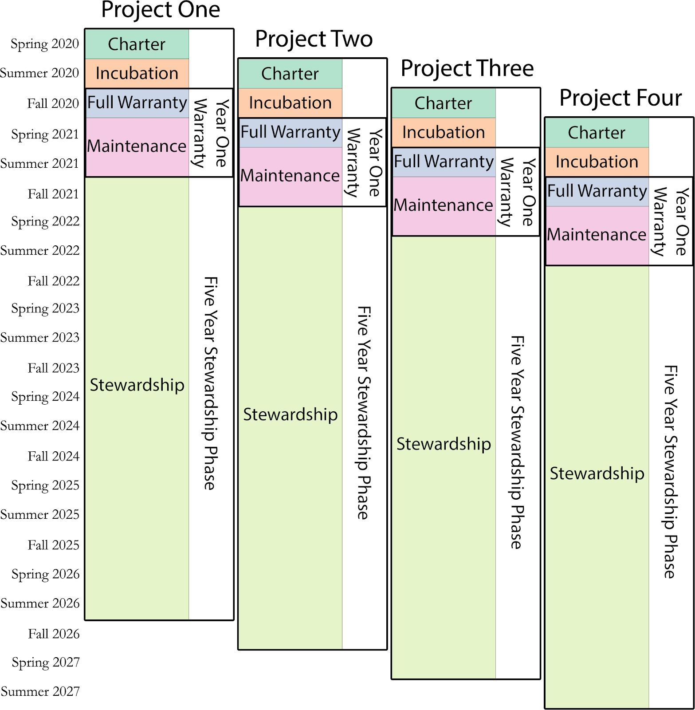

*Note: The conversion of this scholarly article to a website (via markdown) was assisted with an LLM. Errors likely exist. For example, links are currently broken and need to be fixed. To correct errors or to issue a copyright takedown request, please reach out to weingart.scott+dossier@gmail.com or create a pull request.*

# CMU Library Labs (2020-2024)

**Scott B. Weingart & Matthew Lincoln**

Fall 2019 *(edited January 2021)*

[http://dx.doi.org/10.1184/R1/13522718](https://doi.org/10.1184/R1/13522718)

## Table of Contents

- **Executive Summary** … 3
- **Personnel** … 5
- **Identity Statement** … 5
  - Vision … 5
  - Mission … 5
  - Values … 5
  - Goals … 5
- **Initiatives** … 6
  - Incubator … 6
    - Schedule & Load … 6
      - Proposals … 7
      - Semester 1 (Charter Phase) … 8
      - Semester 2 (Incubation Phase) … 8
      - Semester 3 (Full Warranty Phase) … 8
      - Semesters 4-5 (Maintenance Phase) … 8
      - Semesters 6+ (Stewardship Phase) … 8
    - Proposal Process … 8
    - Selection Process … 9
    - Internship Program … 9
    - During the Incubation Phase … 9
    - Post-Incubation … 10
    - Grant Buy-Outs … 11
    - Supporting Documents … 11
      - Call for Proposals … 11
      - Deadlines … 12
      - Criteria … 12
      - Budget Details … 13
      - Application Details … 13
      - Proposal Evaluation Rubric … 13
      - Project Charter … 14
      - Charter Purpose … 14
      - Charter Template - Project Title Here … 15
      - Incubator Graduation Checklist … 16
      - Required Documents For Internal Deposit … 16
      - Project Outcomes … 17
      - [If a public website] … 17
      - [If a KiltHub Deposit, determine these details] … 17
      - Additional Items to be Defined by Project Charter … 17
      - Incubator Graduation Report (public) … 17
      - Project Closeout Documentation (private) … 18
      - Sunset Plans … 18
      - Year One Warranty … 19
      - Summary … 19
      - Regular Maintenance and Responsibilities … 19
      - One Semester Full Warranty Phase … 19
      - Maintenance Phase … 20
      - One Year Continuation Agreement … 21
      - Summary … 21
      - Regular Maintenance and Responsibilities … 21
      - Maintenance … 21
      - Long Term Service Agreement … 22
      - Summary … 22
      - Stewardship Phase … 22
  - Stewardship Initiative … 23
    - Stewardship Graduation … 23
      - Graduation into Custodial Care … 24
      - Graduation into Infrastructure … 24
  - CMU Library Labs Fellowship Program … 24
    - Fellowship Timeline … 25
    - Graduate Fellowship Program Application … 25
      - Overview … 25
      - Selection Criteria and Process … 26
      - Eligibility Requirements … 26
      - Fellowship Expectations … 26
      - Application … 26
  - Digital Humanities Literacy Institute … 27
  - Advisory Board … 27

<!-- page 1 -->

## Executive Summary

After the innumerable successes of the five year, $2 million A.W. Mellon Foundation grant supporting Digital Humanities at Carnegie Mellon University, it is time to plan for the future. This document outlines how to keep the momentum going for the next five years, building off the strengths of what is already in place, and laying the groundwork for a program that can bring pride to Carnegie Mellon University beyond the next decade.

The phrase “Digital Humanities” is becoming dated, as often happens to concepts named for the technologies of a moment. However, as information technologies increasingly permeate and mediate all aspects of our lives, the need for all scholars to actively, intelligently, and critically engage with computation is only growing. With that future in mind, we call this new initiative **CMU Library Labs**, reflecting an expansive mandate to innovate and critically engage with new technologies at the intersection of libraries and scholarship in the arts, humanities, & social sciences.

Since 2015, many overlapping university efforts have developed to support these goals, including dSHARP and the Humanities Analytics program. CMU Library Lab’s mission is to foster excellence in digital humanities, creative arts, and computational social science research and education through supporting and coordinating these existing campus-wide efforts, ensuring essential tasks don’t slip through the cracks on the path to success.

To achieve the mission of excellence in digital humanities, creative arts, and computational social science research and education, the CMU Library Labs will need to spin up several new initiatives. Some of these initiatives will take over tasks previously supported by the A.W. Mellon Foundation grant, while others will be entirely new, reflecting needs that became apparent over the last five years. They include:

- **Incubator**. A project incubator to replace the digital humanities seed grant program. Includes developer time, seed funding, and internship opportunities for students.
- **Stewardship Initiative**. CMU Library Labs will act as short-term technical stewards for projects that have graduated from the incubator and other program-led projects, liaising between system administration staff and project PIs.
- **Fellowship Program**. A graduate fellowship program to replace the A.W. Mellon-funded DH graduate fellowship program.
- **Digital Humanities Literacy Institute**. An annual 3-day introductory course to digital humanities, replacing the 5-day A.W. Mellon-funded DH Summer Literacy Workshop.
- **Advisory Board**. An advisory board of faculty, staff, and students assembled irregularly to consult on matters relevant to digital humanities and its allied disciplines on campus.

CMU Library Labs will work closely with and rely on other groups across campus, including:

<!-- page 3 -->

- **The English Department**. CMU Library Labs will offer internship opportunities for undergraduates pursuing the Humanities Analytics certificate and graduates with an interest in digital humanities.
- **dSHARP**. CMU Library Labs will rely on and contribute to dSHARP’s community-building efforts, particularly the weekly DH lunch lecture series and the guest speaker series.
- **Libraries Digital Strategy**, **Dietrich Computing Services**, and **the Modern Language** **Resource Center**. CMU Library Labs relies on agreements with these three technical groups to offer server space for various digital projects.
- **The STUDIO for Creative Inquiry** and others. CMU Library Labs partners with the STUDIO and other campus groups for events, artist residencies, and related opportunities.

This document sets the stage for CMU Library Labs, describing its identity and each of its initiatives, and opening up the door for a follow-up A.W. Mellon Grant proposal.

<!-- page 4 -->

## Personnel

**Program Director**. The Program Director is responsible for setting and executing the vision of the Library Labs, allocating its budget, and organizing its personnel. Additionally, the director acts as project manager for Incubator Projects, instructor and co-advisor for the Graduate Fellows, coordinator of the Literacy Institute, and convener of the Advisory Board.

**Research Software Engineer**. The Research Software Engineer executes the technical needs of Incubator Projects, supervises project-related technical contractors, and liaises with system administrators for Stewardship Initiative.

**HASTAC Fellows**. Rotating annual HASTAC fellows for community engagement and event organization.

## Identity Statement

### Vision

Ethical, sustainable, and technologically innovative library initiatives engaging with the arts, humanities, & social sciences.

### Mission

To foster excellence in research and education at the intersection of technology and the arts, humanities, & social sciences.

### Values

- Technologically Innovative
- Ethical
- Sustainable

### Goals

- Foster technologically innovative projects in the arts, humanities, & social sciences.
- Support the path from short-term projects to permanent infrastructure.
- Build nimble, sustainable systems to underpin the next generation of scholarship.
- Offer training opportunities for undergraduates, graduates, and staff.

<!-- page 5 -->

## Initiatives

### Incubator

The CMU Library Labs Incubator is a collaborative initiative that turns scholarly ideas into functional prototypes or successful proofs-of-concept. It is similar in spirit to a full-service music studio, where an artist arrives with the beginnings of some songs, and then works diligently with the production team and their house musicians to create a professional album and a plan for distribution and advertisement.

Faculty from around CMU with projects at the intersection of technology and the arts, humanities, or social sciences, broadly construed, can propose their ideas for the CMU Library Labs Incubator. Successful past proposal outputs include a collection of richly digitized Latin American comics, a quantitative analysis of historical golf data, a method for using machine learning and computer vision to de-anonymize 17th century book printers, and an interactive map of Gandhi’s interventions in a region of central India.

Selected proposals will receive collaborative effort from CMU Library Labs personnel, up to $10,000, and the potential to be matched with undergraduate or graduate research interns. The Incubator runs for one semester. Over this roughly four month period, the Program Director will be available for up to 1.5 months for project conception and management, and the Research Software Engineer will be available for up to three months for software and system development. Other experts will be called in as necessary and available. Server sandbox space will be provided, and projects graduating the incubator will receive limited long-term technical service (e.g., web hosting) and assistance in developing next steps (e.g., grant proposals).

CMU Library Labs personnel act as collaborators with, rather than staff of, the project PI(s). Decisions will be made as a team, and authorship or other appropriate credit will be distributed fairly among the members of a project.

#### Schedule & Load

Given the amount of time dedicated to each project, the CMU Library Labs Incubator primarily works on one project per incubation period (semester). The CMU Library Labs Incubator’s formal relationship to projects lasts five semesters (approximately 20 months), after which the CMU Library Labs’ Stewardship Initiative takes over.

<!-- page 6 -->

**Figure 1.** Project timeline. Each row represents a single project moving through the five phases of the CMU Library Labs Incubator: Charter (one semester), Incubation (one semester), Full Warranty (one semester), Maintenance (two semesters), and finally a five-year Stewardship Phase. The diagram shows how four sequentially admitted projects (Project One through Project Four) overlap, illustrating that the program supports one active incubation per semester while continuing to maintain and steward prior cohorts.

##### Proposals

Proposals are due on the first day of each semester. Applicants are informed of acceptances two weeks after the due date. Accepted projects enter the charter phase the same semester. For example, a proposal submitted and accepted in Spring 2020 will begin chartering that same semester, and will begin its incubation period in Summer 2020.

<!-- page 7 -->

##### Semester 1 (Charter Phase)

In the semester preceding the incubation phase, a Project Charter is composed. The charter is the foundational document that describes the rationale, goals, plan of work, resources needed, terms and conditions, and outcomes of a CMU Library Labs Incubation Project.

##### Semester 2 (Incubation Phase)

The CMU Library Labs Incubator operates on a semester schedule. The incubation phase, during which the majority of work takes place, begins on the first day of class, and ends on the last day of final exams.

##### Semester 3 (Full Warranty Phase)

After the incubation phase, CMU Library Labs personnel commit to an additional semester to deal with project-critical bug fixes and related technical work, as well as contributing to the completion of the Incubator Graduation Report.

##### Semesters 4-5 (Maintenance Phase)

During the final two semesters of CMU Library Labs’ relationship to the project, Labs personnel commit to ensuring the technical apparatus of the project continues to function as it did by the end of Semester 3. No additional work will be provided during this period.

##### Semesters 6+ (Stewardship Phase)

In accordance with the Long Term Service Agreement, the CMU Library Labs’ Stewardship Initiative will ensure the technical apparatus of the incubated project will remain available in some form for the ensuing five years. At the end of the five year stewardship phase, the PI and CMU Library Labs will need to sign another Long Term Service Agreement should they mutually agree to continue that availability for an additional five years.

#### Proposal Process

Any faculty member(s) at Carnegie Mellon University’s Pittsburgh campus is eligible to apply for the CMU Library Labs Incubator, so long as they will be employed through the end of their intended incubation period. Proposals must engage with the arts, humanities, or social sciences (broadly construed), and must involve the development of technical or computational elements. Although any such project will be considered, those without a clear connection to expertises held by personnel in CMU Library Labs are less likely to be accepted.

Proposals are due the first day of each semester, and applicants are required to discuss drafts of their proposals with the Program Director before their final submission. PIs will be informed of acceptances a month after the due date.

<!-- page 8 -->

The proposal narrative should be short, no more than 5 pages. Up to $10,000 may be budgeted, as specifically as possible. The budget should also contain estimates for the time needed from CMU Library Labs personnel, breaking that time down as specifically as possible. Up to 1.5 months may be budgeted for the Program Director, and up to three months for the Research Software Engineer.

See the CMU Library Labs Call for Proposals for more details.

#### Selection Process

Proposals will be evaluated in the month after their due date by an ad-hoc evaluation committee, according to the criteria outlined in the Proposal Evaluation Rubric. The evaluation committee is made up of members of the CMU Library Labs Advisory Board or their representatives. After the evaluation committee ranks proposals, they offer their recommendations to the CMU Library Labs Director. Barring extenuating circumstances (e.g., ensuring adequate representation, or preventing a single PI from monopolizing resources year after year), the Program Director will choose the winning proposals based on the evaluation committee’s recommendations. The Program Director will inform applicants of results two weeks after the beginning of each semester.

#### Internship Program

CMU Library Labs will work with faculty instructors and supervisors, as well as recipients of the CMU Library Labs Fellowship, to find potential student work-study interns for involvement on the incubator projects. If one or more students are available and interested in working on a project, program staff will work with the PI to become instructors of a for-credit reading course, or to allocate some of the requested funds, to compensate for student labor. As the students will be learning while working on the project, the bulk of responsibilities and decision-making should not be placed on their shoulders.

##### During the Incubation Phase

During the semester-long incubation phase, CMU Library Labs personnel will collaborate with PIs and the project team to take a project from an idea to a functional prototype or successful proof-of-concept, pulling in collaborators as necessary. PIs are expected to be full collaborators on their project. Whether or not they have mastery of the technologies involved, they are to be active participants in the week-to-week work of project scoping and development. This will help ensure the success of a project after it leaves the incubation phase.

The first two team meetings will take place in the months *before* the beginning of a project’s incubation period, known as the Charter Phase. During this time, the core project team will compose a project charter, to be amended by group consensus. The charter is the foundational document that describes the rationale, goals, plan of work, resources needed, terms and conditions, and outcomes of a CMU Library Labs project. Charters serve as formalized <!-- page 9 --> agreements among all team members on such crucial questions as scope, technical design, infrastructural needs, and success criteria.

After the charter is in place, work can begin on day 1 of the incubation period. Given the four-month timescale, short meetings or email updates from the project team will occur weekly or fortnightly. If there is additional technical staff on the project team, they can either be supervised by the PI or CMU Library Labs personnel. PIs or their representatives are expected to supervise additional work being done on the content side of the project.

Halfway through the incubation period, there will be a check-in meeting to give the team the opportunity to update expectations from the project charter. This meeting will offer the opportunity to look over the Incubator Graduation Checklist to ensure the project is on track for a successful completion.

By the final day of its incubation period, the project team will have produced a prototype or proof-of-concept. It might be a website, an app, a machine learning model, an article draft, an interactive visualization, a database, or anything else that was defined in the project charter. This product represents the end of the incubation phase and the end of CMU Library Labs personnel's active contributions to the project.

Although the incubation phase is over, the CMU Library Labs Incubator’s relationship with the project will last an additional year, and the CMU Library Labs’ relationship with the project might last much longer. At the final meeting, the PI and CMU Library Labs Program Director will sign the Year One Warranty and the Long Term Service Agreement, which will define CMU Library Labs’ relationship to the project going forward, and the Sunset Plans, which will clarify criteria for how the project ends.

##### Post-Incubation

As per the Year One Warranty, CMU Library Labs personnel will lightly support the project for one semester after the incubation phase (the “Full Warranty Phase”). This includes resolving bugs that critically impact the functionality of the final product, finalizing language for additional grant proposals, etc. During this time, the PI(s) and Program Director will also fill out the Incubator Graduation Report and the Incubation Graduation Checklist, due at the end of the third semester.

Once all required documents are submitted, the project will enter “Maintenance Phase” for semesters 4-5. Details will vary by project, but e.g., for websites, this means their technical apparatus will continue to be maintained and editable, but no changes or bug fixes will be provided.

From semester 6 onward, projects leave the care of the CMU Library Labs Incubator and enter into the CMU Library Labs Stewardship Initiative. This is the “Stewardship Phase,” as outlined in <!-- page 10 --> the Long Term Service Agreement. During this phase, CMU Library Labs will ensure the technical apparatus of the incubated project will remain available in some form for five years from the signing of the Long Term Service Agreement. At the end of this phase, the PI and CMU Library Labs will need to sign an additional Long Term Service Agreement to continue that availability for another five years.

#### Grant Buy-Outs

At the will of the CMU Library Labs Director, the Incubator can be “bought out” for a single semester at a time, bypassing the usual proposal process. These buy-outs help ensure CMU Library Labs has funding for future semesters. Additionally, the buy-out program allows PIs some assurance that, should they receive a grant, technical collaborators will be available.

By agreement with the Program Director, PIs applying for external grants can write the CMU Library Labs Incubator team into proposals. These proposals will need to write 75% of requested personnel costs into the grant budget; the additional 25% will be provided in-kind by CMU Library Labs. For example, if a PI requests 3 months of time from the Research Software Engineer (RSE) and 1.5 months of time from the Program Director (PD), the grant will need to pay for 2.25 months of the RSE and 1.125 months of the PD’s salary + benefits. The charter phase of a Buy-Out project will begin the semester *after* a PI receives news of their projects’ funding.

PIs with external grants wishing to make use of the CMU Library Labs Incubator without writing the incubator into the budget may still propose their project under the usual process. However, there is no guarantee those proposals will end up successfully acquiring the incubator’s time.

### Supporting Documents

#### Call for Proposals

The CMU Library Labs Incubator announces a call for proposals from Carnegie Mellon University faculty. Funds and expertise are available to support promising research and education projects that engage with the humanities, creative arts, or social sciences (broadly construed), and involve technical or computational elements. Projects might include computationally-driven cultural analytics, digital humanities tool building, public or crowdsourced humanities projects, cultural databases or exhibits, etc. These funds are intended to seed a digital humanities and computational social sciences community on campus, and thus we welcome projects from faculty who have not yet worked in these areas. Pilot projects with strong prospects for further funding via foundations, government agencies, or other external sources are encouraged, but not required.

Funding of up to $10k per project is available. Faculty may also request up to 3 months of technical personnel time (e.g., programming or tool development, data analysis, etc.) and up to <!-- page 11 --> 1.5 months of project scoping and management support. Projects will last a single semester, and end in a functional prototype, proof-of-concept, article, or other concrete output. A chartering period will precede the incubation phase. The CMU Library Labs Incubator accepts one project per semester.

Full-time, research, teaching, visiting, special, part-time, or adjunct faculty are all welcome to apply, so long as the PI is on the Pittsburgh campus, and they will be employed through the end of their intended incubation period.

##### Deadlines

Application Deadline: [First Day of Semester], [Semester], [Year] Decision letters: [One Month After First of Semester], [Year]

Funding and expertise available: The first day of the semester of the selected incubation period.

*Questions?* Contact Scott B. Weingart at scottbot@cmu.edu

##### Criteria

Proposals will be evaluated on:

- **Intellectual Significance.** The project would stimulate or facilitate new research of value to scholars and general audiences in the arts, humanities, or social sciences, or would use digital technologies to communicate arts, humanities, or social scientific scholarship to broad audiences. It would encompass work of intellectual significance in its potential to enhance research, teaching, or learning in the humanities.
- **Merit of Approach.** The idea, approach, and/or methods under consideration would be innovative, and the technology employed in the project would be appropriate.
- **Project Organization.** The conception, definition, organization, and description of the project are clearly expressed.
- **Feasibility.** The project’s plan of work could be accomplished during the incubation period, and the start-up activities will significantly contribute to the project’s long-term goals. The qualifications, expertise, and levels of commitment of the awardee and collaborators are sufficient to achieve the project’s short-term goals. (Note: the PI does not need technical expertise if the proposal shows they have sufficient support from collaborators or CMU Library Labs personnel.)

If applicable, pilot project proposals should discuss opportunities for obtaining additional sources of support and likelihood of the project being sustained beyond seed funding. The Program Director Scott B. Weingart (scottbot@cmu.edu) can offer applicants guidance.

<!-- page 12 -->

##### Budget Details

Proposals for the CMU Library Labs Incubator may request funds up to $10,000, up to 1.5 months of expertise from the Program Director, and up to 3 months of expertise and development time from the Research Software Engineer.

##### Application Details

Proposals for the CMU Library Labs Incubator should be prepared as follows:

*Cover Page (1 page)* with the following information:

- Principal Investigators’ name(s), affiliation(s), and contact information.
- Title of the project.
- Abstract (up to 200 words).

*Project Narrative* *(2 pages maximum)*: Summarize the proposed activities, including the motivation for the project and any relevant prior work, who will be involved in the work, and the projected timeline.

*Project Budget (2 pages maximum)*: Identify specific budget items and amounts requested, with brief justifications as needed. Some specific details on project budgeting:

- There is no explicit restriction on the use of funds. Funds may be used to cover summer salary and course buyout. However, these expenses must be clearly justified and consistent with college and/or departmental policies.
- Overhead will not be charged. However, benefits do need to be accounted for if using funds to pay for salaries.
- Use of CMU Library Labs Personnel (budget up to 1.5 months from the Program Director and up to 3 months from the Research Software Engineer). CMU Library Labs Personnel are available to fully collaborate on Incubator projects, and are there to ensure projects succeed. Give a rough estimate of how you anticipate their time will be allocated.

Note: It is the responsibility of the PI of funded proposals to ensure that all appropriate IRB approvals are in place prior to the initiation of the project.

Application materials should be submitted to the Program Director, Scott B. Weingart (scottbot@cmu.edu), *as a single PDF* by [Due Date].

All applicants are *required* to reach out to reach out to the Program Director well before the deadline to discuss the proposal.

##### Proposal Evaluation Rubric

| Required Criteria | Not Recommended (1) | Room for Improvement (3) | Highly Recommended (5) |
| --- | --- | --- | --- |
| **Intellectual Significance** | The project is not of interest to most scholars or members of the public, or its contribution to research or practice is minimal. | The project is relevant to a narrow scholarly or public community. It presents a research or methodological contribution to its home discipline, but not one of significance. | The project stimulates or facilitates new research of value to scholars and general audiences in the humanities, or uses digital technologies to communicate humanities scholarship to broad audiences. It encompasses work of intellectual significance in its potential to enhance research, teaching, or learning in the humanities |
| **Merit of Approach** | The method is unsound, or there is no methodological or technological component to the project. | The technology or method employed is appropriate and sound, but does not A) represent a methodological contribution to DH or B) use DH to appropriately contribute to home discipline. (Proposal must be strong in A or B). | The idea, approach, and/or methods are technologically innovative, and the technology/method employed is appropriate and sound. |
| **Project Organization** | No plan is put forward, or the organization does not align with the intended goals of the project. | The timeline and budget are not detailed, but the proposal has a clear plan for when and how work will get done, including who will be undertaking the work. | The conception, definition, organization, and description of the project are clearly expressed. Time, personnel, and money allocations are clear, sensible, and detailed. Assistance needed from DH staff is clearly defined. |
| **Feasibility** | The scope is too large for the support and money available, or the expertise required is not available. | An easily-separable portion of the project can be accomplished within the grant's timeframe, and can convincingly be used to attain more funding for project completion. The proposal does not show a strong awareness of the skills or time required to complete the goal, but it is likely feasible nonetheless. | The plan can be accomplished during the grant term, and the start-up activities will significantly contribute to the project's long-term goals. The qualifications, expertise, and levels of commitment of the awardee and collaborators are sufficient to achieve the project's short-term goals. |

<!-- page 13 -->

### Project Charter

#### Charter Purpose

The charter is the foundational document that describes the rationale, goals, plan of work, resources needed, terms and conditions, and outcomes of a CMU Library Labs project. Charters are written by core members of a project team in planning meetings taking place the month before project work begins. The planning process is intensive, collaborative and requires <!-- page 14 --> substantial input from everyone on a team. Charters serve as formalized agreements among all team members on such crucial questions as scope, technical design, infrastructural needs, and success criteria.

A draft of each project charter is peer-reviewed by all CMU Library Labs personnel, and optionally by additional partners or stakeholders, at a “design review” before the start of project work. Questions and concerns from this period may be raised at the design review. Project teams have two weeks after the design review to address any issues raised and make any requested changes. Project work only begins (and funds are released) once the charter has been finalized and signed by the Project Director (PI) and the CMU Library Labs Program Director. Charters are amended as necessary throughout the project lifecycle to document major changes and note when the Year One Warranty and Long Term Service Agreement take effect, and serve as part of the CMU Library Labs project archive.

CMU Library Labs charters and their planning documents are adapted from templates produced by Princeton University’s Center for Digital Humanities. [^1]

Cite this document:

Recommended Citation

#### Charter Template - Project Title Here

Part I: Project Overview

Description and Objectives

Relevant Resources and Projects Research Questions Project Significance

Significance for X Significance for Y Audiences Project Team [define roles clearly within]

Project Director (PI) Project Manager Technical Lead CMU Library Labs Project Manager etc. Budget Part II: Incubator Phase Plans

Deliverables Data/etc. Status <!-- page 15 --> Objectives Needs Concerns

Risks Interdependencies Security Ethics Management Long-term preservation Meeting Schedule Milestone Timeline Future Plans Part III: Wrap-up Plans Part IV: Agreements

Project pause policy Collaborator Credit Agreement / Collaborator Bill of Rights

[Be as explicit as possible. Recommend picking from below: AHA Project Roles and a Consideration of Process and Product document Off the Tracks Collaborators’ Bill of Rights UCLA’s Student Collaborators’ Bill of Rights] Rights, Permissions, and Attribution Web Presence and Project Publicity Year One Warranty Long Term Service Agreement Items for Incubator Graduation Checklist

PI Signature CMU Library Labs Director Signature Date

Appendices

### Incubator Graduation Checklist

In order to graduate from the incubation phase and enter into the maintenance and stewardship phases, project teams must complete the below checklist.

##### Required Documents For Internal Deposit

- ☐ Sunset Plans Document is submitted and accepted 
- ☐ Incubator Graduation Report is submitted and accepted 
- ☐ Project Closeout Documentation is submitted and accepted 
- ☐ Year One Warranty is signed 
- ☐ Long Term Service Agreement is signed 

<!-- page 16 -->

- ☐ Graduation Checklist Report 

##### Project Outcomes

- ☐ Project has a DOI 
- ☐ Licenses for KiltHub (CMU’s institutional repository), project code, project website 
- ☐ Project has a suggested citation 
- ☐ Project is updated on the CMU Library Labs website 
- ☐ Library press release for project 

##### [If a public website]

- ☐ Visitor counts/tracking set up (via Google Analytics or other), stats available to PI and to CMU Library Labs
- ☐ Audit website for external resources (images, javascript, css, fonts, media), when possible cache copies of assets on our own repository & servers
- ☐ Source code is hosted on CMU Lib github with documentation, at minimum how to get a new instance running, export/reload database if applicable

##### [If a KiltHub Deposit, determine these details]

- ☐ One deposit, or multiple deposits with a collection? 
- ☐ KiltHub-specific license (Determined with project PIs) 
- ☐ How will data be documented in a README.txt (https://library.cmu.edu/kilthub/prepare-data) 
- ☐ Authorship for data deposit 

##### Additional Items to be Defined by Project Charter

- ☐ ______________________  
- ☐ ______________________ 
- ☐ ______________________ 
- ☐ ______________________ 

##### Incubator Graduation Report (public)

Title: Suggested Citation: DOI: Short Description (200 words): List of Collaborators and Roles (in accordance with Collaborator Credit Agreement): Activity Report (under 2 pages): Relevant Links:

- Public URL:
- CMU Library Labs Project Description URL:
- KiltHub Deposit:
- GitHub URL:

<!-- page 17 -->

- Etc.

##### Project Closeout Documentation (private)

Budget Report (under 2 pages): Suggestions for Improving Process (under 1 page): Appendices (articles / drafts / private data or code / etc.): Technical details [If deployed on a server, record server details in deployment log, including:]

1. Directory where deployed code lives 2. Processes (e.g. docker, nginx, cron, webhooks) that must be running 3. Locations and summaries of all configuration files for running services 4. Locations of environment variable files and definitions of variables that must be present 5. Locations of SSL cert and key 6. GitHub repos connected to 7. Any external resources relied upon (APIs, large media) 8. Google Analytics ID

### Sunset Plans

To be filled out in tandem between the project team and CMU Library Labs personnel. Inspired and drawn in part from the Socio-Technical Sustainability Roadmap from the Visual Media Workshop at the University of Pittsburgh.

- How long do you want your project to last?
- What are the project’s sustainability and preservation priorities?
- Under what criteria should the project degrade or cease to exist?
- Where is the documentation? Is it sufficient to reconstruct the project without the original team?
- Where or with whom are relevant passwords and other account or system information held?
- Where is everything stored and backed up? What are the expectations of long-term costs and needs?
- [If project has a database or other content management system] Once a data management workflow is established, is the PI comfortable with adding and editing data in that system without continuing support from technical staff?

<!-- page 18 -->

## Year One Warranty

#### Summary

This service level agreement document  describes the ongoing responsibilities of the CMU [^2]

Library Labs Incubator to supporting _______________ following the end of its “Incubation Phase.” It describes the one semester “Full Warranty Phase” for software issues following the immediate launch of the project and the transition to the two semester “Maintenance Phase” for ensuring the project continues to function as expected. This warranty lasts one calendar year from the last day of the “Incubation Phase.”

New features or redesigns are not covered by this document.

Any issues about this agreement should be directed to CMU Library Labs personnel.

#### Regular Maintenance and Responsibilities

[note: this will vary by project; the below-listed is an example specifically for jekyll websites.]

*CMU Library Labs Responsibilities*

- Monitor the availability of the website
- Ensure continued automated backups (performed by CMU Computing Services)
- Apply any relevant security updates to the server operating system

*Faculty PI Responsibilities*

- Maintain the integrity of and links to accounts and assets not controlled by CMU, including but not limited to:

  - Links to streaming video services (e.g. YouTube, Vimeo)
  - Non-CMU domain name registrations (__________)
- Promptly reporting any loss of data or functionality to CMU Library Labs personnel. We cannot guarantee restoration from backups more than 20 days after the data loss.

#### One Semester Full Warranty Phase

The CMU Library Labs RSE will dedicate time for fixing bugs in the architecture and display of ___________  for one semester after the incubation phase. During this warranty, CMU Library Labs RSE will fix issues that impact the core site functionality, such as resolving issues in the architecture, display, or editing workflow of the website. This does not include building significant new features.

<!-- page 19 -->

During this period, it is the responsibility of the PI to alert the RSE of any issues, and to respond within one week to any communications from the RSE, including testing and confirmation of bug fixes. If the PI fails to respond to these communications, then the warranty is void and the project will shift to the “Maintenance Phase”.

After the Year One Warranty expires, support for the site will shift to the “Stewardship Phase”, as described in the Long Term Service Agreement.

#### Maintenance Phase

The RSE will maintain the project’s technical infrastructure for one year after the “Incubation Phase,” ensuring it continues to function as it did at the end of the “Full Warranty” phase.

[note: this will vary by project; the below-listed is an example specifically for jekyll websites.]

_________ is constructed as a static site, which prioritizes long-term sustainability. Once the files for a static site (HTML, CSS, JavaScript, and all image assets) are generated from the source code via the Jekyll software package, they can be hosted publicly online with minimal computing power and virtually no ongoing system administrator labor.

However, the software for editing and updating the content of the site via a web browser does require a server-side process that incurs a small, but active amount of support work.

During this period, the RSE will be responsible for maintaining continuing access and security of the public site as well as the editing interface in its state as of the end of the full warranty period. No new functionality can be supported in this period.

The RSE will contact the PI one month before transitioning this site to the Stewardship phase, at which point the site will become read-only. If, after the Year One Warranty, the PI demonstrates a continued need to update and change content on the site, the PI must sign an updated SLA with CMU Library Labs. If the site does not pose an undue risk or burden to CMU libraries, this edit-only service level window will be extended for an additional 12 months.

If this SLA is not renewed after the Year One Warranty, we will deactivate the editing service, and the site will revert to the "Stewardship Phase," where it will remain publicly online but will no longer be editable via the web interface.

<!-- page 20 -->

## One Year Continuation Agreement

#### Summary

This service level agreement document  describes the ongoing responsibilities of the CMU [^3]

Library Labs Incubator to support _______________ following the end of its last maintenance phase, should CMU Library Labs and the Project PI choose to renew their maintenance contract. It describes the one year maintenance continuation agreement for ensuring the project continues to function as expected. This agreement lasts one calendar year from the last date of signature.

New features or redesigns are not covered by this document.

Any issues about this agreement should be directed to CMU Library Labs personnel.

#### Regular Maintenance and Responsibilities

[note: this will vary by project; the below-listed is an example specifically for jekyll websites.]

*CMU Library Labs Responsibilities*

- Monitor the availability of the website
- Ensure continued automated backups (performed by Dietrich Computing)
- Apply any relevant security updates to the server operating system

*Faculty PI Responsibilities*

- Maintain the integrity of and links to accounts and assets not controlled by CMU, including but not limited to:

  - Links to streaming video services (e.g. YouTube, Vimeo)
  - Non-CMU domain name registrations (__________)
- Promptly reporting any loss of data or functionality to CMU Library Labs personnel. We cannot guarantee restoration from backups more than 20 days after the data loss.

#### Maintenance

The RSE will maintain the project’s technical infrastructure for one year after the signature date of this document, ensuring it continues to function as it did on that date.

[note: this will vary by project; the below-listed is an example specifically for jekyll websites.]

<!-- page 21 -->

_________ is constructed as a static site, which prioritizes long-term sustainability. Once the files for a static site (HTML, CSS, JavaScript, and all image assets) are generated from the source code via the Jekyll software package, they can be hosted publicly online with minimal computing power and virtually no ongoing system administrator labor.

However, the software for editing and updating the content of the site via a web browser does require a server-side process that incurs a small, but active amount of support work.

During this period, the RSE will be responsible for maintaining continuing access and security of the public site as well as the editing interface in its state as of the end of the full warranty period. No new functionality can be supported in this period.

The RSE will contact the PI one month before transitioning this site to the Stewardship phase, at which point the site will become read-only. If, after the One Year Continuation Agreement, the PI demonstrates a continued need to update and change content on the site, the PI must sign an updated SLA with CMU Library Labs. If the site does not pose an undue risk or burden to CMU libraries, this edit-only service level window will be extended for an additional 12 months.

If this SLA is not renewed, we will deactivate the editing service, and the site will revert to the "Stewardship Phase," where it will remain publicly online but will no longer be editable via the web interface.

## Long Term Service Agreement

#### Summary

This service level agreement document  describes the ongoing responsibilities of CMU Library [^4]

Labs to supporting _______________ following the end of its “Maintenance Phase.” It describes the five-year “Stewardship Phase” during which CMU Library Labs commits to maintaining the accessibility of the project output in its final state, whether or not that final state continues to function as expected.

New features or redesigns are not covered by this document, nor are regular maintenance tasks.

Any issues about this agreement should be directed to CMU Library Labs personnel.

#### Stewardship Phase

[note: this will vary by project; the below-listed is an example specifically for jekyll websites.]

<!-- page 22 -->

Once the site has transitioned to read-only, CMU Libraries and Dietrich Computing commit to hosting the compiled files on CMU web servers for five years. This includes regular server-level backups and security updates for the software that serves the static website, which will be carried out by Dietrich Computing.

At the end of this period, an additional Long Term Service Agreement will need to be signed to continue low-level maintenance for an additional five years. This is a moment to evaluate ___________’s functionality, and the continued importance of maintaining its online presence. Unless the site poses undue risk or burden to CMU Libraries, an extended support SLA will be granted pro forma.

New features, redesigns, or bug fixes (major or minor) are not covered. New features or interface redesigns require a new agreement with CMU Libraries. New content may be added with an agreement to reactivate the editing interface described above.

## Stewardship Initiative

CMU Library Labs will act as short-term technical stewards for projects that have graduated from the Incubator, as well as for other other program-led projects. All CMU Library Labs projects are either under Incubation (active development) or Stewardship (long term availability).

The Stewardship Initiative offers a middle ground between ephemerality and the full curatorial commitment of a digital object within CMU Libraries’ special collections or archives. Projects must have a Long Term Service Agreement to enter the Stewardship Initiative, and those projects will remain available and accessible until the end of that service agreement.

Within the Stewardship Initiative, CMU Library Labs acts as a liaison between relevant system administration staff and project PIs. Once per semester, Labs personnel will check all stewarded projects to ensure their continued functionality, and work with relevant system administrators should any problems arise. A single point of contact per project (usually the PI) will contact CMU Library Labs should any issues occur in the interim, and can expect resolutions to take up to two weeks.

CMU Library Labs personnel *will not* perform regular system administration and maintenance as part of the Stewardship Initiative. Rather, they will ensure continued service remains available through agreements with the University Libraries, Dietrich Computing, etc.

### Stewardship Graduation

Some CMU Library Labs stewarded projects may become candidates for entering custodial care or becoming critical infrastructure. For example, an Omeka collection stewarded by the Library Labs might be acquired by the University Archives, or a journal orchestration prototype might be rolled out as the Libraries’ new journal publication system.

<!-- page 23 -->

If a stewarded project graduates into custodial care or infrastructure, CMU Library Labs personnel will take a *single semester* to assist with the project’s transition of custodianship to its new home. This will be agreed upon at least one semester in advance by the CMU Library Labs Program Director, the Project PI, and the new project custodian. While CMU Library Labs *facilitates* graduation, the impetus and decision of such transitions ultimately lies with the Project PI and the new project custodian (e.g., university archivist, special collections librarian, or technical services staff).

#### Graduation into Custodial Care

When a project enters the University Archives, Special Collections, or the care of an external custodian, CMU Library Labs personnel will assist in liaising between the Project PI and the projects’ future owner. No additional work on the project’s technical apparatus will be provided; however, assistance will be offered in translating metadata, defining system specifications, and one-time project migration.

#### Graduation into Infrastructure

When a project is set to become part of a larger production-level infrastructure, CMU Library Labs personnel will assist in liaising between the Project PI and the projects’ future maintainer. No additional work on the project’s technical apparatus will be provided; however, assistance may be offered in creating a more easily deployable system (e.g., containerizing or flattening), defining system specifications, and migrating the project.

## CMU Library Labs Fellowship Program

Following the success of the A.W. Mellon Foundation Digital Humanities Graduate Fellowship Program, CMU Library Labs will continue offering fellowships to CMU Ph.D. students studying the humanities, creative arts, or social sciences. The program will deviate substantially from its original form, following feedback and lessons learned.

The 5-semester graduate fellowships are available to Ph.D. students who have completed the Digital Humanities Literacy Institute and have not yet defended their dissertation prospectus. Fellows will receive three semesters of teaching/research release and two summer stipends of $5,000.

Fellows will leave the program with a completed digital project, to be used as a dissertation chapter or (in unusual circumstances) a stand-alone publication. The fellowship program works as an overlapping cohort model, with leaving fellows helping train those incoming. Fellows are required to apprentice on at least one of the five Incubator Projects active during their fellowship.

<!-- page 24 -->

To ensure fellowship work aligns with their Ph.D. goals, fellows will need to choose a “Fellowship Faculty Advisor” from among their graduate committee.

### Fellowship Timeline

After completing the Digital Humanities Literacy Institute in the spring semester, graduate students will be encouraged to apply to the graduate fellowship program. Applications are due in the summer semester, and applicants will be notified within the following few months. The fellowship begins the following spring and continues through the end of the second summer. Between four and six fellows are chosen every year, depending on funding availability.

During their first spring semester, the cohort of fellows will all take an introductory digital humanities course together, taught by the CMU Library Labs Program Director with the assistance of the previous fellowship cohort. Fellows will use this course to learn the basics of digital humanities and plan their 5-semester project timeline. A preliminary deliverable must be completed by the end of a fellow’s third semester (December), and the final deliverable by the end of their fifth semester (August).

Through their first summer, fellows are encouraged to pursue their own research, checking in with the CMU Library Labs Program Director as needed. In the fall semester, first-year fellows will check in with each other weekly, updating each other on their project status and keeping themselves on track.

At some point during their first year, fellows are required to take additional training in their specialized area. This can be a CMU course, a class at another university, or self-guided study through a textbook or online class.

Fellows are expected to take their fifth and final (summer) semester to complete their fellowship project, checking in with the CMU Library Labs Program Director as needed.

Cohorts will gather to present their research to each other and the university every December. First-year fellows will present their preliminary research, and fellows who graduated from the program that summer will present their final projects (totaling 8 - 12 presentations, depending on cohort size).

### Graduate Fellowship Program Application

#### Overview

Ph.D. students enrolled in a CMU humanities, creative arts, or social science program are eligible to apply to become Graduate Fellows provided they have completed the Digital Humanities Literacy Institute. The fellowship is designed to help students conceive and develop a Digital Humanities (DH) project.

<!-- page 25 -->

Fellows will receive three semesters of teaching release and two summer stipends of $5,000 each, during which time they will develop the necessary skills for undertaking their proposed research. Fellows will present their research at an annual event. During their tenure, fellows will need to identify an advisor from their committee who will help them with their research. Fellows are expected to remain on campus for the two spring semesters of their fellowship, but may otherwise travel, with the expectation that they will continue their weekly fellowship activities while elsewhere.

Between four and six fellowships will be awarded each ear. **Applications are due June 15th**.

#### Selection Criteria and Process

Fellows will be selected by the CMU Library Labs advisory committee, or proxies thereof. Awards will be announced in early fall to ensure fellows have time to choose and register for relevant coursework for their DH project (if appropriate). Candidates with a clearly articulated research agenda and a visible capacity to learn the relevant technology will be given priority in selection. The selection committee will additionally strive to ensure those from marginalized groups without traditionally strong access to technical education are represented in each cohort. Students must be in good standing and may apply more than once.

#### Eligibility Requirements

Students interested in becoming fellows must have:

- Completed the Digital Humanities Literacy Institute (typically fall / summer of year 1).
- A faculty advisor willing to help with their digital research. Faculty technical expertise not required, but desirable.
- Demonstrated technical proficiency to complete the proposed project, or have a set plan to obtain it. (Including course experience, relevant work, etc.) Students are encouraged to reach out to the CMU Library Labs Program Director to discuss this plan.

#### Fellowship Expectations

- *Spring class*. First years: attend an Introduction to DH course in the spring. Second years: co-teach the Introduction to DH course in the spring.
- *Fall Check-In Group*. Attend weekly check-ins with the cohort in the fall semester..
- *Apprenticeship*. Apprentice with one of five DH Incubator Projects.
- *Annual Presentation*. Present on research twice during fellowship.

#### Application

Applications are due June 15, and fellows will be chosen prior to spring teaching assignments. Applications should include (expected length: 2-4 pages in total excluding CV):

- *Cover Letter*. Short (under 1 page) letter covering your purposes for applying for the fellowship, your expectations out of it, and any other relevant details
- *Curriculum Vitae*. Provide an academic CV.

<!-- page 26 -->

- *Research Proposal*. 1-2 page proposal outlining the nature, scope, and goals of your intended research project, specifically addressing how you plan on using the fellowship to reach these goals. Preference will be given to projects that connect with the student’s dissertation project or feed into their dissertation proposal.
- *Relevant Experience*. Short (under 1 page) description of relevant previous digital experience. If none, include a training roadmap for how you plan on obtaining the relevant skills for the completion of your project proposal, including coursework (if applicable) or self-guided readings.
- *Mentorship*. Pre-arrange with a faculty mentor on your committee who will guide you during your research process.

Applications should be sent to the CMU Library Labs Program Director.

## Digital Humanities Literacy Institute

CMU Library Labs will continue the tradition set by the A.W. Mellon-funded DH Summer Literacy Workshop, organizing an annual 3-day introductory course to digital humanities. This will be held at the end of every fall / beginning of every summer, and will be open to anyone in the Pittsburgh region. As with previous years, the course will rely heavily on guest lectures and the Digital Humanities Literacy Guidebook.

## Advisory Board

CMU Library Labs will convene an advisory board of faculty, staff, and students assembled irregularly to consult on matters relevant to digital humanities and its allied disciplines on campus. The advisory board will be essential to daily CMU Library Labs operations, assisting in evaluating incubator project proposals and graduate fellowship applications.

Advisory board members will be called on to help ensure CMU remains a welcoming home for the digital humanities, by bringing guidelines for dissertations, hiring, and T&P cases to their home departments. Additionally, they will coordinate with CMU Library Labs personnel in applying for grants that will further the community’s cause at Carnegie Mellon University.

The advisory board will convene twice a year; all other activities and exchanges will take place over email.

<!-- page 27 -->

## Notes

[^1]: Belcher, Wendy Laura, Rebecca Sutton Koeser, Rebecca Munson, Gissoo Doroudian, and Meredith Martin. CDH Project Charter — *Princeton Ethiopian Miracles of Mary 2019-20*. Center for Digital Humanities at Princeton. 2019. http://doi.org/10.5281/zenodo.3359178

[^2]: The structuring of this agreement is derived in part from Jean Bauer and Rebecca Sutton Koeser. *“Built by CDH” Software Warrant,* Center for Digital Humanities at Princeton (2018), http://doi.org/10.5281/zenodo.3359198 and ibid., *“Built by CDH” Long Term Software Agreement*, Center for Digital Humanities at Princeton (2018), http://doi.org/10.5281/zenodo.3359203.

[^3]: The structuring of this agreement is derived in part from Jean Bauer and Rebecca Sutton Koeser. *“Built by CDH” Software Warrant,* Center for Digital Humanities at Princeton (2018), http://doi.org/10.5281/zenodo.3359198 and ibid., *“Built by CDH” Long Term Software Agreement*, Center for Digital Humanities at Princeton (2018), http://doi.org/10.5281/zenodo.3359203.

[^4]: The structuring of this agreement is derived in part from Jean Bauer and Rebecca Sutton Koeser. *“Built by CDH” Software Warrant,* Center for Digital Humanities at Princeton (2018), http://doi.org/10.5281/zenodo.3359198 and ibid., *“Built by CDH” Long Term Software Agreement*, Center for Digital Humanities at Princeton (2018), http://doi.org/10.5281/zenodo.3359203.

