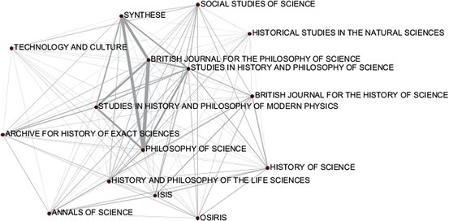
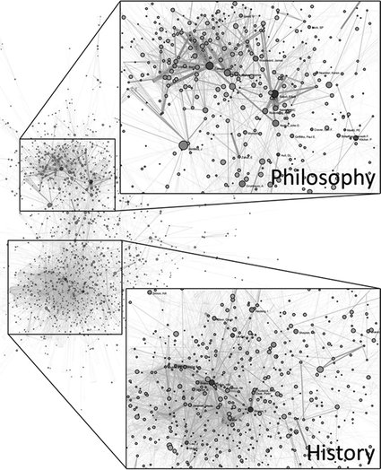
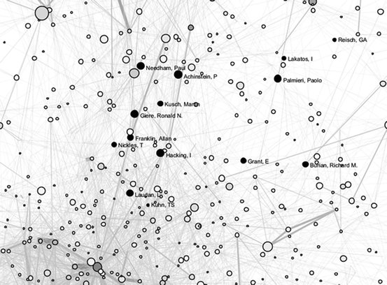
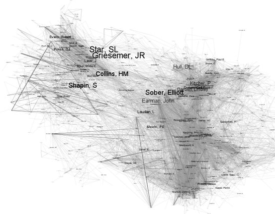

# Finding the History and Philosophy of Science

**Scott B. Weingart**

Received: 9 July 2013 / Accepted: 26 March 2014 / Published online: 11 February 2015
© Springer Science+Business Media Dordrecht 2015

## Abstract

History of science and philosophy of science have experienced a somewhat turbulent relationship over the last century. At times it has been said that philosophy needs history, or that history needs philosophy. Very occasionally, something entirely new is said to need them both. Often, however, their relationship is seen as little more than a marriage of convenience. This article explores that marriage by analyzing the citations of over 7,000 historians, philosophers, and sociologists of science. The data reveal that a small but tightly-knit bridge does exist between the disciplines, and raises suggestions about how to understand that bridge in a more nuanced fashion.

<!-- page 201 -->

## 1 Introduction

History of science and philosophy of science have experienced a somewhat turbulent relationship over the last century. At times it has been said that philosophy needs history (Burian 1977; Hanson 1962; Laudan et al. 1986; Laudan 1992; McMullin 1974; Richards 1992), or that history needs philosophy (Feigl 1970; Hanson 1962; Koyre 1955; Laudan 1992; Richards 1992; Richardson 2008). Very occasionally, something entirely new is said to need them both (Galison 2008; Smocovitis 1994; Wylie 1994). Often, however, the relationship between the two is seen as little more than a marriage of convenience (Giere 1973; Reichenbach 1938; Salmon 1963; Wray 2010).

No matter their *actual* relationship, it has clearly been important enough to revisit time and again. The relationship between history and philosophy of science (HPS) is further confounded by the many forms it might take: (1) historically-informed philosophy of science, (2) philosophically-informed history of science, (3) the philosophy of history of science, (4) the history of philosophy of science, or (5) a new field entirely whose body of work belongs to neither area but draws from both. Though each has some claim to the HPS name, the first two options are not necessarily integrative, though they do require a dual expertise; the second two merely combine 'philosophy of science' or 'history of science' with 'history' or 'philosophy' respectively (leaving out an 'of science' in each case); and the last case would be far enough afield from either discipline that both might question its motive entirely.[^1]

In this light, Hanson's (1962) rewording of Kant's (1781) slogan that "History of science without philosophy of science is blind" and "philosophy of science without history of science is empty" appears to represent an impossible ideal. If neither group knows what an integrated approach would look like, and some equal combination of both would produce results neither want to call their own, then the project seems doomed from the start. The problem, however, is a straw man. The question should not be whether history of science and philosophy of science can be fully integrated, but to what extent each can contribute to the other, and whether interesting results can come of studies pulling ideas and methodologies from both.

No matter what is said to the contrary, HPS undoubtedly exists. There are at least 15 HPS departments worldwide, with 15 or so more offering HPS through combined programs. There are panels and conferences devoted to integrated HPS, journals and professional societies which encompass them both, and a great many researchers who identify as working in HPS. The purpose of this article is to locate the ground over which HPS co-exist, in response to an article by Wray (2010) published by *Erkenntnis* which concluded "there is little evidence that there is such a field as the HPS."

The nature of HPS is not the purpose of this discussion, nor is the contents of the various forms it might take (1)–(5). Arguably, successful examples of each already exist. Although (1) and (2) are long-since ubiquitous, it should be recalled that HPS were split for decades by the contexts of discovery and justification (Reichenbach 1938), and it took heated arguments from historians of science to include philosophy (Koyre 1955) and from philosophers of science to include history (McMullin 1974). Successful applications of POHOS (3) and HOPOS (4) are more recent (Jardine 2009; Richardson 2008), and (5) manifests itself—at least—in historical epistemology (or is it epistemological history?), studies of the evolution of scientific methodologies, and STS in general.

In the end, the question of the existence of HPS, as a discipline or an intellectual domain, is a social one. Academic communities do form around the content of their study, yes, but this is but one of many dimensions around which they organize. The

<!-- page 202 -->

best we can do to empirically show that a certain social structure exists is to study their institutional traces. In the case of academia, that means looking at publications, citations, institutional affiliations, mentorship relationships, conference attendance, and so on. These traces are often difficult to find and study in aggregate, so we must make do with what we have. What follows is a discussion of what we have.

## 2 Scientometrics

Scientometrics, the quantitative study of scholarship itself, has been around in various forms for some time. While much has been made of its value to impact metrics for promotion, grant-allocation, and research awards, an early and vocal critical reaction to this use has evolved concurrently. More nuanced approaches to the analysis of research grew with this critical response, which led to the ability to use these methods to explore and understand the socio-topical landscape of academia. Digitized document and citation databases and automated tools streamlined the process, at once improving the accuracy, breadth, and depth of scientometric studies.

The unfortunate notion of certain government agencies and tenure and promotion committees that citation counts directly correlate with quality is not inherent in scientometrics. Eugene Garfield, one of the progenitors of the field, early on admitted that citation frequency was some function of merit, reputational, controversiality of subject matter, accessibility, and so forth (Garfield 1972). Further, it is known that citation counts do not necessarily say anything about a paper's impact or importance to society (Garfield 1979). Scientometrics was conceived as a study of the patterns visible in scholarly practices and social structures, which can often but do not necessarily overlap with content, quality, or impact.

Citations are commonly used in scientometric studies because they have traditionally been relatively easy to harvest and can be very telling. For example, it has been shown that cohorts of researches tend to cite within their group more than outside of it, and citation practices and frequencies can be good indicators of social structures and power relations within a field (Phelan 1999). Citation networks of who-cites-whom can be further abstracted to get a sense of the topical and social landscape of a discipline using bibliographic coupling and co-citation networks.

A bibliographic coupling network generates a landscape of a discipline by connecting articles if their bibliographies are similar (Kessler 1963).[^2] In bibliographic coupling, an article's relationships are essentially determined by its author. The author makes a definitive choice to include certain references and exclude others, and many times those choices are determined socially. References are plucked from canonical works in the author's field, articles read while the author

<!-- page 203 -->

was in school or perusing her disciplinary journals, and so forth. This suggests that two articles may be quite similar topically, but if the authors of each come from different disciplinary backgrounds and cite very different sources, their bibliographies may not be strongly coupled. As such, bibliographic coupling networks are good for placing articles in their social academic landscape as understood by their original authors.

Co-citation networks are the functional opposite of bibliographic coupling. Where bibliographic coupling connects two articles if they cite the same sources, co-citation networks link two articles if they *are cited by* the same sources (Small 1973).[^3] In this situation, article similarity is determined by the more recent citing documents. As such, and as opposed to a bibliographic coupling network, co-citation networks can change over time as new sources 'co-cite' two old articles together, thus connecting those two articles more closely together in the co-citation network. Thus co-citation networks represent how modern authors across disciplines understand the similarity between documents, rather than how the original authors themselves viewed their disciplinary landscape. A co-citation network will reveal which articles scholars found to be similar, even if the original authors of those articles saw no connection between themselves.

With regards to the HPS, a bibliographic coupling network would show those articles which purposefully represented themselves as integrated HPS, by the fact that they reference articles from both. A co-citation network would instead reveal those articles which have become canonical, or are the unintended bases of a community which bridge HPS together. Both are useful for this study.

A valid criticism can be raised that co-citation and bibliographic coupling networks would be more intertwined than this narrative suggests. Authors' institutional and pedagogical affiliations, after all, affect their citation practices and the practices of those around them. In the short term, a co-citation network may then appear remarkably similar to its respective bibliographic coupling network. Those effects significantly shrink, however, as the timescale of the dataset increases; bibliographic coupling networks remain the same no matter how much time passes, while co-citation networks begin to represent the present state of academia as much as they represent the past. With large enough datasets, the distinction between co-citation and bibliographic coupling networks can be easily detected (Boyack and Klavans 2010).

These two types of networks can be further abstracted by generalizing to authors or journals. For example, an author co-citation network connects authors who tend to be spoken of in the same breath; if Smith and Brown are frequently referenced together, even if it is not always the same articles written by both of them, then they are connected in the author co-citation network. The author bibliographic coupling network connects Smith and Brown if they frequently tend to reference the same sources across all their articles. Journals can be treated the same way, where they are connected in co-citation if they in aggregate are frequently cited in the same

<!-- page 204 -->

articles, or are connected in bibliographic coupling if their articles tend to reference the same sources.

Of author co-citation networks, Culnan (1987) writes "this mapping is based on the composite judgement of hundreds of citers, rather than on the judgement of a small group of experts. It is, therefore, the field's view of itself." McCain (1989) writes that author co-citation networks represent a higher level of generality than document co-citation networks, revealing "broad research foci, schools of thought that guide or constrain scholarly activity, and overall trends or dimensions in scholars' approach toward research." Given that groups of scholars who identify themselves as colleagues tend to cite one another and a similar disciplinary canon, author co-citation networks can be particularly useful at revealing unified fields of study.

## 3 Finding HPS

The growing prominence of citation analysis within scientometrics has led to its tentative use outside the discipline. Adoption in the humanities has been slower than in most fields, in part due to lack of available data and in part due to lack of interest (Ardanuy et al. 2009; Hérubel 1994; Knievel and Kellsey 2005; Thompson 2002). Adoption in HPS has been sparser still; the only study I am aware of was published by Wray (2010) in *Erkenntnis* titled "Philosophy of Science: What are the Key Journals in the Field?"

Wray's article strays from the title question of which journals are key to the philosophy of science, although that question is answered as well. His thesis is that "there is little evidence that there is such a field as the HPS. Rather, philosophy of science is most properly conceived of as a sub-field of philosophy." He arrives at this conclusion via a citation analysis of three well-respected edited collections: *A Companion to the Philosophy of Science*, *The Routledge Companion to Philosophy of Science*, and *The Philosophy of Science* edited by David Papineau, in total comprising 149 articles. Wray counts the number of times major journals are cited within each article, and notes that the great majority of cited sources are philosophy of science journals. *Isis*, the most prominent history of science journal, is not cited at all, and integrated HPS journals are themselves cited only rarely. The lack of citations to history or HPS journals is taken by Wray as evidence that "philosophy of science is largely independent of the history of science," because "if there were such a field as [HPS], one would expect scholars in that field to be citing publications in the leading history of science journal."

While Wray's study is particularly well-suited for finding the key journals in the philosophy of science, a few methodological issues make his claim about the non-existence of HPS unconvincing, including lack of available data and assumptions about the nature of HPS. The data used in the *Erkenntnis* study does suggest that mainstream philosophy of science, as represented by three generalist philosophy edited collections, is not particularly reliant on history of science research. However, there is no evidence suggesting that those three volumes are particularly representative of HPS, whatever it may be, and as such there is no expectation that

<!-- page 205 -->

their citation practices should be representative of HPS citation practices. At best, Wray's method can be used to suggest the proportion of one of the five potential varieties of HPS within philosophy of science: (1) historically-informed philosophy of science. As Wray shows, the proportion of historically-informed philosophy of science is quite small within philosophy of science in general. Wray's dataset might also be used to explore the place of (4) history of philosophy of science, however those articles are not likely to be represented in history of science journals. An analysis of mainstream philosophy volumes would not reveal (2) philosophically-informed history of science, (3) the philosophy of history of science, or (5) a true hybrid HPS. It is also worth pointing out that, although Wray considers books important enough to be used as sources, he does not count citations to history of science books. As monographs are a key unit of production and consumption of history of science research, this may have skewed his results further.

The question is then what data are currently available and potentially usable as evidence for the landscape of HPS and its place mediating the two often disparate disciplines. Previous scientometric research suggests a citation database of a large enough body of HPS articles can reveal the topology of and interconnections between scholarly disciplines. As such, I collected the citation data of 15 journals categorized as 'History & Philosophy of Science' from ISI's *Web of Science* in the *Arts & Humanities Citation Index*.[^4] Many of these journals were considered by Wray to be key journals in the field of philosophy of science; the only journal missing from his list is *Erkenntnis*, the data for which were not available at the time of download. The data include 12,510 articles from 1956 to 2010 written by 7,449 authors making 329,000 references to articles, books, and other sources.[^5]

Data were initially processed and pruned a basic text editor, and then imported into The Sci2 Tool (Sci2 Team 2009). The tool converts ISI-style records into a database of articles and citations, as described by Weingart et al. (2011). Each citation is automatically matched and merged to its referent, such that if four articles in *Isis* cite the same article in *Synthese*, each using slightly different formatting, the system is aware that each citation points to the same *Synthese* record held elsewhere in the database. Authors whose names or initials vary slightly are also intelligently merged (e.g., Thomas S. Kuhn, T.S. Kuhn, and so forth). The database includes all cited references from every journal article, including those to books and

<!-- page 206 -->

manuscripts, however it includes no cited references *from* any sources outside the 15 selected journals. Figures 1, 2, and 3 were created using The Sci2 Tool and an external plugin called GUESS, and Fig. 4 was generated by exporting a GUESS file to Gephi (Bastian et al. 2009), to make the names more legible.[^6]

Figure 1 shows the journal bibliographic coupling network of the dataset, where journals are linked more strongly if articles in them cite the same sources more frequently. It represents the social landscape of these journals as understood by their authors through their citation practices. As the figure shows, *Philosophy of Science, Studies in History and Philosophy of Modern Physics, Studies in HPS, British Journal for the Philosophy of Science,* and *Synthese* are clearly the most tightly coupled journals. It is no coincidence that Wray's paper suggests four of these five are key journals in the field of philosophy of science. They form a strong cohort and are representative of philosophy of science in general.

What is curious at first glance, however, is the relatively sparse connections between history of science journals. An explanation might be that, because history articles usually require the referencing of primary sources and monographs fairly specific to the study at hand, it is much less likely that history of science articles would share references. In this light, it is unsurprising that Wray found far fewer history of science than philosophy of science references; even *historical journals* have relatively few references to other history of science journals. In fact, of the twenty most highly-cited sources in the dataset of both HPS journals, all but two of them are to monographs.

While the multimodality of scholarship (e.g., conferences, journals, and books) renders citation analysis alone insufficient to prove a discipline's non-existence, even an incomplete dataset may be used to point the way to something that does exist. A co-citation analysis, connecting articles which are frequently cited in the same bibliography, reveals which articles authors think ought to be grouped together for the purpose of their research. Authors make conscious choices of which articles to cite together in a paper; sometimes the articles are topically relevant to the paper, sometimes they are contextual or standard citations in a field. The resulting co-citation network provides an aggregate view of implicit connections between each individual's own work and the field in which she is situated. Using authors instead of articles for co-citations, linking together authors who are frequently cited together, is a good level of granularity to tease apart scholarly communities and linkages between them.

The author co-citation network in Fig. 2 compares how the 7,449 authors *who were published in the dataset* tended to be cited together by other authors in the dataset. The only authors who appear in the network are those who published in one of the 15 journals, and two authors are connected to one another by how frequently other authors in the dataset cite them within the same article.[^7] Each node, or author,

<!-- page 207 -->

is sized by the number of articles they authored in the dataset, and those which are darker were cited more frequently. The connections, or edges, between each author pair are thicker and darker if those two authors were more frequently cited together.

Distinct history of science and philosophy of science communities are clearly visible. These communities are filled with authors who are cited almost exclusively by either historians or philosophers, but rarely both. Figure 2 reveals that philosophers tend to form into more tightly-knit clusters with fewer people in each, whereas historians tend to be more diffuse, according to co-citation patterns. The outliers in the graph represent authors from specialized areas of history or philosophy of science which do not always engage with outside scholarship, and are unlikely to be referenced with others in either community.

The interesting area for this study, however, is the section between the separate history and philosophy communities. These are authors not only clearly cited from both worlds, but as the interconnections suggest, often cited together. This suggests a core set of authors whom both historians and philosophers of science consider worthy of citing, and suggests that they are sufficiently related to part of a community between history of science and philosophy of science. Though the cluster between the two main communities is not as tightly-knit or well-formed as its larger siblings, the bridge is clearly coherent enough to be suggestive. The highlighted names in Fig. 3 represent some of the researchers who straddle both groups.[^8] We see scholars who have attempted to bridge the gap between HPS, including Kuhn and Laudan, as well as those who expressed skepticism about their combining, like Giere. A quick glance through the home pages of interstitial authors shows many of them consider themselves both historians and philosophers of science.

**Fig. 1** Bibliographic coupling network of 15 journals in the dataset. *Edge thickness* denotes how frequently articles two journals cite the same source. Spatial coordinates of journals are stochastically generated using the GEM layout algorithm, so it is important to read this graph by the number and weight of connections between any two node pairs, rather than by the spatial distance between them

<!-- page 208 -->

**Fig. 2** Author co-citation network, with the history of science and philosophy of science clusters zoomed in and separated. Author nodes are sized by how central they are in the network and colored by how often they are cited, *light-to-dark*. Spatial coordinates of authors are stochastically generated using the GEM layout algorithm, so it is important to read this graph by the number and weight of connections between any two node pairs, rather than by the spatial distance between them

<!-- page 209 -->

The author bibliographic coupling network (Fig. 4), which shows connections between authors as they themselves would conceive them rather than as future authors do, also shows a strongly coherent bridge between HPS. The highly-cited author straddling the history and philosophy communities is Andrew Pickering, whose website describes his research as an intersection between history, philosophy and sociology of science and technology.

The evidence present in the 15-journal citation data reinforces Wray's original analysis, showing that mainstream philosophy of science tends not to cite history of science. It also shows that mainstream history of science tends not to cite philosophy of science. Of the 15 journals which were solely dedicated to philosophy of science, none of the top-20 most cited sources were specifically history of science journals. Similarly, none of the top-20 most cited sources in history of science journals were specifically philosophy of science journals.

**Fig. 3** Author co-citation network zoomed into area between history and philosophy of science. All features are equivalent to those in Fig. 2, except the *dark*, named nodes, which were selected based on their high citation count and their identification (by themselves or by others) as practitioners spanning both history and philosophy of science. The selections are illustrative rather than exhaustive

<!-- page 210 -->

However, Wray's conclusion that history of science and philosophy of science tend not to draw from one another, though accurate, is not the whole story. More data was needed to show that, though the two communities themselves might not heavily draw from one another, this fact does not preclude the possibility that a third community might draw from both, or that some researchers on either side might legitimately engage with the other. To say that HPS fails because the majority of historians and philosophers do not participate in it is akin to saying the Louisiana Creole people do not exist because the majority of peoples from which they originate to not speak each other's languages. A larger and more encompassing dataset provides the additional granularity needed to differentiate communities and connections. This dataset shows that, despite Wray's initial conclusion, HPS is readily visible when one looks a little closer.

## 4 Conclusion

An analysis of citations from 12,510 history or philosophy of science articles reveals a cohesive bridge between the two communities which connect them together. Though the space in between is not as strongly coherent a community as either philosophy of science or history of science, it is still clearly visible that there is an exchange and a set of canonical authors at the interface between the two. This

<!-- page 211 -->

intersection is, unsurprisingly, occupied by those who either self-identify as both historians and philosophers of science, or authors who have since become beacons of both fields. With that said, the data also suggest that in large part, most sections of the two communities ignore each other entirely.

Future work looking beyond citations alone can tease apart the five noted potential candidates for the title 'HPS' within the dataset. On the quantitative side, a natural language analysis using a method like Latent Dirichlet allocation (Blei et al. 2003) might bring us closer to understanding the nature of bridge between HPS; on the qualitative side, simply interviewing those authors who are publishing along that bridge would likely produce similar results. The task will be to search for an institutional and content-based coherence which can unify integrated HPS and set the agenda for future research. Galison (2008) offered ten fantastic questions to lead this search, and perhaps a further computational literature search might focus the field even further. Even without an understanding of some fully integrated HPS, knowing the points of connection is a useful endeavor. The evidence suggests HPS are married; whether by convenience or shared intent, what is left is to understand the nature of this marriage and how to make it more fruitful in the coming years.

**Fig. 4** Author bibliographic coupling network between history and philosophy of science. This graph was generated in Gephi, and authors are sized by the frequency with which they are cited in the dataset

**Acknowledgments** This research was funded in part by a National Science Foundation Graduate Research Fellowship. I would like to thank Katy Börner, Jutta Schickore, Vincent Larivière, K. Brad Wray, and the anonymous reviewers for their valuable comments and suggestions.

<!-- page 212 -->

## References

Ardanuy, J., Urbano, C., & Quintana, L. (2009). A citation analysis of Catalan literary studies (1974–2003): Towards a bibliometrics of humanities studies in minority languages. *Scientometrics, 81*(2), 347–366. doi:10.1007/s11192-008-2143-3.

Bastian, M., Heynmann, S., & Jacomy, M. (2009). Gephi: An Open source software for exploring and manipulating networks. In *Presented at the international AAAI conference on weblogs and social media*. Retrieved from http://www.aaai.org/ocs/index.php/ICWSM/09/paper/view/154.

Blei, D. M., Ng, A. Y., & Jordan, M. I. (2003). Latent dirichlet allocation. *Journal of Machine Learning Research, 3*, 993–1022.

Boyack, K. W., & Klavans, R. (2010). Co-citation analysis, bibliographic coupling, and direct citation: Which citation approach represents the research front most accurately? *Journal of the American Society for Information Science and Technology, 61*(12), 2389–2404. doi:10.1002/asi.21419.

Burian, R. M. (1977). More than a marriage of convenience: On the inextricability of history and philosophy of science. *Philosophy of Science, 44*(1), 1–42.

Culnan, M. J. (1987). Mapping the intellectual structure of MIS, 1980–1985: A co-citation analysis. *MIS Quarterly, 11*(3), 341–353.

Feigl, H. (1970). Beyond peaceful coexistence. In *Historical and philosophical perspectives of science* (pp. 3–11). Minneapolis, MN: University of Minnesota Press.

Galison, P. (2008). Ten problems in history and philosophy of science. *Isis, 99*(1), 111–124. doi:10.1086/587536.

Garfield, E. (1972). Citation analysis as a tool in journal evaluation. *Science, 178*(60), 471–479.

Garfield, E. (1979). Is citation analysis a legitimate evaluation tool? *Scientometrics, 1*(4), 359–375. doi:10.1007/BF02019306.

Giere, R. N. (1973). History and philosophy of science: Intimate relationship or marriage of convenience? *The British Journal for the Philosophy of Science, 24*(3), 282–297. doi:10.1093/bjps/24.3.282.

Hanson, N. R. (1962). The irrelevance of history of science to philosophy of science to philosophy of science. *The Journal of Philosophy, 59*(21), 574–586.

Hérubel, J.-P. V. M. (1994). Citation studies in the humanities and social sciences. *Collection Management, 18*(3–4), 89–137. doi:10.1300/J105v18n03_06.

Jardine, N. (2009). Philosophy of history of science. In A. Tucker (Ed.) *A companion to the philosophy of history and historiography* (pp. 285–296). New York: Wiley. Retrieved from http://onlinelibrary.wiley.com/doi/10.1002/9781444304916.ch25/summary.

Kant, I. (1781). *Kritik der reinen Vernunft*. Riga: Johann Friedrich Hartknoch.

Kessler, M. M. (1963). Bibliographic coupling between scientific papers. *American Documentation, 14*(1), 10–25. doi:10.1002/asi.5090140103.

Knievel, J. E., & Kellsey, C. (2005). Citation analysis for collection development: A comparative study of eight humanities fields. *The Library Quarterly, 75*(2), 142–168.

Koyre, A. (1955). Influence of philosophic trends on the formulation of scientific theories. *The Scientific Monthly, 80*(2), 107–111.

Laudan, R. (1992). The "new" history of science: Implications for philosophy of science. In *PSA: Proceedings of the biennial meeting of the philosophy of science association* (pp. 476–481).

Laudan, L., Donovan, A., Laudan, R., Barker, P., Brown, H., Leplin, J., et al. (1986). Scientific change: Philosophical models and historical research. *Synthese, 69*(2), 141–223.

McCain, K. W. (1989). Mapping authors in intellectual space. *Communication Research, 16*(5), 667–681. doi:10.1177/009365089016005007.

McMullin, E. (1974). History and philosophy of science: A marriage of convenience? In *PSA: Proceedings of the biennial meeting of the philosophy of science association* (pp. 585–601).

Phelan, T. J. (1999). A compendium of issues for citation analysis. *Scientometrics, 45*(1), 117–136. doi:10.1007/BF02458472.

Reichenbach, H. (1938). *Experience and prediction an analysis of the foundations and structure of knowledge*.

Richards, R. J. (1992). Arguments in a sartorial mode, or the asymmetries of history and philosophy of science. In *PSA: Proceedings of the biennial meeting of the philosophy of science association* (pp. 482–489).

Richardson, A. W. (2008). Scientific philosophy as a topic for history of science. *Isis, 99*(1), 88–96. doi:10.1086/587534.

<!-- page 213 -->

Salmon, W. C. (1963). *Logic*. The University of California: Prentice-Hall.

Sci2 Team. (2009). *Science of science (Sci2) tool*. Indiana University and SciTech Strategies. Retrieved from http://sci2.cns.iu.edu.

Small, H. (1973). Co-citation in the scientific literature: A new measure of the relationship between two documents. *Journal of the American Society for Information Science, 24*(4), 265–269.

Smocovitis, V. B. (1994). Contextualizing science: From science studies to cultural studies. In *PSA: Proceedings of the biennial meeting of the philosophy of science association* (pp. 402–412).

Thompson, J. W. (2002). The death of the Scholarly monograph in the humanities? Citation patterns in literary scholarship. *Libri, 52*(3), 121–136.

Weingart, S. B., Guo, H., Börner, K., Boyack, K. W., Linnemeier, M. W., & Duhon, R. J. (2011). *Science of science (Sci2) tool user manual*. Retrieved from http://sci2.wiki.cns.iu.edu.

Wray, K. B. (2010). Philosophy of science: What are the key journals in the field? *Erkenntnis, 72*(3), 423–430. doi:10.1007/s10670-010-9214-6.

Wylie, A. (1994). Discourse, practice, context: From HPS to interdisciplinary science studies. In *PSA: Proceedings of the biennial meeting of the philosophy of science association* (pp. 393–395).

## Notes

[^1]: Take for example Feigl's (1970) suggestion. "Permit me to mention just one episode in the history of recent science that seems to me worthy of the (collaborative!) attention and investigation by scientifically well-informed historians *and* philosophers of science: the peculiarly late (and hardly justifiable) opposition to the atomic theory by Enrst Mach and especially Wilhelm Ostwald, and the critical counterattacks by Ludwig Boltzmann and Max Planck." The problem is valid, but it is not unreasonable to imagine a historian or philosopher of science scratching their head as to why it would be useful.

[^2]: The concept is straightforward: if 90 % of the citations of two articles overlap, the odds are that the topic being discussed in both articles are closely related. At the scale of hundreds of thousands of articles, one can imagine the formation a fairly detailed landscape, where article A is related to articles B and C; article B to articles A, C, and D; and so forth until each article is situated in its proper relation to all the others, some very near and others very distant. Operationally, if two articles share 15 references, there is a link of strength 15 between them; if they share zero references, there is no link between them.

[^3]: In a co-citation network, if no bibliographies include both article A and Article B, they are not linked. If one paper's bibliography references both article A and article B, they are connected with a strength of 1; if articles A and B appear together in 15 different bibliographies, they are connected with a strength of 15.

[^4]: The journals I included were an English language subset of those listed in ISI's *History & Philosophy of Science* category. They were: *British Journal for the Philosophy of Science, Journal of Philosophy, Synthese, Philosophy of Science, Studies in History and Philosophy of Science, Annals of Science, Archive for History of Exact Sciences, British Journal for the History of Science, Historical Studies in the Natural Sciences, History and Philosophy of the Life Sciences, History of Science, Isis, Journal for the History of Astronomy, Osiris, Social Studies of Science, Studies in History and Philosophy of Modern Physics,* and *Technology and Culture.* I chose only English language journals to prevent community separation or connection due to language effects, and I chose this particular subset based on discussions with the HPS faculty at Indiana University. Based on these discussions, I removed extremely specialized journals and journals which did not seem applicable to the study at hand. While this is not the ideal dataset for the study at hand, it is, apparently, good enough to show a bridge between history and philosophy of science.

[^5]: The data collection step consisted of downloading every article listed in one of the 15 journals directly from Web of Science, 500 records at a time. The data were then joined by hand using Notepad++, removing headers and footers, so all data could be analyzed in a single step.

[^6]: All figures include network visualizations whose nodes (either journals or authors) are arranged in a force-directed layout, meaning their specific *xy* coordinates have an element of randomness. Journals or authors are related by lines drawn between them, rather than by spatial proximity, although spatial proximity can usually be used as a good heuristic for relatedness.

[^7]: I constrained the network to only include authors from these 15 journals because, by authoring in one of these journals, they have implicitly self-selected themselves as historians, philosophers, or sociologists of science. This constraint makes for a much more manageable and legible network.

[^8]: Highlighted names were chosen based on their recognizability and citation count within the dataset.
